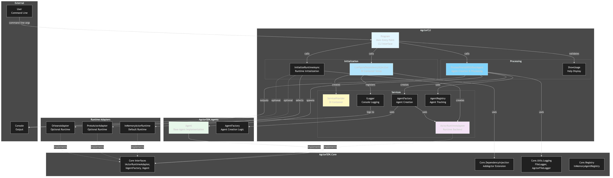

# Architecture Diagram

[Edit source](./architecture-diagram.mmd)

## Overview

This diagram illustrates the high-level architecture of the AgctorCLI project, showing how the command-line interface interacts with the Agctor agent system.

## Key Components

### Program Entry Point
- **Program**: Main entry point that accepts command-line arguments, validates input, and orchestrates the agent processing workflow

### Initialization Layer
- **ConfigureDependencyInjection**: Sets up the dependency injection container with all required Agctor services
- **InitializeRuntimeAsync**: Initializes the selected actor runtime adapter (InMemory, Proto.Actor, or Orleans)

### Processing Layer
- **ProcessPromptWithRootAgent**: Creates a root agent, assigns the prompt, monitors processing, and retrieves results
- **ShowUsage**: Displays usage information when arguments are missing or invalid

### Services
- **ServiceProvider**: Microsoft.Extensions.DependencyInjection container managing all service lifetimes
- **ILogger**: Console logging for monitoring and debugging
- **IActorRuntimeAdapter**: Runtime backend abstraction (InMemory, Proto.Actor, or Orleans)
- **AgentFactory**: Factory for creating and managing agent instances
- **AgentRegistry**: Registry for tracking agent instances

## Execution Flow

1. **User Input**: User provides prompt via command-line arguments
2. **Validation**: Program validates arguments and shows usage if invalid
3. **DI Configuration**: Sets up dependency injection with Agctor services
4. **Runtime Initialization**: Initializes the selected runtime adapter
5. **Agent Creation**: Creates a root agent using AgentFactory
6. **Prompt Processing**: Agent processes the prompt (may spawn child agents)
7. **Result Output**: Displays results to console
8. **Cleanup**: Properly disposes of resources

## Dependencies

- **AgctorSDK.Core**: Core interfaces, dependency injection extensions, logging utilities
- **AgctorSDK.Agents**: Agent implementations and factory
- **Microsoft.Extensions**: Dependency injection, logging, hosting

## Runtime Support

The CLI supports multiple runtime backends:
- **InMemory**: Default runtime, fully implemented
- **Proto.Actor**: Optional distributed runtime (placeholder)
- **Orleans**: Optional Microsoft Orleans runtime (placeholder)
