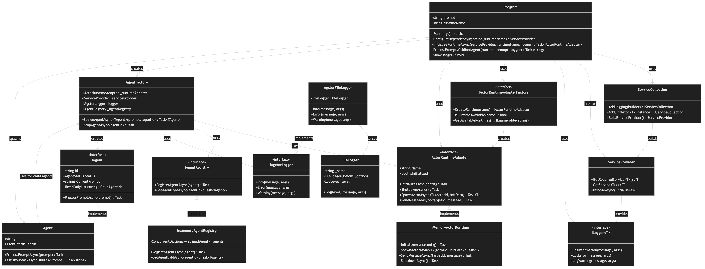

# Class Diagram

[Edit source](./class-diagram.mmd)

## Overview

This UML class diagram shows the detailed class structure, relationships, and dependencies in the AgctorCLI project.

## Key Classes

### Main Entry Point

- **Program**: Main class containing the CLI entry point and orchestration logic
  - `Main(args)`: Entry point that validates arguments and coordinates execution
  - `ConfigureDependencyInjection(runtimeName)`: Sets up DI container with Agctor services
  - `InitializeRuntimeAsync(...)`: Initializes the selected runtime adapter
  - `ProcessPromptWithRootAgent(...)`: Creates agent and processes prompt
  - `ShowUsage()`: Displays usage information

### Dependency Injection

- **ServiceCollection**: Microsoft.Extensions.DependencyInjection collection builder
- **ServiceProvider**: DI container providing service resolution and lifecycle management

### Logging

- **ILogger<T>**: Microsoft.Extensions.Logging interface for structured logging
- **FileLogger**: File-based logging implementation from AgctorSDK.Core
- **AgctorFileLogger**: Wrapper around FileLogger implementing IAgctorLogger interface

### Runtime & Agents

- **IActorRuntimeAdapter**: Interface for runtime backends (InMemory, Proto.Actor, Orleans)
- **IActorRuntimeAdapterFactory**: Factory for creating runtime adapters
- **InMemoryActorRuntime**: Default in-memory runtime implementation
- **AgentFactory**: Factory for creating and managing agent instances
- **IAgent**: Interface for intelligent agents
- **Agent**: Base agent implementation with task decomposition capabilities
- **IAgentRegistry**: Interface for tracking agents
- **InMemoryAgentRegistry**: In-memory implementation of agent registry

## Relationships

- **Program → ServiceCollection**: Program uses ServiceCollection to configure DI
- **Program → ServiceProvider**: Program creates and uses ServiceProvider for service resolution
- **Program → AgentFactory**: Program creates AgentFactory to spawn agents
- **AgentFactory → RuntimeAdapter**: AgentFactory uses runtime adapter to create actors
- **AgentFactory → AgentRegistry**: AgentFactory registers agents with registry
- **AgentFactory → IAgctorLogger**: AgentFactory uses logger for diagnostics
- **Agent → AgentFactory**: Agents use factory to spawn child agents

## Design Patterns

- **Dependency Injection**: All services are injected via Microsoft.Extensions.DependencyInjection
- **Factory Pattern**: AgentFactory and RuntimeAdapterFactory create instances
- **Registry Pattern**: AgentRegistry tracks agent instances
- **Adapter Pattern**: Runtime adapters provide abstraction over different backends

## External Dependencies

- **Microsoft.Extensions.DependencyInjection**: DI container
- **Microsoft.Extensions.Logging**: Logging infrastructure
- **AgctorSDK.Core**: Core interfaces and utilities
- **AgctorSDK.Agents**: Agent implementations
