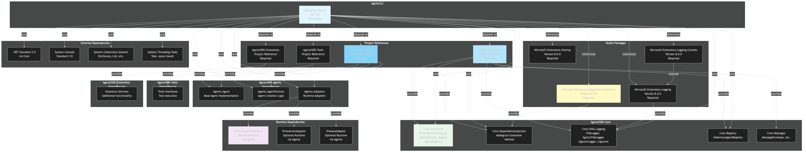

# Dependencies Diagram



[Edit source](./dependencies-diagram.mmd)

## Overview

This diagram shows the dependency relationships for the AgctorCLI project, including project references, NuGet packages, and external services.

## Project References

### AgctorSDK.Core (Required)

Core SDK providing:
- **Core.Interfaces**: Base interfaces (IActorRuntimeAdapter, IAgentFactory, IAgent, IAgentRegistry)
- **Core.DependencyInjection**: AddAgctor extension method for DI configuration
- **Core.Utils.Logging**: Logging utilities (FileLogger, AgctorFileLogger, IAgctorLogger)
- **Core.Registry**: InMemoryAgentRegistry implementation
- **Core.Messages**: Message types and envelopes

### AgctorSDK.Agents (Required)

Agents SDK providing:
- **Agents.Agent**: Base agent implementation with task decomposition
- **Agents.AgentFactory**: Factory for creating and managing agents
- **Agents.Adapters**: Runtime adapters (InMemory, Proto.Actor, Orleans)

### AgctorSDK.Tools (Required)

Tools SDK providing tool execution interfaces and implementations.

### AgctorSDK.Extensions (Required)

Extension services providing additional functionality.

## NuGet Packages

### Microsoft.Extensions.DependencyInjection (v8.0.0) - Required

Dependency injection container:
- Used for service registration and resolution
- Provides ServiceCollection and ServiceProvider

### Microsoft.Extensions.Hosting (v8.0.0) - Required

Hosting infrastructure for .NET applications.

### Microsoft.Extensions.Logging (v8.0.0) - Required

Logging abstractions and infrastructure:
- ILogger<T> interface
- Logging builder extensions

### Microsoft.Extensions.Logging.Console (v8.0.0) - Required

Console logging provider:
- Outputs log messages to console
- Used for CLI user feedback

## External Dependencies

### .NET Standard 2.0

Indirect dependency via AgctorSDK.Core for cross-platform compatibility.

### System.Console

Standard input/output for CLI interaction:
- Console.WriteLine for output
- Console.Error for error output

### System.Collections.Generic

Collections used throughout:
- Dictionary for configuration
- List for collections
- IEnumerable for iteration

### System.Threading.Tasks

Asynchronous programming:
- Task and Task<T> for async operations
- async/await pattern

## Runtime Dependencies

### InMemoryActorRuntime (Default)

In-memory runtime adapter:
- Fully implemented
- Used as default runtime
- Provided via AgctorSDK.Agents

### ProtoActorAdapter (Optional)

Proto.Actor runtime adapter:
- Distributed actor system support
- Optional, not required for basic CLI usage
- Provided via AgctorSDK.Agents

### OrleansAdapter (Optional)

Microsoft Orleans runtime adapter:
- Placeholder implementation
- Optional, not required for basic CLI usage
- Provided via AgctorSDK.Agents

## Dependency Flow

```
AgctorCLI
  ├── AgctorSDK.Core (Project Reference)
  │     ├── .NET Standard 2.0
  │     └── Core interfaces and utilities
  ├── AgctorSDK.Agents (Project Reference)
  │     └── Agent implementations and runtime adapters
  ├── AgctorSDK.Tools (Project Reference)
  │     └── Tool execution interfaces
  ├── AgctorSDK.Extensions (Project Reference)
  │     └── Extension services
  ├── Microsoft.Extensions.DependencyInjection v8.0.0
  ├── Microsoft.Extensions.Hosting v8.0.0
  ├── Microsoft.Extensions.Logging v8.0.0
  └── Microsoft.Extensions.Logging.Console v8.0.0
```

## Version Constraints

- **.NET**: Target framework is .NET 8.0
- **Microsoft.Extensions**: All packages version 8.0.0
- **Nullable Reference Types**: Enabled (`<Nullable>enable</Nullable>`)

## Optional Dependencies

Some dependencies are only required when using specific features:

- **Proto.Actor Runtime**: Only required when using ProtoActorAdapter
- **Orleans Runtime**: Only required when using OrleansAdapter (not currently implemented)
- **AgctorSDK.Tools**: Required for tool execution features
- **AgctorSDK.Extensions**: Required for extension features

## Dependency Injection

The project uses Microsoft.Extensions.DependencyInjection:

- Program creates ServiceCollection
- Registers Agctor services via AddAgctor extension
- Builds ServiceProvider for service resolution
- Services are resolved via GetRequiredService<T> or GetService<T>
