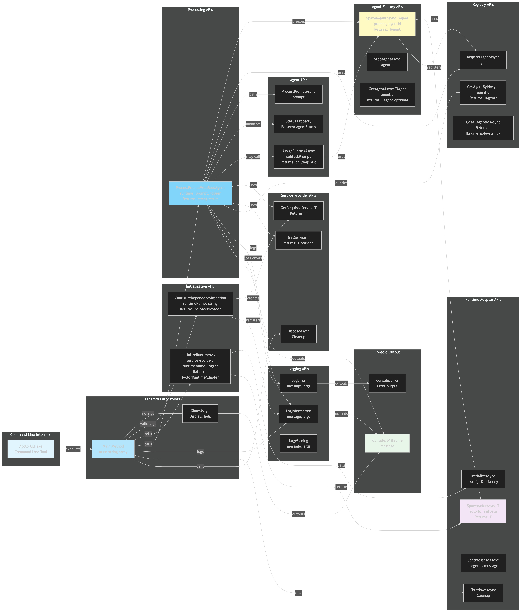

# Endpoints Diagram

[Edit source](./endpoints-diagram.mmd)

## Overview

This diagram illustrates the command-line interface endpoints and method calls within the AgctorCLI project. Since this is a CLI application, "endpoints" refer to public methods and command-line interactions.

## Command Line Interface

### Entry Point
- **AgctorCLI.exe**: Executable command-line tool
  - Usage: `AgctorCLI.exe "prompt" [runtime]`
  - Arguments:
    - `prompt` (required): The prompt or task to process
    - `runtime` (optional): Runtime backend name (defaults to "InMemory")

## Program Methods

### Main Entry Point
- **Main(args)**: Entry point that validates arguments and orchestrates execution
- **ShowUsage()**: Displays usage information and examples

### Initialization Methods
- **ConfigureDependencyInjection(runtimeName)**: Sets up DI container
  - Returns: `ServiceProvider` with all configured services
- **InitializeRuntimeAsync(serviceProvider, runtimeName, logger)**: Initializes runtime
  - Returns: `IActorRuntimeAdapter` ready for use

### Processing Methods
- **ProcessPromptWithRootAgent(runtime, prompt, logger)**: Processes user prompt
  - Creates root agent
  - Monitors agent status
  - Returns: `string` result

## Service Provider APIs

- **GetRequiredService<T>()**: Resolves required service (throws if not found)
- **GetService<T>()**: Resolves optional service (returns null if not found)
- **DisposeAsync()**: Cleans up resources

## Runtime Adapter APIs

- **InitializeAsync(config)**: Initializes runtime with configuration
- **SpawnActorAsync<T>(actorId, initData)**: Creates actor instance
- **SendMessageAsync(targetId, message)**: Sends message to actor
- **ShutdownAsync()**: Gracefully shuts down runtime

## Agent Factory APIs

- **SpawnAgentAsync<TAgent>(prompt, agentId)**: Creates agent instance
- **StopAgentAsync(agentId)**: Stops and removes agent
- **GetAgentAsync<TAgent>(agentId)**: Retrieves agent reference

## Agent APIs

- **ProcessPromptAsync(prompt)**: Processes prompt/task
- **AssignSubtaskAsync(subtaskPrompt)**: Spawns child agent for subtask
- **Status**: Property indicating current agent status (Idle, Processing, Completed, Failed)

## Registry APIs

- **RegisterAgentAsync(agent)**: Registers agent in registry
- **GetAgentByIdAsync(agentId)**: Retrieves agent by ID
- **GetAllAgentIdsAsync()**: Returns all registered agent IDs

## Logging APIs

- **LogInformation(message, args)**: Logs informational messages
- **LogError(message, args)**: Logs error messages
- **LogWarning(message, args)**: Logs warning messages

## Console Output

- **Console.WriteLine(message)**: Standard output
- **Console.Error**: Error output stream

## Execution Flow

1. **CLI Execution**: User runs `AgctorCLI.exe "prompt" [runtime]`
2. **Argument Validation**: Main validates arguments, shows usage if invalid
3. **DI Configuration**: ConfigureDependencyInjection sets up services
4. **Runtime Initialization**: InitializeRuntimeAsync creates runtime adapter
5. **Agent Creation**: ProcessPromptWithRootAgent creates root agent via factory
6. **Prompt Processing**: Agent processes prompt (may spawn children)
7. **Status Monitoring**: Program polls agent status until completion
8. **Result Output**: Result printed to console
9. **Cleanup**: Runtime and services disposed

## Error Handling

- Missing arguments → ShowUsage displayed
- Invalid runtime → Exception with available runtimes listed
- Agent failure → Error logged, failure message returned
- Timeout → Warning logged, timeout message returned
