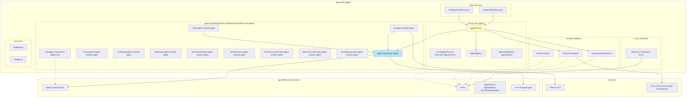

# Architecture Diagram

[Edit source](./architecture-diagram.mmd)

## Overview

This diagram illustrates the high-level architecture of the AgctorSDK.Agents project, showing the relationships between agents, factories, adapters, and external dependencies.

## Key Components

### Agents Layer
- **BaseActor**: Minimal `IActor` primitive used by some non-agent actors (for example `FileSystemTool` in Tools)
- **Agent**: Default `IAgent` implementation with recursive task decomposition
- **LLMAgent**, **CoderAgent**, **HumanAgentAdapter**, **PullRequestAgent**, **TaskScoperAgent**: Workflow agents extending `Agent`
- **SessionCoordinatorAgent**, **SessionMemoryAgent**: Chat/session orchestration
- **PersonExtractorProjectAgent**, **MemoryCuratorProjectAgent**, **PersonQueryProjectAgent**: Project-memory YAML agents
- **EchoAgent**: Implements `IAgent` directly for demos (does not inherit `Agent`)
- **TracedAgent**: Decorator implementing `IAgent` with activity tracking

### Factory & Registry
- **AgentFactory**: Default implementation for creating and managing agent instances
- **TracingAgentFactory**: Factory that wraps agents with tracing capabilities
- **AgentRegistry**: Central registry for tracking and discovering agent instances
- **AgentTypeOptions**: Configuration for agent type registration
- **AgentOptions**: Settings and options for agent behavior

### Runtime Adapters
- **InMemoryActorRuntime**: In-memory actor runtime implementation for local development
- **ProtoActorAdapter**: Proto.Actor runtime adapter for distributed actor systems
- **OrleansAdapter**: Orleans runtime adapter (placeholder for future implementation)

### Task Executors
- **CodeGraphTaskExecutor**: Executor that integrates with CodeGraph agents for code-related tasks
- **PullRequestTaskExecutor**: Executor for pull request workflow tasks

### Tools Models
- **ToolRequest**: Model for tool invocation requests
- **ToolResult**: Model for tool execution results

## Relationships

- Agents inherit from BaseActor and implement IAgent interface from AgctorSDK.Core
- AgentFactory creates agents using runtime adapters and manages their lifecycle
- Agents can spawn child agents for task decomposition (hierarchical agent structure)
- Runtime adapters provide the underlying actor framework integration (InMemory, Proto.Actor, Orleans)
- Task executors coordinate with agents through the registry and factory
- LLMAgent communicates with external Ollama service via HTTP API

## Message Flow

- Agents communicate via message envelopes (MessageEnvelope from Core)
- Parent agents spawn child agents through AgentFactory
- Child agents send completion/failure notifications back to parent agents
- Runtime adapters handle message routing and delivery

## External Dependencies

- **Ollama**: Local LLM service for natural language processing
- **Proto.Actor**: High-performance actor framework (v1.5.0)
- **Orleans**: Microsoft Orleans actor framework (placeholder)
