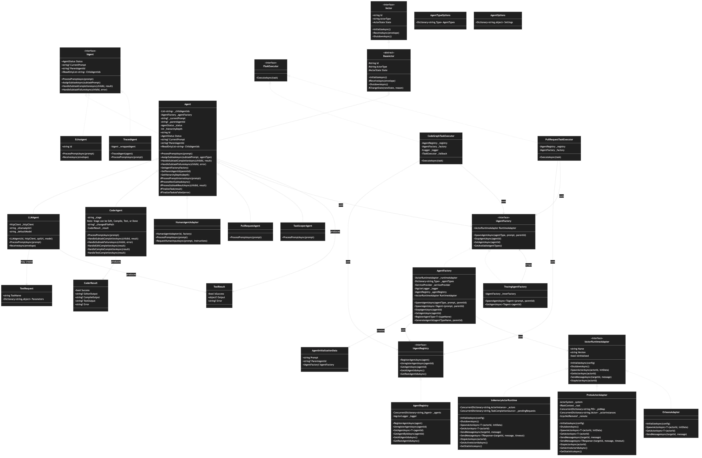

# Class Diagram



[Edit source](./class-diagram.mmd)

## Overview

This UML class diagram shows the detailed class structure, inheritance relationships, and interfaces in the AgctorSDK.Agents project.

## Key Classes

### Core Interfaces (from AgctorSDK.Core)

- **IActor**: Base interface for all actors defining lifecycle and message handling
- **IAgent**: Extended interface for intelligent agents with task decomposition capabilities
- **IAgentFactory**: Factory interface for creating and managing agent instances
- **IAgentRegistry**: Registry interface for tracking and discovering agents
- **IActorRuntimeAdapter**: Adapter interface for different runtime backends (InMemory, Proto.Actor, Orleans)
- **ITaskExecutor**: Interface for executing project tasks

### Base Classes

- **BaseActor**: Abstract base class providing core actor functionality (state management, lifecycle)
- **Agent**: Base agent implementation with recursive task decomposition, child agent spawning, and subtask management

### Specialized Agents

- **LLMAgent**: Agent that communicates with Ollama LLM service for natural language processing
- **CoderAgent**: Orchestrates code editing, compilation, and testing workflows (Edit → Compile → Test)
- **CoderResult**: Result model containing editor, compile, and test outputs
- **EchoAgent**: Simple agent that echoes responses (useful for testing)
- **TracedAgent**: Decorator pattern agent that adds activity tracking capabilities
- **HumanAgentAdapter**: Agent that facilitates human interaction in workflows
- **PullRequestAgent**: Specialized agent for managing pull request workflows
- **TaskScoperAgent**: Agent that scopes and breaks down tasks

### Factories and Registries

- **AgentFactory**: Default implementation for creating and managing agent instances
- **AgentInitializationData**: Data structure passed to agents during initialization
- **TracingAgentFactory**: Factory that wraps agents with tracing capabilities
- **AgentRegistry**: Default implementation for tracking agent instances
- **AgentTypeOptions**: Configuration options for agent type registration
- **AgentOptions**: Settings and options for agent behavior

### Runtime Adapters

- **InMemoryActorRuntime**: In-memory actor runtime implementation for local development and testing
- **ProtoActorAdapter**: Proto.Actor runtime adapter for distributed actor systems
- **OrleansAdapter**: Orleans runtime adapter (placeholder for future implementation)

### Task Executors

- **CodeGraphTaskExecutor**: Executor that integrates with CodeGraph agents for code-related tasks
- **PullRequestTaskExecutor**: Executor for pull request workflow tasks

### Tool Models

- **ToolRequest**: Model for tool invocation requests
- **ToolResult**: Model for tool execution results (success/failure, output, errors)

## Inheritance Hierarchy

```
IActor
  └── BaseActor (abstract)
       └── Agent
            ├── LLMAgent
            ├── CoderAgent
            ├── HumanAgentAdapter
            ├── PullRequestAgent
            └── TaskScoperAgent

IAgent
  ├── Agent (implements)
  ├── EchoAgent (implements)
  └── TracedAgent (decorates Agent)
```

## Key Relationships

- **Agent → AgentFactory**: Agents use the factory to spawn child agents
- **AgentFactory → RuntimeAdapter**: Factory uses runtime adapters to create actor instances
- **AgentFactory → AgentRegistry**: Factory registers agents with the registry
- **TaskExecutors → AgentRegistry/AgentFactory**: Executors coordinate with agents through registry and factory
- **CoderAgent → CoderResult**: CoderAgent produces structured results containing edit/compile/test outputs

## Design Patterns

- **Factory Pattern**: AgentFactory creates agent instances
- **Registry Pattern**: AgentRegistry tracks and discovers agents
- **Adapter Pattern**: Runtime adapters provide abstraction over different actor frameworks
- **Decorator Pattern**: TracedAgent wraps agents with tracing capabilities
- **Template Method Pattern**: Agent base class defines workflow, derived classes override specific steps
