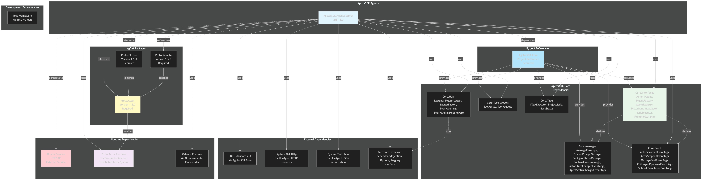

# Dependencies Diagram



[Edit source](./dependencies-diagram.mmd)

## Overview

This diagram shows the dependency relationships for the AgctorSDK.Agents project, including project references, NuGet packages, and external services.

## Project References

### AgctorSDK.Core (Required)

The project has a direct project reference to `AgctorSDK.Core`, which provides:

- **Core.Interfaces**: Base interfaces (IActor, IAgent, IAgentFactory, IAgentRegistry, IActorRuntimeAdapter, ITaskExecutor, IRuntimeStatistics)
- **Core.Messages**: Message types (MessageEnvelope, ProcessPromptMessage, GetAgentStatusMessage, etc.)
- **Core.Tools.Models**: Tool-related models (ToolResult, ToolRequest)
- **Core.Tasks**: Task execution interfaces and models (ITaskExecutor, ProjectTask, TaskStatus)
- **Core.Utils**: Utility classes (Logging, ErrorHandling)
- **Core.Events**: Event argument classes for agent lifecycle events

## NuGet Packages

### Proto.Actor (v1.5.0) - Required

High-performance actor framework used by `ProtoActorAdapter`:

- **Proto.Actor**: Core actor framework
- **Proto.Cluster**: Clustering support for distributed actors
- **Proto.Remote**: Remote actor communication via gRPC

These packages enable distributed actor systems and are essential for the ProtoActorAdapter implementation.

## External Dependencies

### .NET Standard 2.0

Indirect dependency via AgctorSDK.Core for cross-platform compatibility.

### System.Net.Http

Used by `LLMAgent` for making HTTP requests to the Ollama service.

### System.Text.Json

Used by `LLMAgent` for JSON serialization/deserialization when communicating with Ollama API.

### Microsoft.Extensions

Dependency injection, options pattern, and logging infrastructure:

- **Microsoft.Extensions.DependencyInjection**: Dependency injection container
- **Microsoft.Extensions.Options**: Options pattern for configuration
- **Microsoft.Extensions.Logging**: Logging abstractions

These are typically provided via AgctorSDK.Core.

## Runtime Dependencies

### Ollama Service (External)

HTTP-based LLM service used by `LLMAgent`:

- **Endpoint**: Typically `http://localhost:11434` (configurable)
- **API**: REST API for text generation
- **Protocol**: HTTP/JSON
- **Status**: External service that must be running separately

### Proto.Actor Runtime

Distributed actor runtime provided by Proto.Actor packages:

- Used by `ProtoActorAdapter` for actor lifecycle management
- Provides message routing, clustering, and remote communication
- Requires initialization before use

### Orleans Runtime (Placeholder)

Microsoft Orleans actor framework:

- Currently a placeholder implementation in `OrleansAdapter`
- Not actively used in current implementation
- May be implemented in future iterations

## Dependency Flow

```
AgctorSDK.Agents
  ├── AgctorSDK.Core (Project Reference)
  │     ├── .NET Standard 2.0
  │     └── Microsoft.Extensions.*
  ├── Proto.Actor v1.5.0 (NuGet)
  ├── Proto.Cluster v1.5.0 (NuGet)
  ├── Proto.Remote v1.5.0 (NuGet)
  ├── System.Net.Http (via .NET)
  └── System.Text.Json (via .NET)
```

## Runtime Dependencies

At runtime, the following external services may be required:

- **Ollama**: Required if using `LLMAgent` (must be running separately)
- **Proto.Actor Runtime**: Required if using `ProtoActorAdapter` (initialized by adapter)
- **Orleans Runtime**: Not currently required (placeholder implementation)

## Development Dependencies

Test frameworks and tools are typically referenced by test projects (`AgctorSDK.Core.Tests`, `AgctorSDK.Core.IntegrationTests`) rather than the main project.

## Version Constraints

- **.NET**: Target framework is .NET 8.0
- **Proto.Actor**: Version 1.5.0 (all related packages)
- **Nullable Reference Types**: Enabled (`<Nullable>enable</Nullable>`)

## Optional Dependencies

Some dependencies are only required when using specific features:

- **Ollama**: Only required when using `LLMAgent`
- **Proto.Actor**: Only required when using `ProtoActorAdapter`
- **Orleans**: Not currently implemented (placeholder)

## Dependency Injection

The project uses Microsoft.Extensions.DependencyInjection for dependency management:

- `AgentFactory` requires `IActorRuntimeAdapter`, `IServiceProvider`, `IAgctorLogger`, `IAgentRegistry`
- `AgentRegistry` requires `IAgctorLogger`
- Runtime adapters are injected into `AgentFactory`
- Agents receive `IServiceProvider` for optional dependency resolution
