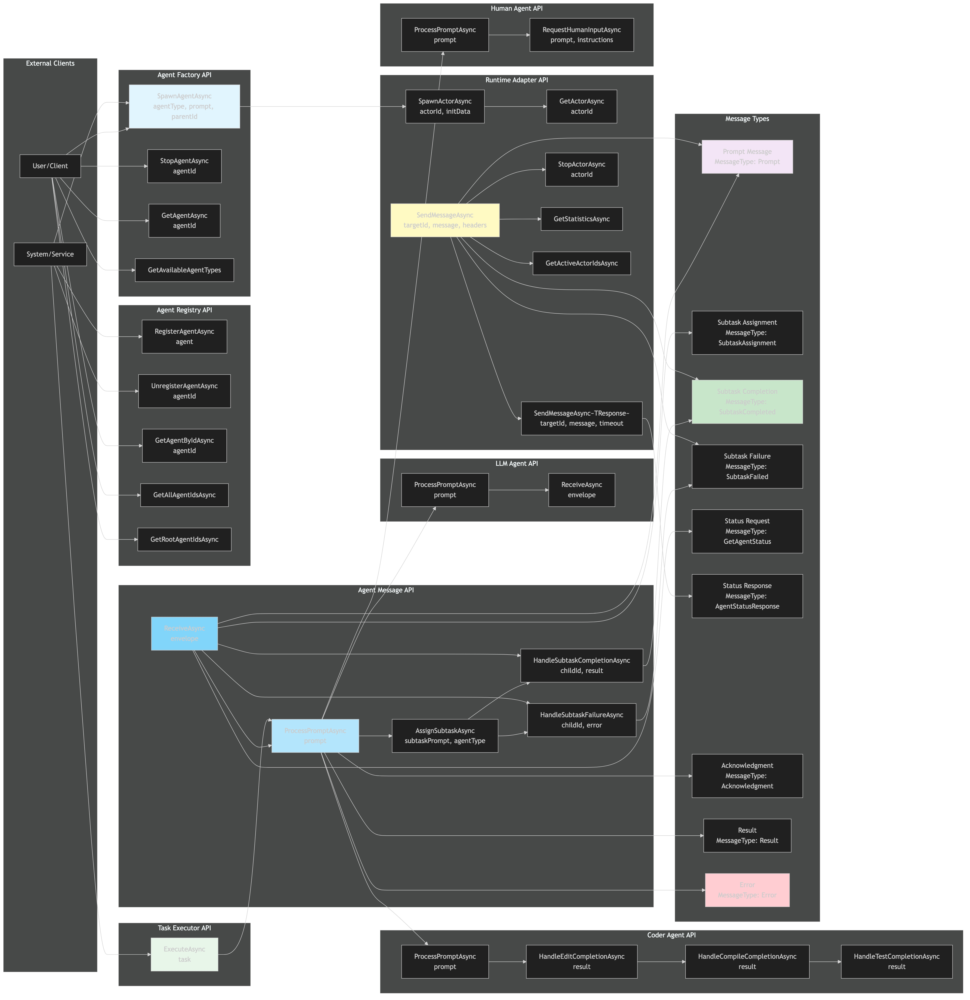

# Endpoints Diagram

[Edit source](./endpoints-diagram.mmd)

## Overview

This diagram illustrates the message-based API endpoints and interactions within the AgctorSDK.Agents project. Since this is an actor-based system, endpoints are defined as message handlers and method calls rather than HTTP endpoints.

## API Categories

### Agent Factory API

The `IAgentFactory` interface provides methods for creating and managing agents:

- **SpawnAgentAsync(agentType, prompt, parentId)**: Creates a new agent instance of the specified type
- **StopAgentAsync(agentId)**: Stops and removes an agent from the runtime
- **GetAgentAsync(agentId)**: Retrieves a reference to an existing agent
- **GetAvailableAgentTypes()**: Returns a list of registered agent types

### Agent Registry API

The `IAgentRegistry` interface provides methods for tracking and discovering agents:

- **RegisterAgentAsync(agent)**: Registers an agent instance in the registry
- **UnregisterAgentAsync(agentId)**: Removes an agent from the registry
- **GetAgentByIdAsync(agentId)**: Retrieves an agent by its ID
- **GetAllAgentIdsAsync()**: Returns all registered agent IDs
- **GetRootAgentIdsAsync()**: Returns IDs of root agents (agents without parents)

### Agent Message API

The `IAgent` interface defines core agent message handling:

- **ProcessPromptAsync(prompt)**: Processes a prompt/task description
- **AssignSubtaskAsync(subtaskPrompt, agentType)**: Spawns a child agent for a subtask
- **HandleSubtaskCompletionAsync(childId, result)**: Handles completion of a child agent's subtask
- **HandleSubtaskFailureAsync(childId, error)**: Handles failure of a child agent's subtask
- **ReceiveAsync(envelope)**: Core message receiving method (implements IActor)

### Runtime Adapter API

The `IActorRuntimeAdapter` interface provides runtime-level operations:

- **SpawnActorAsync(actorId, initData)**: Spawns an actor instance in the runtime
- **GetActorAsync(actorId)**: Retrieves an actor reference
- **SendMessageAsync(targetId, message, headers)**: Sends a fire-and-forget message
- **SendMessageAsync<TResponse>(targetId, message, timeout)**: Sends a message and waits for response
- **StopActorAsync(actorId)**: Stops an actor instance
- **GetStatisticsAsync()**: Returns runtime statistics
- **GetActiveActorIdsAsync()**: Returns all active actor IDs

### Task Executor API

The `ITaskExecutor` interface provides task execution:

- **ExecuteAsync(task)**: Executes a project task, typically delegating to appropriate agents

### Specialized Agent APIs

#### LLM Agent
- **ProcessPromptAsync(prompt)**: Processes prompt through Ollama LLM service
- **ReceiveAsync(envelope)**: Handles incoming messages and forwards to LLM

#### Coder Agent
- **ProcessPromptAsync(prompt)**: Initiates code editing workflow
- **HandleEditCompletionAsync(result)**: Processes edit step completion
- **HandleCompileCompletionAsync(result)**: Processes compilation step completion
- **HandleTestCompletionAsync(result)**: Processes test step completion

#### Human Agent Adapter
- **ProcessPromptAsync(prompt)**: Processes prompt that requires human input
- **RequestHumanInputAsync(prompt, instructions)**: Requests input from human user

## Message Types

The system uses various message types identified by the `MessageType` header:

- **Prompt**: Initial task/prompt message
- **SubtaskAssignment**: Assignment of a subtask to a child agent
- **SubtaskCompleted**: Notification that a subtask has completed
- **SubtaskFailed**: Notification that a subtask has failed
- **GetAgentStatus**: Request for agent status information
- **AgentStatusResponse**: Response containing agent status
- **Acknowledgment**: Acknowledgment of message receipt
- **Result**: Result message containing task output
- **Error**: Error message indicating failure

## Message Flow

1. **Client → Factory**: Client requests agent creation via `SpawnAgentAsync`
2. **Factory → Runtime**: Factory uses runtime adapter to spawn actor instance
3. **Runtime → Agent**: Runtime delivers initialization data and messages to agent
4. **Agent → Agent**: Agent spawns child agents via factory for task decomposition
5. **Child → Parent**: Child agents send completion/failure messages to parent
6. **Agent → Runtime**: Agent sends messages through runtime adapter
7. **Runtime → Client**: Runtime delivers responses back to client

## Request-Response Pattern

- **Fire-and-Forget**: `SendMessageAsync` sends message without waiting for response
- **Request-Response**: `SendMessageAsync<TResponse>` sends message and waits for typed response
- **Correlation**: Messages use `CorrelationId` in metadata/headers to match requests with responses

## Error Handling

- Errors are communicated via `Error` message type
- Failed subtasks trigger `HandleSubtaskFailureAsync` in parent agent
- Runtime adapters handle timeout and connection errors
- Agents can transition to `Faulted` state on critical errors
