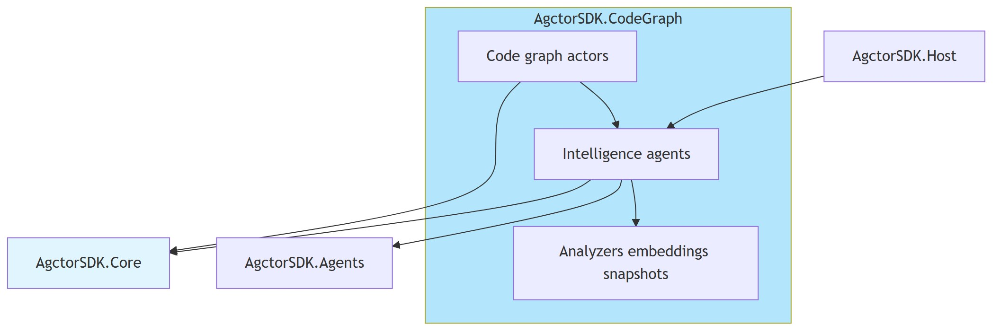
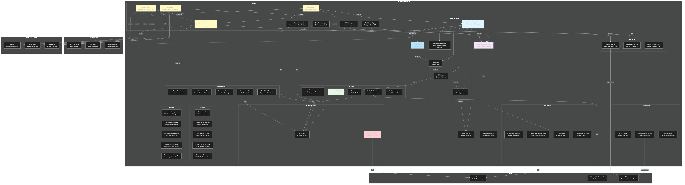

# Architecture Diagram

## Component overview (high level)

[Edit overview source](./component-architecture-diagram.mmd)

## Detailed architecture

[Edit source](./architecture-diagram.mmd)

## Overview

AgctorSDK.CodeGraph models a codebase as an actor hierarchy and layers search, indexing, refactoring, review, and test automation on top of that graph.

## Key Components

### Code Graph Actors (Hierarchical)
- **CodeGraphActorBase**: Abstract base implementing `IActor`; holds name, path, and children
- **SolutionActor → ProjectActor → FileActor → ClassActor → MethodActor**: Mirrors the physical solution structure as a tree of actors
- **ComprehensionActor**: Handles semantic search and public-method queries
- **EmbeddingStoreActor**: Actor wrapper around `IVectorStore` for embeddings
- **TestScaffolderActor**: Writes skeleton test files for planned test tasks

### Agents (Intelligence Layer)
- **IndexerAgent**: Walks the graph, generates embeddings, and stores them
- **EmbeddingCoordinatorAgent**: Ensures embeddings are ready and marks them stale after edits
- **SearchAgent**: Semantic (vector) and structural (intent-based) search
- **QueryAgent**: Orchestrates SearchAgent + LLMAgent for natural-language answers
- **RefactorAgent**: Orchestrates SearchAgent + LLMAgent + CoderAgent for automated refactoring
- **CodeReviewerAgent**: Reviews commit diffs using an LLM
- **GitWatcherAgent**: Creates graph snapshots on demand
- **IntentDetectionAgent**: Classifies user prompts into structured intents
- **TestPlannerAgent**: Generates test plans from snapshot diffs

### Analyzers
- **AnalyzerRegistry**: Central registry mapping languages to analyzers
- **RoslynCodeAnalyzer**: Parses C# using Roslyn for class/method extraction
- **LLMAnalyzer**: Fallback analyzer using LLM when no static analyzer exists
- **TreeSitterAnalyzer**: Placeholder for Python analysis

### Embeddings
- **IEmbeddingGenerator / OllamaEmbeddingGenerator**: Generates vector embeddings via Ollama
- **IVectorStore / InMemoryVectorStore**: Stores and queries vectors using cosine similarity
- **EmbeddingLifecycleMessages**: Shared readiness, status, and stale notifications

### Intent Resolution
- **HeuristicIntentResolver**: Fast keyword/regex-based intent detection
- **RegexIntentResolver**: Configurable regex patterns
- **LlmIntentResolver**: LLM-based intent classification
- **ProxyIntentResolver**: Delegates to IntentDetectionAgent via actor runtime

### LLM Integration
- **ILLMClient / OllamaLlmClient**: Abstraction over local Ollama LLM service

### Persistence & Snapshots
- **FileSystemActorStorage / ActorSerializer**: Persists actor hierarchies as JSON
- **SnapshotService**: Saves/loads code graph snapshots
- **SnapshotDiffService**: Computes diffs between two snapshots
- **DiffFormatterService**: Formats diffs as human-readable text

### Snippets
- **CSharpSnippetProvider**: Extracts method/class source using Roslyn
- **PythonSnippetProvider**: Extracts snippets using indentation
- **SnippetProviderRegistry**: Maps files to matching providers
- **SnippetResolverAgent**: LLM fallback when no language-specific provider exists

## External Dependencies
- **Ollama**: LLM completions and embedding generation
- **Roslyn (Microsoft.CodeAnalysis)**: C# parsing and syntax analysis
- **File System**: Source code, snapshots, and persisted actor state
