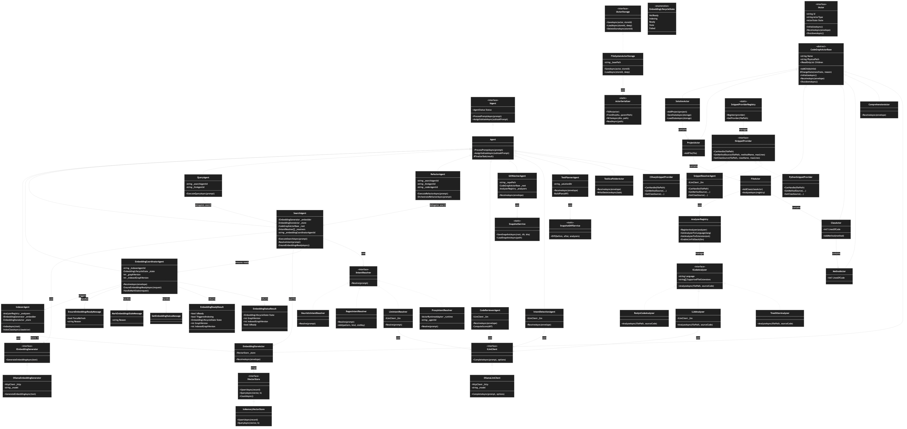

# Class Diagram



[Edit source](./class-diagram.mmd)

## Overview

This UML class diagram shows the main types and relationships in `AgctorSDK.CodeGraph`.

## Inheritance Hierarchy

### Code Graph Actors
```
IActor
  └── CodeGraphActorBase (abstract)
       ├── SolutionActor
       ├── ProjectActor
       ├── FileActor
       ├── ClassActor
       ├── MethodActor
       ├── ComprehensionActor
       └── EmbeddingStoreActor
```

### Agents
```
IAgent
  └── Agent (from AgctorSDK.Agents)
       ├── IndexerAgent
       ├── EmbeddingCoordinatorAgent
       ├── SearchAgent
       ├── QueryAgent
       ├── RefactorAgent
       ├── CodeReviewerAgent
       ├── GitWatcherAgent
       ├── IntentDetectionAgent
       ├── TestPlannerAgent
       ├── TestScaffolderActor
       └── SnippetResolverAgent
```

### Interfaces and Implementations
```
ICodeAnalyzer       → RoslynCodeAnalyzer, LLMAnalyzer, TreeSitterAnalyzer
IEmbeddingGenerator → OllamaEmbeddingGenerator
IVectorStore        → InMemoryVectorStore
IIntentResolver     → HeuristicIntentResolver, RegexIntentResolver, LlmIntentResolver, ProxyIntentResolver
ILlmClient          → OllamaLlmClient
IActorStorage       → FileSystemActorStorage
ISnippetProvider    → CSharpSnippetProvider, PythonSnippetProvider, SnippetResolverAgent
```

## Key Relationships

- **SolutionActor → ProjectActor → FileActor → ClassActor → MethodActor**: Tree containment mirroring the codebase
- **IndexerAgent → EmbeddingStoreActor**: Indexes graph nodes as vectors
- **EmbeddingCoordinatorAgent → IndexerAgent**: Central embedding readiness and freshness
- **SearchAgent → EmbeddingCoordinatorAgent + EmbeddingStoreActor + IIntentResolver**: Semantic and structural search
- **QueryAgent → SearchAgent + LLMAgent**: Combines search results with LLM reasoning
- **RefactorAgent → SearchAgent + LLMAgent + CoderAgent**: Full refactoring pipeline
- **FileActor → AnalyzerRegistry**: Parses source files on demand

## Design Patterns

- **Composite Pattern**: Code graph actor hierarchy (Solution → Project → File → Class → Method)
- **Strategy Pattern**: ICodeAnalyzer, IIntentResolver, ISnippetProvider have multiple implementations
- **Registry Pattern**: AnalyzerRegistry, SnippetProviderRegistry manage implementations
- **Adapter Pattern**: EmbeddingStoreActor wraps IVectorStore as an actor
- **Proxy Pattern**: ProxyIntentResolver delegates to IntentDetectionAgent via runtime
- **Template Method**: Agents override ProcessPromptInternalAsync for specific behavior
