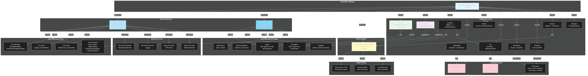

# Dependencies Diagram



[Edit source](./dependencies-diagram.mmd)

## Overview

This diagram shows the dependency relationships for the AgctorSDK.CodeGraph project, including project references, NuGet packages, and runtime services.

## Project References

### AgctorSDK.Core (Required)
Provides core interfaces and utilities:
- **Core.Interfaces**: IActor, IAgent, IAgentFactory, IActorRuntimeAdapter
- **Core.Messages**: MessageEnvelope, event args
- **Core.Utils**: Logging and error handling
- **Core.Tasks**: ITaskExecutor, ProjectTask

### AgctorSDK.Agents (Required)
Provides the agent framework:
- **Agent**: Base class with task decomposition (all CodeGraph agents inherit from this)
- **CoderAgent**: Edit-compile-test orchestrator (used by RefactorAgent)
- **LLMAgent**: Ollama prompt processing (used by QueryAgent, RefactorAgent)
- **AgentFactory**: Agent creation and lifecycle management
- **Runtime Adapters**: InMemory, Proto.Actor

## NuGet Packages

### Microsoft.CodeAnalysis.CSharp (v4.14.0) - Required
Roslyn C# compiler platform:
- Syntax tree parsing for C# source files
- Used by **RoslynCodeAnalyzer** for class/method extraction
- Used by **CSharpSnippetProvider** for precise code snippet extraction
- Provides compilation API for type information

## External Runtime Services

### Ollama LLM (HTTP API)
Used by multiple components:
- **OllamaLlmClient**: Text completion for code review, intent detection, refactoring plans
- **OllamaEmbeddingGenerator**: Vector embeddings (nomic-embed-text model)
- **LLMAnalyzer**: Fallback code analysis when no static analyzer is available
- Endpoint: `http://localhost:11434` (configurable)

### File System
Used for:
- **Source code**: Read by analyzers and snippet providers
- **Snapshots**: Saved/loaded by SnapshotService
- **Actor state**: Persisted by FileSystemActorStorage
- **Test files**: Written by TestScaffolderActor

## Transitive Dependencies (via AgctorSDK.Core)
- **Microsoft.Extensions.DependencyInjection**: DI container
- **Microsoft.Extensions.Logging**: Logging infrastructure
- **System.Net.Http**: HTTP client for Ollama communication
- **System.Text.Json**: JSON serialization for persistence

## Internal Modules

The project is organized into 10 internal modules:

| Module | Files | Key Responsibility |
|--------|-------|--------------------|
| **Actors** | 9 | Code graph hierarchy (Solution → Method) |
| **Agents** | 8 | Intelligence layer (Index, Search, Refactor, etc.) |
| **Analyzers** | 5 | Source code parsing (Roslyn, LLM, TreeSitter) |
| **Embeddings** | 4 | Vector generation and storage |
| **Intents** | 7 | Natural-language intent resolution |
| **Llm** | 2 | LLM client abstraction |
| **Persistence** | 3 | Actor state storage |
| **Snapshots** | 2 | Code graph snapshots and diffing |
| **Snippets** | 6 | Source code snippet extraction |
| **Messages** | 5 | Message types for agent communication |

## Dependency Flow

```
AgctorSDK.CodeGraph
  ├── AgctorSDK.Core (Project Reference)
  │     ├── Core interfaces (IActor, IAgent, ...)
  │     ├── Microsoft.Extensions.* (transitive)
  │     └── System.Net.Http, System.Text.Json (transitive)
  ├── AgctorSDK.Agents (Project Reference)
  │     ├── Agent base class
  │     ├── CoderAgent, LLMAgent
  │     └── Proto.Actor v1.5.0 (transitive)
  └── Microsoft.CodeAnalysis.CSharp v4.14.0 (NuGet)
```

## Version Constraints
- **.NET**: Target framework .NET 8.0
- **Roslyn**: Version 4.14.0
- **Nullable Reference Types**: Enabled
- **Implicit Usings**: Enabled
