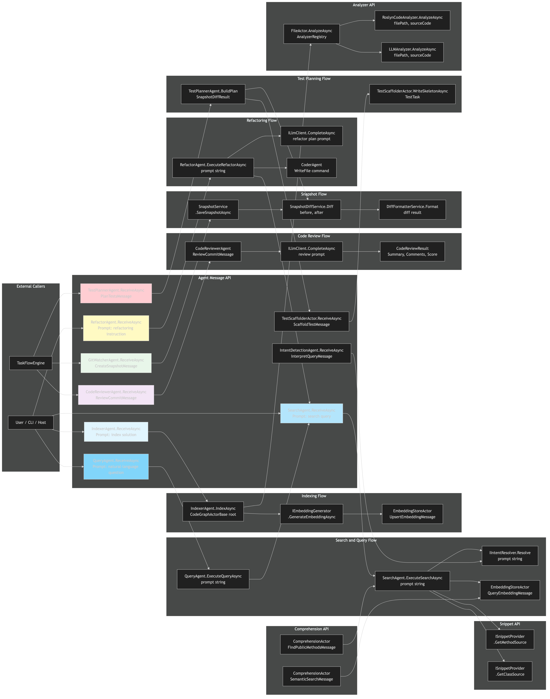

# Endpoints Diagram

[Edit source](./endpoints-diagram.mmd)

## Overview

This diagram shows the message-based API endpoints and data flows within the AgctorSDK.CodeGraph project.

## Agent Message Endpoints

### IndexerAgent
- **ReceiveAsync** — Accepts a prompt message to trigger full solution indexing
- **IndexAsync(root)** — Recursively traverses graph, generates embeddings, stores them

### SearchAgent
- **ReceiveAsync** — Accepts a search prompt
- **ExecuteSearchAsync(prompt)** — Resolves intent, performs structural or vector search
- Uses `IIntentResolver` chain and `EmbeddingStoreActor` for vector queries

### QueryAgent
- **ReceiveAsync** — Accepts a natural-language question
- **ExecuteQueryAsync(prompt)** — Delegates to SearchAgent, then asks LLMAgent for a final answer

### RefactorAgent
- **ReceiveAsync** — Accepts a refactoring instruction
- **ExecuteRefactorAsync(prompt)** — Gathers context via SearchAgent, generates plan via LLM, delegates edits to CoderAgent

### CodeReviewerAgent
- **ReceiveAsync** — Accepts `ReviewCommitMessage(commitSha, diff)`
- Returns `CodeReviewResult(summary, comments, score)`

### GitWatcherAgent
- **ReceiveAsync** — Accepts `CreateSnapshotMessage(commitSha)`
- Returns `SnapshotCreatedMessage(commitSha, path)`

### IntentDetectionAgent
- **ReceiveAsync** — Accepts `InterpretQueryMessage(prompt)`
- Returns `IntentResolvedMessage(resolution)`

### TestPlannerAgent
- **ReceiveAsync** — Accepts `PlanTestsMessage(diff)`
- Returns `TestPlanResult(tasks)`

### TestScaffolderActor
- **ReceiveAsync** — Accepts `ScaffoldTestMessage(task)`
- Returns `TestScaffoldedMessage(filePath)`

## Service APIs

### AnalyzerRegistry
- `RegisterAnalyzer(ICodeAnalyzer)` — Register a language analyzer
- `GetAnalyzerForLanguage(lang)` — Resolve by language name
- `GetAnalyzerForExtension(ext)` — Resolve by file extension

### EmbeddingStoreActor
- `UpsertEmbeddingMessage(record)` — Store embedding vector
- `QueryEmbeddingMessage(vector, k)` — Query nearest neighbors

### SnapshotService
- `SaveSnapshotAsync(root, dir, sha)` — Save code graph snapshot
- `LoadSnapshotAsync(path)` — Load snapshot from disk

### SnapshotDiffService
- `Diff(before, after, analyzers)` — Compute diff between snapshots

### SnippetProviderRegistry
- `GetProvider(filePath)` — Get provider for a file
- `Register(provider)` — Register a snippet provider

### ComprehensionActor
- `FindPublicMethodsMessage(classFilter)` — Find public methods
- `SemanticSearchMessage(query, k)` — Semantic search over graph

## Data Flow Patterns

### Indexing Flow
1. IndexerAgent traverses graph → FileActor.AnalyzeAsync (Roslyn/LLM) → IEmbeddingGenerator → EmbeddingStoreActor

### Search Flow
1. SearchAgent.ExecuteSearchAsync → IIntentResolver chain → Structural query OR vector search → results

### Query Flow
1. QueryAgent → SearchAgent (context) → LLMAgent (answer) → final response

### Refactoring Flow
1. RefactorAgent → SearchAgent (context) → LLMAgent (plan) → CoderAgent (edit + compile + test)

### Review Flow
1. CodeReviewerAgent → ILlmClient (review) → CodeReviewResult

### Test Planning Flow
1. TestPlannerAgent.BuildPlan(diff) → TestTasks → TestScaffolderActor.WriteSkeletonAsync

## Message Types

| Message | Direction | Description |
|---------|-----------|-------------|
| `ReviewCommitMessage` | In → CodeReviewerAgent | Request code review |
| `CodeReviewResult` | Out ← CodeReviewerAgent | Review summary, comments, score |
| `CreateSnapshotMessage` | In → GitWatcherAgent | Request snapshot creation |
| `SnapshotCreatedMessage` | Out ← GitWatcherAgent | Snapshot path confirmation |
| `InterpretQueryMessage` | In → IntentDetectionAgent | Classify prompt intent |
| `IntentResolvedMessage` | Out ← IntentDetectionAgent | Structured intent |
| `PlanTestsMessage` | In → TestPlannerAgent | Generate test plan |
| `TestPlanResult` | Out ← TestPlannerAgent | List of test tasks |
| `ScaffoldTestMessage` | In → TestScaffolderActor | Write test skeleton |
| `TestScaffoldedMessage` | Out ← TestScaffolderActor | Skeleton file path |
| `FindPublicMethodsMessage` | In → ComprehensionActor | Find public methods |
| `SemanticSearchMessage` | In → ComprehensionActor | Semantic search |
| `UpsertEmbeddingMessage` | In → EmbeddingStoreActor | Store embedding |
| `QueryEmbeddingMessage` | In → EmbeddingStoreActor | Query vectors |
