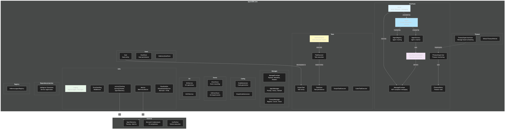

# Architecture Diagram

[Edit source](./architecture-diagram.mmd)

## Overview

AgctorSDK.Core is the foundational library defining all core interfaces, message types, task/goal management, timeout supervision, observability, and utility services for the Agctor framework.

## Key Components

### Interfaces
- **IActor**: Base actor lifecycle (Initialize, Receive, Shutdown)
- **IAgent**: Extended with prompt processing, subtask assignment, parent-child hierarchy
- **IAgentFactory**: Agent creation and lifecycle management
- **IAgentRegistry**: Agent tracking and discovery
- **IActorRuntimeAdapter**: Abstraction over runtime backends (InMemory, Proto.Actor, Orleans)
- **IMessageEnvelope**: MCP-compliant message wrapper with payload, metadata, and headers
- **ITimeoutSupervisor / ITimeoutPolicy**: Timeout monitoring and policy enforcement

### Tasks & Goals
- **Goal → ProjectTask**: Goals decompose into task DAGs
- **TaskFlowEngine**: Executes tasks respecting dependencies with configurable concurrency
- **ITaskExecutor**: SimpleTaskExecutor, CoderTaskExecutor

### Observability
- **IMetricsCollector**: Counter, gauge, histogram metrics via OpenTelemetry
- **IActivityTracker**: Distributed tracing with OpenTelemetry integration
- **IVisualizationService**: Generates Mermaid diagrams and HTML visualizations

### Utils
- **Logging**: IAgctorLogger, FileLogger, LoggerFactory
- **ErrorHandling**: ErrorHandlingMiddleware
- **GitCliHelper**: Git CLI utilities

## External Dependencies
- OpenTelemetry (tracing, metrics, exporters)
- Microsoft.CodeAnalysis.CSharp (code generation)
- IronPython (Python execution)
