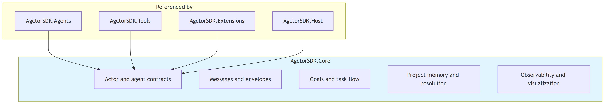

# Architecture Diagram

## Component overview (high level)

[Edit overview source](./component-architecture-diagram.mmd)

## Detailed architecture

[Edit source](./architecture-diagram.mmd)

## Overview

AgctorSDK.Core is the foundational library defining all core interfaces, message types, task/goal management, timeout supervision, observability, and utility services for the Agctor framework. It also implements **PRD-013 project memory**: file-canonical `.agctor` packages, YAML schemas, memory intents, markdown projection, and rebuildable SQLite/Postgres indexes (`ProjectMemory` namespace).

### Ingest user messaging

After **person-extractor** JSON is applied to disk, **`IngestUserMessageFormatter`** (in `ProjectMemory/Orchestration/`) builds a **human-readable chat summary**: facts grouped by person with readable labels (Skill, Occupation, Name, …), optional **Updated files** paths, and a **Needs your confirmation** section for out-of-schema proposals. The Host playground calls this when an extract-only scenario turn completes so users see what was saved—not only a bare file path from the curator LLM.

## Key Components

### Interfaces
- **IActor**: Base actor lifecycle (Initialize, Receive, Shutdown)
- **IAgent**: Extended with prompt processing, subtask assignment, parent-child hierarchy
- **IAgentFactory**: Agent creation and lifecycle management
- **IAgentRegistry**: Agent tracking and discovery
- **IActorRuntimeAdapter**: Abstraction over runtime backends; concrete adapters ship in **AgctorSDK.Agents** (InMemory, Proto.Actor, Orleans)
- **IMessageEnvelope**: MCP-compliant message wrapper with payload, metadata, and headers
- **ITimeoutSupervisor / ITimeoutPolicy**: Timeout monitoring and policy enforcement

### Tasks & Goals
- **Goal → ProjectTask**: Goals decompose into task DAGs
- **TaskFlowEngine**: Executes tasks respecting dependencies with configurable concurrency
- **ITaskExecutor**: SimpleTaskExecutor, CoderTaskExecutor

### Observability
- **IMetricsCollector**: Counter, gauge, histogram metrics via OpenTelemetry
- **IActivityTracker**: Distributed tracing with OpenTelemetry integration
- **IVisualizationService**: Generates Mermaid diagrams and HTML visualizations

### Entity resolution (PRD-018)
- **Resolution** namespace: signal producers, metrics, bootstrapper, span sinks — optional subsystem wired when the Host registers `AddAgctorResolution` and a project `.agctor` root exists.

### Utils
- **Logging**: IAgctorLogger, FileLogger, LoggerFactory
- **ErrorHandling**: ErrorHandlingMiddleware
- **Git**: GitCliService, GitEventStore

## External Dependencies
- OpenTelemetry (tracing, metrics, exporters)
- Microsoft.CodeAnalysis.CSharp (code generation)
- IronPython (Python execution)
