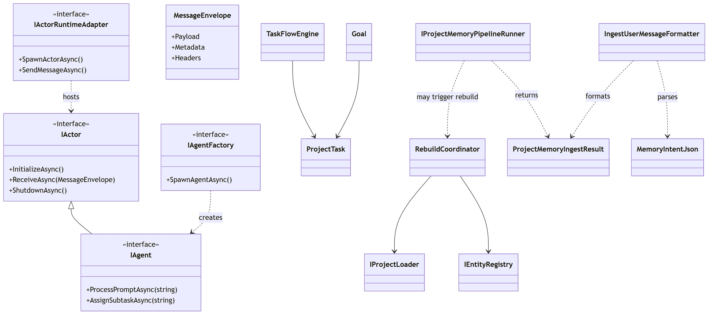

# Class Diagram

[Edit source](./class-diagram.mmd)

## Overview

UML class diagram for AgctorSDK.Core showing all core interfaces, their relationships, and key implementations.

## Inheritance

- **IActor** → **IAgent**: Agent extends actor with prompt processing
- **ITimeoutSupervisor** extends **IActor**: Timeout supervisor is itself an actor
- **IMessageEnvelope** → **MessageEnvelope**: MCP-compliant message wrapper

## Key Interface Groups

- **Actor Model**: IActor, IAgent, IAgentFactory, IAgentRegistry, IActorRuntimeAdapter
- **Messaging**: IMessageEnvelope, MessageEnvelope
- **Tasks**: ITaskStore, ITaskExecutor, TaskFlowEngine, ProjectTask
- **Goals**: IGoalStore, Goal
- **Project memory**: IProjectMemoryPipelineRunner, ProjectMemoryIngestResult, MemoryIntentJson, **IngestUserMessageFormatter** (playground/API ingest summaries)
- **Timeout**: ITimeoutSupervisor, ITimeoutPolicy
- **Observability**: IMetricsCollector, IActivityTracker, IVisualizationService
- **Code Generation**: ICodeGenerator
- **Events**: IEventStore
- **Git**: IGitService
