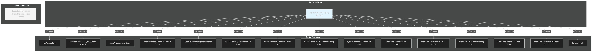

# Dependencies Diagram

[Edit source](./dependencies-diagram.mmd)

## Overview

AgctorSDK.Core is the foundation library with no project references. All other projects depend on it.

## NuGet Packages

| Package | Version | Purpose |
|---------|---------|---------|
| IronPython | 3.4.1 | Python code execution |
| Microsoft.CodeAnalysis.CSharp | 4.14.0 | C# code generation and compilation |
| OpenTelemetry.Api | 1.6.0 | Tracing and metrics API |
| OpenTelemetry.Exporter.Console | 1.6.0 | Console trace exporter |
| OpenTelemetry.Exporter.Jaeger | 1.5.1 | Jaeger trace exporter |
| OpenTelemetry.Exporter.OTLP | 1.6.0 | OTLP trace exporter |
| OpenTelemetry.Exporter.Zipkin | 1.6.0 | Zipkin trace exporter |
| OpenTelemetry.Extensions.Hosting | 1.6.0 | Hosting integration |
| System.Threading.Channels | 8.0.0 | Async message channels |
| Microsoft.Extensions.DependencyInjection | 8.0.0 | DI container |
| Microsoft.Extensions.Hosting | 8.0.0 | Hosting abstractions |
| Microsoft.Extensions.Logging | 8.0.0 | Logging infrastructure |
| Microsoft.Extensions.Http | 8.0.0 | HTTP client factory |
| Microsoft.Extensions.Options | 8.0.0 | Options pattern |
| Scrutor | 4.2.2 | DI service decoration |

## Project References
None — this is the foundation library that all other AgctorSDK projects depend on.
