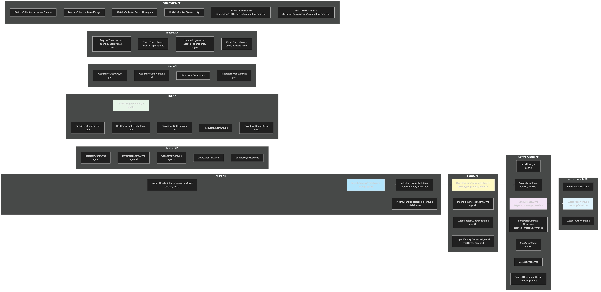

# Endpoints Diagram

[Edit source](./endpoints-diagram.mmd)

## Overview

API surface of AgctorSDK.Core organized by interface group. These are not HTTP endpoints but programmatic interfaces that all other projects consume.

## API Groups

### Actor Lifecycle
- `InitializeAsync` / `ReceiveAsync` / `ShutdownAsync`

### Agent Operations
- `ProcessPromptAsync` / `AssignSubtaskAsync` / `HandleSubtaskCompletionAsync` / `HandleSubtaskFailureAsync`

### Factory
- `SpawnAgentAsync` / `StopAgentAsync` / `GetAgentAsync` / `GenerateAgentId`

### Runtime Adapter
- `InitializeAsync` / `SpawnActorAsync` / `SendMessageAsync` / `StopActorAsync` / `GetStatisticsAsync` / `RequestHumanInputAsync`

### Registry
- `RegisterAgentAsync` / `UnregisterAgentAsync` / `GetAgentByIdAsync` / `GetAllAgentIdsAsync` / `GetRootAgentIdsAsync`

### Task Management
- `ITaskStore` CRUD + `ITaskExecutor.ExecuteAsync` + `TaskFlowEngine.RunAsync`

### Goal Management
- `IGoalStore` CRUD operations

### Timeout Supervision
- `RegisterTimeoutAsync` / `CancelTimeoutAsync` / `UpdateProgressAsync` / `CheckTimeoutAsync`

### Observability
- Metrics: `IncrementCounter` / `RecordGauge` / `RecordHistogram`
- Tracing: `StartActivity` / `PropagateContext` / `ExtractContext`
- Visualization: `GenerateAgentHierarchyMermaidDiagramAsync` / `GenerateMessageFlowMermaidDiagramAsync`
