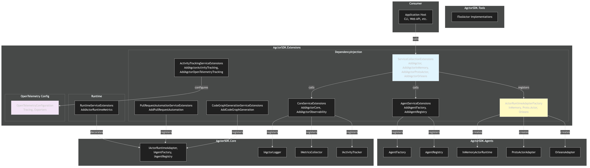

# Architecture Diagram

[Edit source](./architecture-diagram.mmd)

## Overview

AgctorSDK.Extensions provides DI extension methods for registering all Agctor services, configuring runtime adapters, and setting up observability.

## Key Components

### DI Extensions
- **ServiceCollectionExtensions**: Main entry point (`AddAgctor`, `AddAgctorInMemory`, `AddAgctorProtoActor`, `AddAgctorOrleans`)
- **CoreServiceExtensions**: Core services (logging, metrics, activity tracking)
- **AgentServiceExtensions**: Agent factory and registry registration
- **ActivityTrackingServiceExtensions**: OpenTelemetry and logger-based tracking
- **CodeGraphGenerationServiceExtensions**: CodeGraph task executor
- **PullRequestAutomationServiceExtensions**: PR automation with Git service

### Runtime Factory
- **ActorRuntimeAdapterFactory**: Creates runtime adapters by name (InMemory, Proto.Actor, Orleans)

### OpenTelemetry
- **OpenTelemetryConfiguration**: Configures tracing with Console, Zipkin, OTLP, Jaeger exporters
