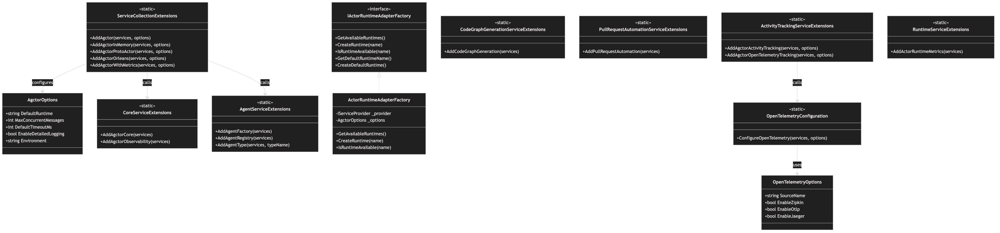

# Class Diagram

[Edit source](./class-diagram.mmd)

## Overview

Static extension method classes for DI registration and the runtime adapter factory.

## Key Classes
- **ServiceCollectionExtensions**: Main entry point for all `AddAgctor*` methods
- **ActorRuntimeAdapterFactory**: Creates runtime adapters by name
- **AgctorOptions / OpenTelemetryOptions**: Configuration options
- **OpenTelemetryConfiguration**: Configures tracing exporters
