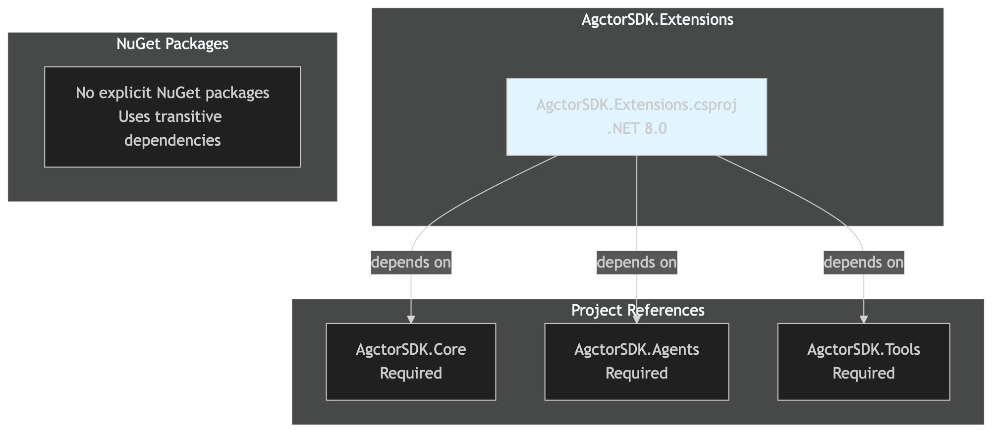

# Dependencies Diagram

[Edit source](./dependencies-diagram.mmd)

## Overview

AgctorSDK.Extensions bridges Core, Agents, and Tools via DI registration.

## Project References
- **AgctorSDK.Core**: Core interfaces, options, logging
- **AgctorSDK.Agents**: Agent/factory/registry implementations, runtime adapters
- **AgctorSDK.Tools**: Tool actor implementations

## NuGet Packages
No explicit NuGet packages — relies on transitive dependencies from referenced projects.
