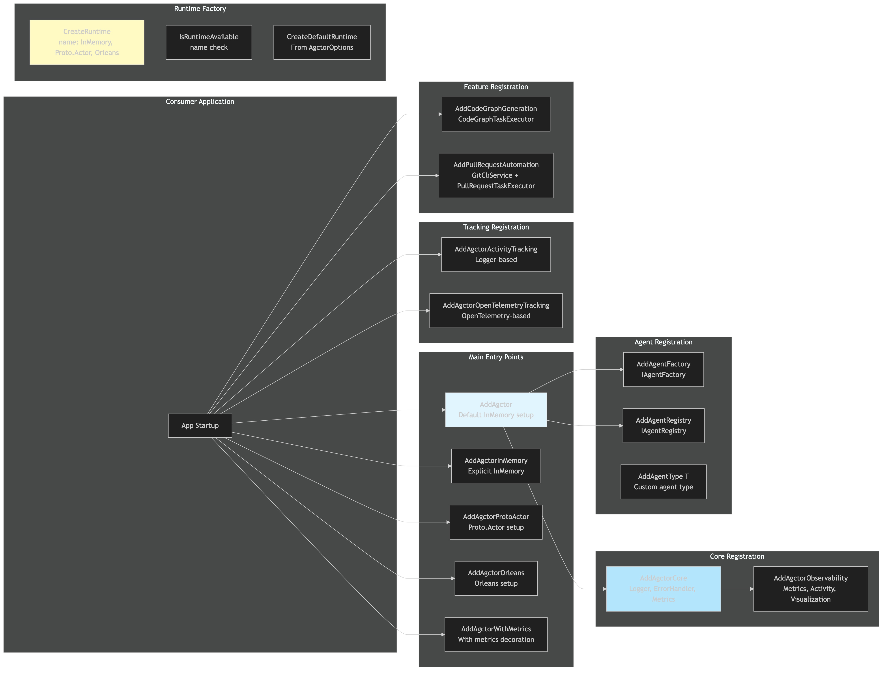

# Endpoints Diagram

[Edit source](./endpoints-diagram.mmd)

## Overview

DI extension methods available to consumers for configuring the Agctor framework.

## Main Entry Points
- `AddAgctor(options)` — Default setup with InMemory runtime
- `AddAgctorInMemory(options)` — Explicit InMemory
- `AddAgctorProtoActor(options)` — Proto.Actor runtime
- `AddAgctorOrleans(options)` — Orleans runtime
- `AddAgctorWithMetrics(options)` — With metrics decoration

## Feature Extensions
- `AddCodeGraphGeneration()` — Register CodeGraphTaskExecutor
- `AddPullRequestAutomation()` — Register GitCliService + PullRequestTaskExecutor
- `AddAgctorActivityTracking()` — Logger-based activity tracking
- `AddAgctorOpenTelemetryTracking()` — OpenTelemetry tracing
