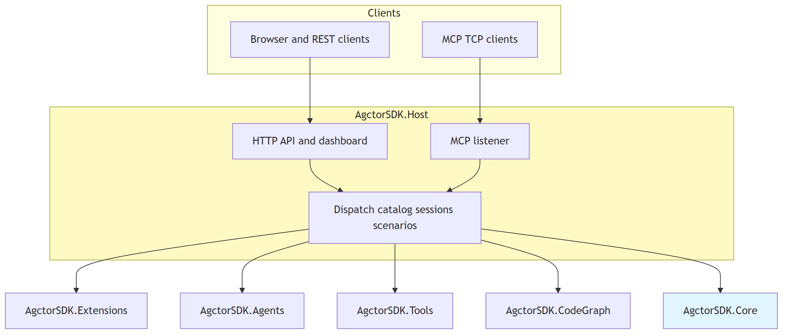
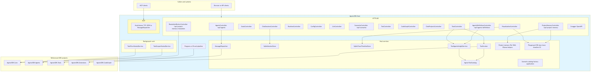

# Architecture Diagram

## Component overview (high level)

[Edit overview source](./component-architecture-diagram.mmd)

## Detailed architecture

[Edit source](./architecture-diagram.mmd)

## Overview

AgctorSDK.Host is the HTTP and MCP gateway for the AGCTOR runtime.

## Key Components

### HTTP API Controllers
- **AgentsController** (`/api/agents`): Agent CRUD, messaging, streaming, health, type enablement
- **AgentsDefinitionsController** (`/api/agents/definitions`): Unified catalog, project-memory YAML CRUD, and **`GET …/tool-usage`** for dashboard agent→tool insight
- **GoalsController**, **ToolsController** (`/api/tools` including **`GET …/agent-associations`**), **RuntimeController**, **RagProvidersController** (PRD-025), **TerminalController**, **ConfigController**, **LlmController**
- **ScenariosController** (`/api/scenarios`), **TestController** (`/api/test`)
- **CodeGraphController**, **VisualizationController**
- **ChatProjectsController**, **ChatSessionsController**
- **ProjectMemoryController** (`/api/project-memory`), **ResolutionReviewController** (`/api/project-memory/resolution`)

### Project Memory Playground and trace timeline

- **`POST /api/project-memory/playground/message/stream`**: SSE turn runner for scenario flows (router → persona LLM nodes → merge/output). After **person-extractor** ingest, the final assistant text uses **`IngestUserMessageFormatter`** (Core) when only extract/curator personas ran—listing saved facts by person instead of bare curator prose.
- **`TraceTimelineViewComponent`** (`Pages/Shared/Components/TraceTimeline/`): Gantt chart + event cards loaded from **`GET /api/Visualization/trace/{traceId}/timeline`**. Tools and actor receive steps **nest under parent LLM/agent runs** (tree connector + emerald tool strip). Span metadata comes from **`TraceTimelineEventMapper`** and optional `timelineDetailJson` (including `agctor.tool.invoke` for tool drill-down).
- **Activity nesting**: Context tools invoked inside the **`pm.playground.persona-llm`** activity scope so trace `parentId` links tools to the agent run that used them.

### MCP Protocol
- **McpListener**: TCP server on `Mcp:Port` (default **8080**, configurable including `0` for ephemeral) routing JSON messages through **MessageDispatcher**

### Services
- **MessageDispatcher**: Routes envelopes to agents via `IActorRuntimeAdapter`
- **SqliteSessionStore** / **SqliteTraceTimelineStore**: Durable chat and trace timelines
- **AgctorToolCatalog**: Single registry of `IToolActor` types, HTTP tool ids, and **`ToolInfo`** discovery (name, description, parameters) used by **ToolInvoker** and insight APIs
- **ToolInvoker**: Direct tool execution path used by HTTP/MCP (resolves tools via the catalog)
- **ToolAgentsInsightService** (`IToolAgentsInsightService`): Merged **tool↔agent** / **agent↔tool** views from **AgctorToolCatalog** (Extensions), `IAgentFactory` registration, project-memory YAML `tools.allow`, and C# affinity hints
- **Scenario** types: catalog, factory, application service, and current-scenario store for demos and dashboard

### RAG providers (PRD-025)

- **`RagProvidersController`** (`/api/rag-providers`): catalog, settings persistence, health, test query, Docker sidecar lifecycle (mirrors **RuntimeController** patterns).
- **`RagProvidersDashboardService`**: shared read/write for API + Razor ViewComponent.
- **`RagContextService`** (Core): queries `IRagProviderAdapter` and formats prompt appendices; used by **`PersonMemoryMarkdownContextBuilder`** when `contextStrategy` is `rag` or `graph_rag`.
- **`IRagProviderDockerService`**: `docker compose` CLI for `docker/rag-providers/docker-compose.yml` (`lightrag`, `cognee-mcp`).
- **Dashboard**: `/Dashboard/RagProviders` + `rag-providers-dashboard.js`; Scenarios flow editor links to configured default provider.

See [rag-providers.md](./rag-providers.md).

### Background services

`TaskScoperHostedService` and `TaskFlowHostedService` are **defined in `AgctorSDK.Extensions`** (`IHostedService` implementations). The Host registers them as **singletons** and starts them from **`Program.cs` `ApplicationStarted`** (rather than `AddHostedService`) so HTTP and Swagger come up before the loops bind ports.

- **TaskScoperHostedService**: Converts goals to task DAGs (default scan interval **30s**, `TaskScoper:ScanInterval`)
- **TaskFlowHostedService**: Executes ready tasks (default interval **10s**, `TaskFlow:Interval`)

### Scenarios
- **CodeGenerationChainScenario**: LLM + CodeExecutor demo
- **CodeGraphDemoScenario**: CodeGraph pipeline with indexing, embedding coordination, search, and refactoring
