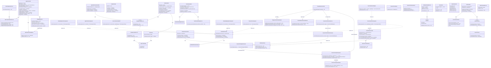

# Class Diagram

[Edit source](./class-diagram.mmd)

## Overview

Controllers, services, and background workers in the Host project.

## Controllers
- **AgentsController**: Agent CRUD + messaging via MessageDispatcher; agent-type enablement via IAgentTypeEnablementService (PRD-010)
- **AgentsDefinitionsController**: Unified definitions catalog, YAML CRUD, and **`GET /api/agents/definitions/tool-usage`** for dashboard agent→tool insight
- **GoalsController**: Goal CRUD via IGoalStore
- **ToolsController**: Tool invocation via ToolInvoker; **`GET /api/tools/agent-associations`** for dashboard tool→agent insight
- **TestController**: Scenario setup via IScenarioFactory; optional scenario name from IConfiguration (PRD-010)
- **CodeGraphController**: CodeGraph status, embeddings, and file preview
- **RuntimeController**: `GET`/`PUT /api/runtime` — live adapter + catalog; Tier A persistence via IUserRuntimeSettingsService (PRD-012)

## Services
- **MessageDispatcher**: Routes messages through actor runtime
- **ToolInvoker**: Direct tool execution; resolves tools via **AgctorToolCatalog**
- **ToolAgentsInsightService** (`IToolAgentsInsightService`): Builds tool↔agent and agent↔tool dashboard payloads from catalog + YAML + C# hints
- **ScenarioFactory**: Creates test scenarios
- **CurrentScenarioStore**: Persists the selected scenario for the dashboard session
- **HostConfigurationService**: Aggregates `GET /api/Config` including dashboard scenario name and per-type enablement (PRD-010)
- **AgentTypeEnablementService**: Reads/writes `appsettings.User.json` for `Agctor:AgentTypeEnablement`; stops agents when disabled (PRD-010)
- **UserRuntimeSettingsService**: Writes `Agctor:DefaultRuntime` and optional Proto keys to `appsettings.User.json` (PRD-012)

## Background Services
- **TaskScoperHostedService**: Goal-to-task decomposition
- **TaskFlowHostedService**: Task DAG execution

## Dashboard Razor ViewComponents (PRD-007 / CodeGraph)

Razor **ViewComponents** under `ViewComponents/` render the CodeGraph dashboard panels invoked from `Pages/Dashboard/CodeGraph.cshtml`:

- **EmbeddingStoreViewComponent**, **AgentChatViewComponent**, **ActorTreeViewComponent** (includes file preview modal markup), **TraceTimelineViewComponent**, **EmbeddingDebugViewComponent**, **RawJsonViewComponent**

The **Project Memory Playground** page (`/Dashboard/ProjectMemory/Playground`) reuses **TraceTimelineViewComponent** and loads timelines via **VisualizationController**. UI logic in **`TraceTimeline/Default.cshtml`** nests tool spans under agent runs; **`TraceTimelineEventMapper`** adds `eventKind`, `status`, and `parentId` for the tree.

Playground orchestration types under **`Services/ProjectMemory/`** and **`Services/Scenarios/`**:

- **ProjectMemoryController** — SSE playground stream, ingest side-effects, **`IngestUserMessageFormatter`** final reply when extract-only
- **ScenarioFlowGraphInterpreter** / **ScenarioFlowOutputComposer** — scenario graph execution and merge policies
- **ScenarioFlowExecutionService** / **ScenarioFlowRuntimeOrchestrator** — PRD-024 v2 flows via **ScenarioFlowRuntimeActor** (suspend, loopBack, domain events)
- **ScenarioFlowValidator** — catalog save validation including v2 node types and loop regions
- **PlaygroundTraceTimelineDetail** — structured `timelineDetailJson` for persona, ingest, persist, and tool spans
- **ProjectMemoryPersonaLlmRunner** — prompt envelope and ingest footer helpers

Client orchestration for the page lives in **`wwwroot/js/dashboard/project-memory-playground.js`**.

The **Agents** dashboard page uses **`wwwroot/js/dashboard/agents-page.js`** (PRD-010): loads **`/api/agents/definitions/tool-usage`** for the tool-access card grid, runtime chips, definitions column, and C# drawer.

The **Tools** dashboard page uses **`wwwroot/js/dashboard/tools-page.js`**: loads **`/api/tools/agent-associations`** for the tool list and per-tool agent table.

The **Actor runtime** dashboard page uses **`wwwroot/js/dashboard/actor-runtime-page.js`** (PRD-012).
