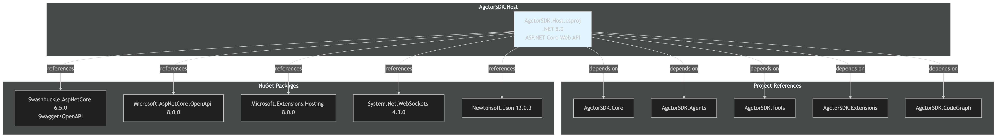

# Dependencies Diagram

[Edit source](./dependencies-diagram.mmd)

## Overview

AgctorSDK.Host references all other Agctor projects and serves as the main application host.

## Project References
- **AgctorSDK.Core**: Core interfaces and models
- **AgctorSDK.Agents**: Agent implementations and runtime adapters
- **AgctorSDK.Tools**: Tool actor implementations
- **AgctorSDK.Extensions**: DI registration extensions
- **AgctorSDK.CodeGraph**: Code graph analysis agents

## NuGet Packages
| Package | Version | Purpose |
|---------|---------|---------|
| Swashbuckle.AspNetCore | 6.5.0 | Swagger/OpenAPI UI |
| Microsoft.AspNetCore.OpenApi | 8.0.0 | OpenAPI support |
| Microsoft.Extensions.Hosting | 8.0.0 | Background services |
| System.Net.WebSockets | 4.3.0 | WebSocket support |
| Newtonsoft.Json | 13.0.3 | JSON serialization |
