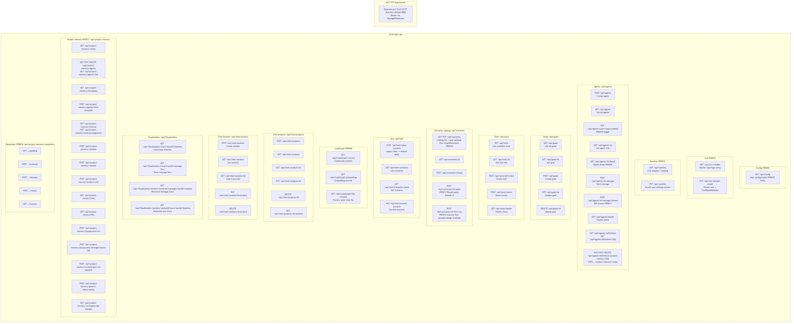

# Endpoints Diagram

[Edit source](./endpoints-diagram.mmd)

## Overview

HTTP REST API endpoints and MCP TCP protocol exposed by AgctorSDK.Host.

**Dashboard tool insight:** the **Tools** page (`/Dashboard/Tools`) and **Agents** page (`/Dashboard/Agents`) load **`GET /api/tools/agent-associations`** and **`GET /api/agents/definitions/tool-usage`** respectively — same underlying merge of `AgctorToolCatalog`, registered tool actors, project-memory YAML `tools.allow`, and C# routing hints (not runtime invocation traces).

## REST API Endpoints

### Config – Dashboard (PRD-006 / PRD-010)
| Method | Path | Description |
|--------|------|-------------|
| GET | `/api/Config` | Get full Host configuration (runtime, LLM, MCP, tools, scenarios, agent types, **dashboard scenario name**, **per-type enablement**) |

### LLM / Ollama – Dashboard (PRD-015)
| Method | Path | Description |
|--------|------|-------------|
| GET | `/api/Llm/models` | List local models (proxies Ollama `GET /api/tags` using configured base URL) |
| PUT | `/api/Llm/default-model` | Body `{ "model": "<name>" }` — merge `Agctor:LLM:DefaultModel` into `appsettings.User.json` and apply via `LLMAgent.ConfigureDefaults` |

### Runtime – Dashboard (PRD-012)
| Method | Path | Description |
|--------|------|-------------|
| GET | `/api/runtime` | Live `IActorRuntimeAdapter` (canonical id, stats), configured next-boot values, catalog with capabilities |
| PUT | `/api/runtime` | Body `{ "defaultRuntime", "protoHost?", "protoPort?" }` — merge into `appsettings.User.json`; **`requiresRestart: true`** |

### RAG providers – Dashboard (PRD-025)
| Method | Path | Description |
|--------|------|-------------|
| GET | `/api/rag-providers` | Current provider, configured `Agctor:Rag`, catalog |
| GET | `/api/rag-providers/health` | Provider + Docker sidecar health |
| PUT | `/api/rag-providers` | Persist default provider and LightRAG/Graphiti/Cognee settings to `appsettings.User.json` |
| POST | `/api/rag-providers/query` | Test retrieval (dashboard “Test query” panel) |
| GET | `/api/rag-providers/docker/{providerId}` | Docker sidecar status |
| POST | `/api/rag-providers/docker/{providerId}/install` | Pull sidecar image |
| POST | `/api/rag-providers/docker/{providerId}/start` | Start sidecar |
| POST | `/api/rag-providers/docker/{providerId}/stop` | Stop sidecar |

See [rag-providers.md](./rag-providers.md) for architecture and Project Memory `contextStrategy` wiring.

### Terminal – Dashboard (PRD-012 / PRD-025)
| Method | Path | Description |
|--------|------|-------------|
| GET | `/api/terminal/presets` | Preset docker compose commands (`contextType`: `actor-runtime` \| `rag-provider`) |
| POST | `/api/terminal/run` | Run validated `docker compose` from repo root |

### Agents (`/api/agents`)
| Method | Path | Description |
|--------|------|-------------|
| POST | `/api/agents` | Create new agent |
| GET | `/api/agents` | List all agents |
| PUT | `/api/agents/types/{typeName}/enabled` | Body `{ "enabled": bool }` — persist toggle; stop instances when disabled (PRD-010) |
| GET | `/api/agents/{id}` | Get agent info |
| GET | `/api/agents/{id}/detail` | Get agent info + type-specific detail (PRD-006) |
| POST | `/api/agents/{id}/message` | Send message to agent |
| POST | `/api/agents/{id}/message/stream` | SSE: stream LLM deltas + final `done` (PRD-011) |
| GET | `/api/agents/health` | Health check |

### Agent definitions (`/api/agents/definitions`) — PRD-013
| Method | Path | Description |
|--------|------|-------------|
| GET | `/api/agents/definitions` | Unified catalog: registered C# agent types + project-memory YAML specs |
| GET | `/api/agents/definitions/tool-usage` | **Dashboard / Agents:** dynamic view of host tools each agent may use (YAML `tools.allow` + known C# routing); complements `GET /api/tools/agent-associations` |
| GET | `/api/agents/definitions/{id}` | Detail for a type name or YAML spec id |
| POST | `/api/agents/definitions/project-memory` | Create new `*.agent.yaml` (body `SaveAgentRequestDto`) |
| PUT | `/api/agents/definitions/project-memory/{id}` | Update YAML on disk |
| DELETE | `/api/agents/definitions/project-memory/{id}` | Delete backing YAML |

### Goals (`/api/goals`)
| Method | Path | Description |
|--------|------|-------------|
| GET | `/api/goals` | List all goals |
| GET | `/api/goals/{id}` | Get goal by ID |
| POST | `/api/goals` | Create goal |
| PUT | `/api/goals/{id}` | Update goal |
| DELETE | `/api/goals/{id}` | Delete goal |

### Tools (`/api/tools`)
| Method | Path | Description |
|--------|------|-------------|
| GET | `/api/tools` | List available tools |
| GET | `/api/tools/agent-associations` | **Dashboard / Tools:** dynamic tool list, per-tool agent associations, unmapped YAML allow tokens |
| GET | `/api/tools/{id}` | Get tool info |
| POST | `/api/tools/{id}/invoke` | Invoke tool |
| POST | `/api/tools/batch` | Batch invoke tools |
| GET | `/api/tools/health` | Health check |

### Scenarios catalog (`/api/scenarios`)
| Method | Path | Description |
|--------|------|-------------|
| GET | `/api/scenarios` | List merged scenario catalog (optional `flow` GraphDocument per scenario, PRD-014) |
| GET | `/api/scenarios/{id}` | Get one scenario |
| PUT | `/api/scenarios` | Save user catalog; validates flow |
| POST | `/api/scenarios/reload` | Reload catalog from disk |
| POST | `/api/scenarios/{id}/apply` | Apply scenario (spawn/configure per kind) |
| POST | `/api/scenarios/{id}/flow/run` | Execute `flow` (sequential + parallel→Merge); `LlmNode` uses project-memory YAML + Ollama; optional `llmNodeTimeoutSeconds` (default 180) |

### Test (`/api/test`)
| Method | Path | Description |
|--------|------|-------------|
| POST | `/api/test/setup-scenario` | Setup test scenario; body may omit `scenarioName` to use `Agctor:Dashboard:ScenarioName` |
| GET | `/api/test/scenarios` | List available scenarios |
| GET | `/api/test/scenarios/{name}` | Get scenario info |
| GET | `/api/test/current-scenario` | Get the current dashboard scenario |

### CodeGraph – Dashboard (PRD-006)
| Method | Path | Description |
|--------|------|-------------|
| GET | `/api/CodeGraph/current` | Get current CodeGraph context (actor tree + embedding summary) when code-graph-demo is active; 404 otherwise |
| GET | `/api/CodeGraph/embeddings` | Get embedding records for debugging and visualization |
| GET | `/api/CodeGraph/file-content?path=...` | Preview file content for a file in the active actor tree |

### Chat projects (`/api/chat/projects`)
| Method | Path | Description |
|--------|------|-------------|
| POST | `/api/chat/projects` | Create a chat project (`name`, `projectType`, optional `projectId`) |
| GET | `/api/chat/projects` | List projects (newest update first) |
| GET | `/api/chat/projects/{id}` | Get one project |
| PUT | `/api/chat/projects/{id}` | Update name and/or project type |
| DELETE | `/api/chat/projects/{id}` | Delete project (sessions become standalone) |
| GET | `/api/chat/projects/{id}/sessions` | List sessions in this project |

### Chat Sessions (`/api/chat/sessions`)
| Method | Path | Description |
|--------|------|-------------|
| POST | `/api/chat/sessions` | Create a chat session (optional `projectId` to create inside a project) |
| GET | `/api/chat/sessions` | List sessions: optional `projectId=` or `standalone=true` |
| GET | `/api/chat/sessions/{id}` | Load session transcript (metadata + turns + summary) |
| PUT | `/api/chat/sessions/{id}/project` | Assign session to a project (body: `{ "projectId" }`) |
| DELETE | `/api/chat/sessions/{id}/project` | Remove session from project (standalone) |

### Project memory (`/api/project-memory`) — PRD-013
| Method | Path | Description |
|--------|------|-------------|
| GET | `/api/project-memory/status` | Project root, load summary, agent count |
| GET | `/api/project-memory/agents` | List portable agent specs |
| GET | `/api/project-memory/agents/{id}` | One spec + YAML preview |
| PUT | `/api/project-memory/agents/{id}` | Save agent YAML |
| DELETE | `/api/project-memory/agents/{id}` | Delete agent file |
| GET | `/api/project-memory/templates` | Built-in agent templates |
| POST | `/api/project-memory/agents/from-template` | Create agent from template |
| GET | `/api/project-memory/schema` | Schema bundle (YAML per segment) |
| PUT | `/api/project-memory/schema/{segment}` | Save one schema segment |
| POST | `/api/project-memory/validate` | Validate project (no full rebuild) |
| POST | `/api/project-memory/rebuild` | Full rebuild |
| POST | `/api/project-memory/project-root` | Persist `Agctor:ProjectMemory:ProjectRoot` |
| GET | `/api/project-memory/tree` | Project directory tree (JSON) |
| GET | `/api/project-memory/file?path=` | Preview file under project root |
| POST | `/api/project-memory/playground/run` | One-shot LLM test (optional `sessionId` for transcript context) |
| POST | `/api/project-memory/playground/message/stream` | SSE chat turn; scenario flow or single-agent path; persists user/assistant to chat session store. On extract-only flows, **`done.responseData`** uses **`IngestUserMessageFormatter`** (grouped facts + updated paths). Emits `flow_plan`, `flow_step`, `phase`, `llm_delta`, `done`. |
| POST | `/api/project-memory/orchestrator/run` | Pipeline: extract → route/write → optional query (`mode`: auto, ingestOnly, queryOnly) |
| POST | `/api/project-memory/generic-inbox/replay` | Replay generic inbox / routing (debug and recovery) |
| GET | `/api/project-memory/workspace/git-changes` | Git working-tree summary for the configured project root |

### Visualization trace timeline (`/api/Visualization`)

| Method | Path | Description |
|--------|------|-------------|
| GET | `/api/Visualization/trace/{traceId}/timeline` | **`TraceTimelineResponse`**: ordered **`TraceTimelineEventDto`** rows with `parentId`, `depth`, `eventKind` (`tool`, `llm`, `ingest`, …), `status`, and optional `timelineDetailJson` (LLM I/O, ingest paths, **`agctor.tool.invoke`**). Consumed by **`TraceTimeline`** view component (nested agent/tool UI). |
| GET | `/api/Visualization/trace/{traceId}/message-flow` | Message-flow graph for a trace |
| GET | `/api/Visualization/sessions/{sessionId}/messages/{turnId}/timeline` | Timeline for a historical message |
| GET | `/api/Visualization/sessions/{sessionId}/turns/{turnId}/timeline` | Timeline for a historical turn |

### Entity resolution review (`/api/project-memory/resolution`) — PRD-018
| Method | Path | Description |
|--------|------|-------------|
| GET | `/api/project-memory/resolution/pending` | Pending merge candidates for human review |
| POST | `/api/project-memory/resolution/promote` | Accept / promote a candidate |
| POST | `/api/project-memory/resolution/demote` | Demote a candidate |
| POST | `/api/project-memory/resolution/reject` | Reject a candidate |
| GET | `/api/project-memory/resolution/metrics` | Lightweight resolution metrics snapshot |

## Dashboard (Razor Pages)
- **GET /Dashboard** – Host configuration overview
- **GET /Dashboard/Agents** – Unified agent-type table, **live tool access by agent** (`/api/agents/definitions/tool-usage`), definitions, scenario apply (PRD-010 / PRD-013)
- **GET /Dashboard/Tools** – **Tools** tab: host tool catalog with **which agents use each tool** (`/api/tools/agent-associations`), tool descriptions from `AgctorToolCatalog`
- **GET /Dashboard/AgentDetail/{id}** – Agent detail with type-specific view
- **GET /Dashboard/CodeGraph** – CodeGraph actor tree and embedding summary
- **GET /Dashboard/ActorRuntime** – Actor runtime selection, Docker sidecars (PRD-012)
- **GET /Dashboard/RagProviders** – External RAG providers: LightRAG, Graphiti, Cognee, test query (PRD-025)
- **GET /Dashboard/ProjectMemory** – Project memory overview (PRD-013)
- **GET /Dashboard/ProjectMemory/Agents** – Portable agent list
- **GET /Dashboard/ProjectMemory/Agents/Edit** – Agent editor (`?id=` optional)
- **GET /Dashboard/ProjectMemory/Templates** – Template gallery + wizard
- **GET /Dashboard/ProjectMemory/Playground** – Chat transcript + streaming LLM tests for agent specs
- **GET /Dashboard/ProjectMemory/Schema** – Schema studio (YAML tabs)
- **GET /Dashboard/ProjectMemory/Workspace** – Tree + file preview
- **GET /Dashboard/ProjectMemory/Projects** – Manage chat projects and move sessions
- **GET /Dashboard/ProjectMemory/Maintenance** – Project root, validate, rebuild

## MCP Protocol
- **TCP** (`McpListener`): bind address `Mcp:Host` (default `0.0.0.0`) and port `Mcp:Port` (default **8080**; `0` picks an ephemeral port). Newline-delimited JSON messages route through **MessageDispatcher** to agents.

## Swagger
- **GET /swagger**: OpenAPI UI for API exploration
