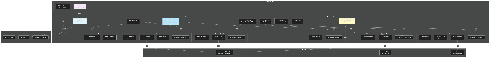

# Architecture Diagram

[Edit source](./architecture-diagram.mmd)

## Overview

AgctorSDK.Tools provides tool actors for code editing, execution, compilation, formatting, and testing with language-specific implementations.

## Key Components

### Tool Actors
- **CodeEditorTool**: File operations (WriteFile, InsertIntoFile, ReplaceInFile, ApplyPatch)
- **CodeExecutorTool**: Code execution (RunCode, RunFile)
- **CompileTool**: Compilation (CompileCode, CompileFile)
- **FormatTool**: Code formatting
- **TestRunnerTool**: Test execution (RunTests)
- **FileSystemTool**: Basic file system operations

### Language Services (Factory Pattern)
- **Language Adapters**: AST-based code manipulation (CSharpLanguageAdapter via Roslyn)
- **Code Formatters**: CSharpFormatter (Roslyn), PythonFormatter (black)
- **Language Compilers**: CSharpCompiler (Roslyn in-memory)
- **Language Executors**: CSharpExecutor (Roslyn), PythonExecutor (IronPython)
- **Language Test Runners**: CSharpTestRunner (dotnet test CLI)

### Decorators
- **TracedToolActor**: Adds activity tracking to tool actors
- **MetricsEnabledActor**: Adds metrics collection

## Design Patterns
- **Factory Pattern**: All language services use factories for registration and retrieval
- **Strategy Pattern**: Language-specific implementations via interfaces
- **Decorator Pattern**: TracedToolActor, MetricsEnabledActor add cross-cutting concerns
- **Adapter Pattern**: IFileSystem abstracts file operations for testability
