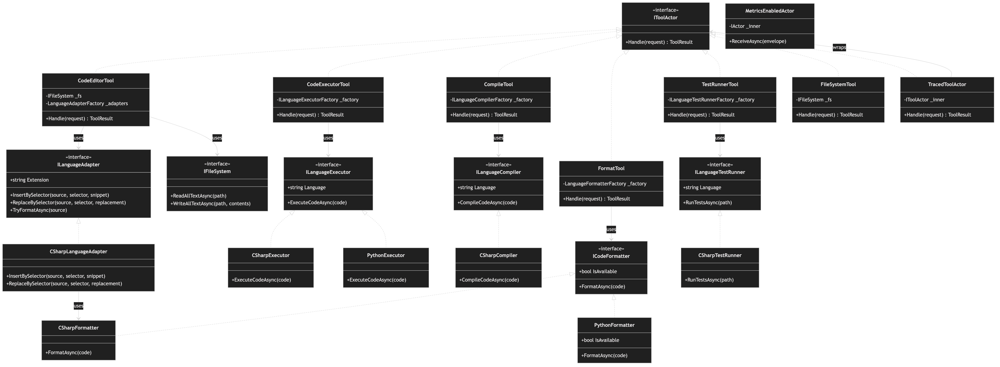

# Class Diagram

[Edit source](./class-diagram.mmd)

## Overview

UML class diagram showing tool actors, language service interfaces, and their implementations.

## Tool Actors
All implement `IToolActor` and accept `ToolRequest`, returning `ToolResult`.

## Language Service Hierarchy
- **ILanguageAdapter** → CSharpLanguageAdapter
- **ICodeFormatter** → CSharpFormatter, PythonFormatter
- **ILanguageCompiler** → CSharpCompiler
- **ILanguageExecutor** → CSharpExecutor, PythonExecutor
- **ILanguageTestRunner** → CSharpTestRunner

## Decorators
- **TracedToolActor**: Wraps IToolActor with activity tracking
- **MetricsEnabledActor**: Wraps IActor with metrics
