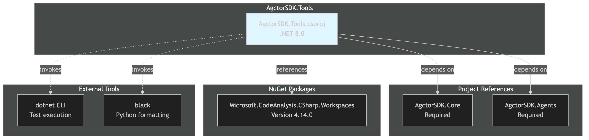

# Dependencies Diagram

[Edit source](./dependencies-diagram.mmd)

## Overview

AgctorSDK.Tools dependencies.

## Project References
- **AgctorSDK.Core**: Core interfaces and models
- **AgctorSDK.Agents**: Agent base class, runtime adapters

## NuGet Packages
- **Microsoft.CodeAnalysis.CSharp.Workspaces** (v4.14.0): Roslyn for C# parsing, compilation, and formatting

## External Tools (Runtime)
- **dotnet CLI**: Used by CSharpTestRunner for test execution
- **black**: Used by PythonFormatter (optional, checked at runtime)
