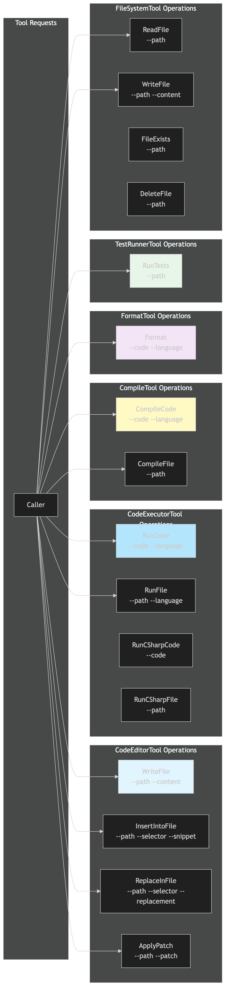

# Endpoints Diagram

[Edit source](./endpoints-diagram.mmd)

## Overview

Tool operations available via `IToolActor.Handle(ToolRequest)`. Each tool supports named operations with parameters.

## CodeEditorTool
- `WriteFile --path --content` — Write content to file
- `InsertIntoFile --path --selector --snippet` — AST-based insertion
- `ReplaceInFile --path --selector --replacement` — AST-based replacement
- `ApplyPatch --path --patch` — Apply unified diff patch

## CodeExecutorTool
- `RunCode --code --language` — Execute inline code
- `RunFile --path --language` — Execute code from file
- `RunCSharpCode --code` / `RunCSharpFile --path` — C# shortcuts

## CompileTool
- `CompileCode --code --language` — Compile inline code
- `CompileFile --path` — Compile from file

## FormatTool
- `Format --code --language` — Format source code

## TestRunnerTool
- `RunTests --path` — Run tests (.csproj or .sln)

## FileSystemTool
- `ReadFile` / `WriteFile` / `FileExists` / `DeleteFile`
