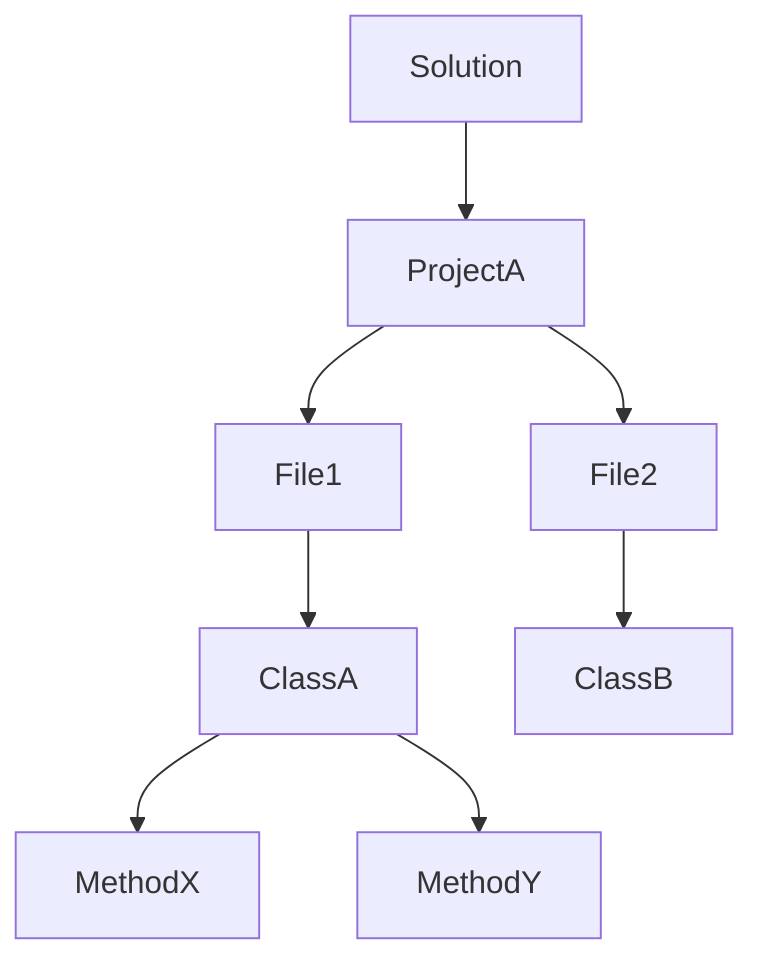
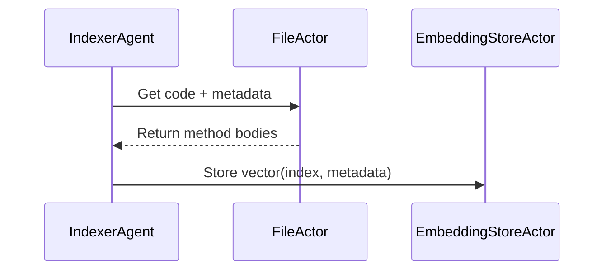

# AGCTOR Code Understanding Subsystem (PRD)

## Overview

This document defines the Product Requirements for the **Code Understanding Subsystem** of the AGCTOR framework. This subsystem is designed to support:

1. **Self-improving agents** that need to reason over, test, and modify code.
2. **Agentic IDE assistants** that interactively help users with code comprehension, navigation, and transformation.
3. **Multi-language compatibility** with pluggable analyzers and fallback LLM-based understanding for unsupported languages.

The system relies heavily on a hybrid approach:
- **Actor-based model** of code structure for persistent, concurrent, stateful reasoning.
- **Optional vector-based retrieval** to support fuzzy and semantic matching.

---

## Components

### 1. Actor Hierarchy (CodeGraph)

The entire codebase is represented as a graph of actors:

```
SolutionActor
├── ProjectActor(s)
│   ├── FileActor(s)
│   │   ├── ClassActor(s)
│   │   │   └── MethodActor(s)
```

Each actor stores its own local AST fragment (when supported) and metadata.

**Responsibilities:**
- Respond to queries about structure, location, references.
- Can persist state to disk and restore on load.
- Route semantic requests across actor graph.

### 2. Language-Agnostic Parsing

Interface: `ICodeAnalyzer`

```csharp
public interface ICodeAnalyzer
{
    string Language { get; }
    Task<ParsedFile> AnalyzeAsync(string filePath, string sourceCode);
    Task<string> SummarizeMethodAsync(MethodReference method);
    Task<IEnumerable<string>> ListClassesAsync(string filePath);
    Task<string> ExtractASTFragmentAsync(string filePath, string elementId);
}
```

Each supported language registers its own plugin:
- C# → `RoslynAnalyzer`
- Python → `TreeSitterAnalyzer`
- Rust → `SynAnalyzer`
- Fallback → `LLMAnalyzer` (uses language model to answer structural queries)

### 3. Embedding + Retrieval (Optional)

#### EmbeddingStoreActor
- Stores vector representations of files, classes, or methods.
- Built using lightweight options like **Qdrant Embedded**, **HNSW.NET**, or **Faiss (CLI)**.
- Supports on-disk persistence.

#### IndexerAgent
- Walks the CodeGraph and generates embeddings using a configured model.
- Syncs results to the EmbeddingStoreActor.

#### VectorSearchActor
- Accepts queries like `FindSimilarTo(string query)`.
- Returns a list of semantically similar elements with metadata.

---

## Workflow Example: Query + Vector Hybrid

```plaintext
1. PlannerAgent wants to find auth logic.
2. Sends semantic query to VectorSearchActor.
3. VectorSearchActor returns top-5 classes.
4. PlannerAgent sends message to those ClassActors for summaries.
5. ClassActors respond with AST or LLM-based summaries.
```

---

## Folder and Persistence Structure

```
.agctorstore/
├── actors/
│   ├── solution.json
│   ├── ProjectA/
│   │   ├── file-xyz.json
│   │   └── class-abc.json
├── vector/
│   └── qdrant/  # or hnsw, faiss, etc
└── logs/
```

All actor state is persistable via MessagePack or JSON, depending on config.

---

## LLM Fallback Strategy

When no structural analyzer is available for a file:
- `LLMAnalyzer` is used.
- It chunks code intelligently.
- Prompts the LLM to answer structural or behavioral questions.
- Can still participate in actor flow and embed vectors.

---

## Use Cases

### ✅ Self-Improving Agent
- Understands full codebase via CodeGraph.
- Uses embedding index for cross-file semantic queries.
- Modifies code via message-passing (e.g. "Add method", "Inject test").
- Generates PRs with documentation and visual diffs.

### ✅ Agentic IDE Assistant
- Interactive agent per file or class.
- Allows ask-explain-refactor flow.
- Vector search helps user explore unfamiliar code.
- Responds to natural language questions with structural or embedded data.

---

## Visual Diagrams

### Actor Graph:


### Embedding Sync Flow:


---

## Summary

This system creates a language-extensible, actor-modeled understanding of code, enhanced with optional semantic retrieval. It enables both:
- Automated reasoning and modification (for self-improving agents)
- Interactive assistance and search (for developer-facing tools)

The hybrid approach (structural + vector + LLM fallback) ensures long-term flexibility and effectiveness across environments and languages.
