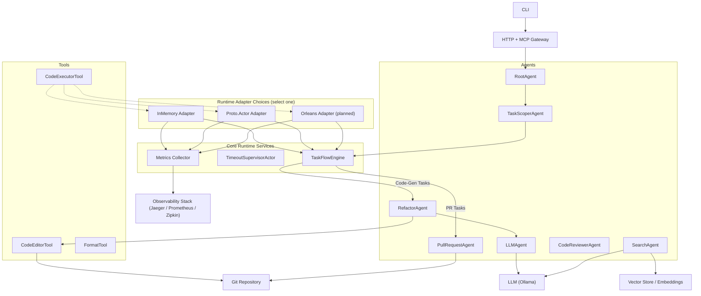
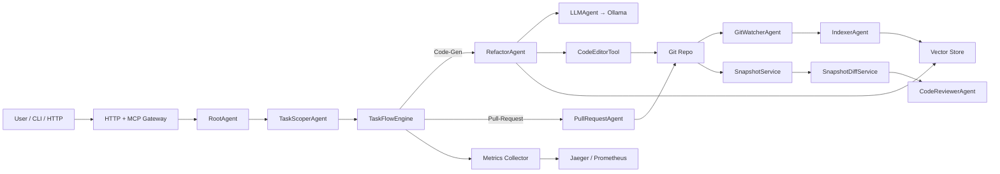
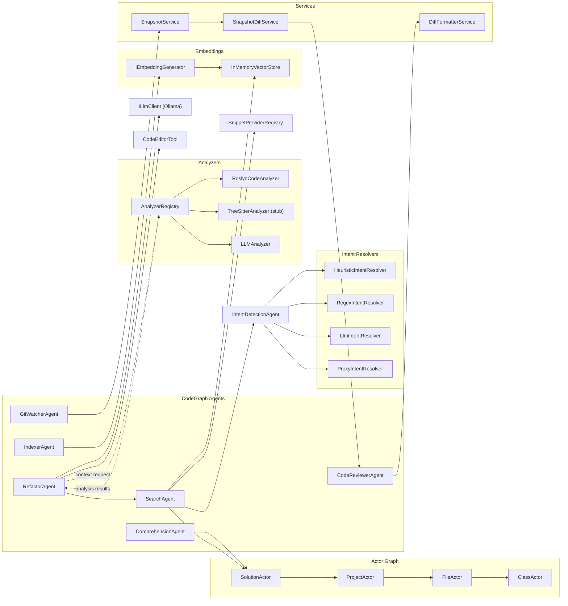
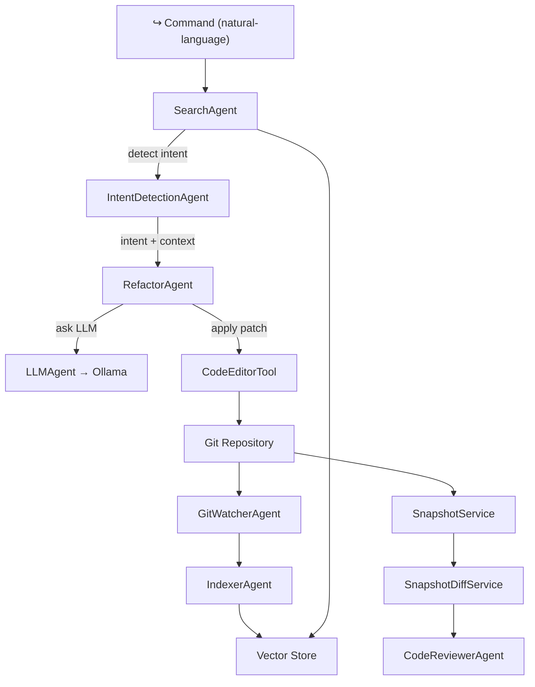

# Agctor System – Architecture Overview

This diagram captures the high-level components and primary data flows within the Agctor framework after completion of Step 5 (Pull-Request automation). 

---

### Agctor System – Simplified View (easier to understand)

---

## CodeGraph – Component Interaction Detail

The diagram illustrates how the main CodeGraph agents, analyzers, actor graph, embedding pipeline, and services collaborate to process code-understanding and refactor commands. 

---

### CodeGraph – Simplified View (easier to understand)

This view groups the many components into a concise end-to-end flow:
1. SearchAgent interprets a user command and resolves intent.
2. RefactorAgent fetches context, consults the LLM, and edits code through CodeEditorTool.
3. Git changes trigger indexing and review agents, closing the feedback loop. 