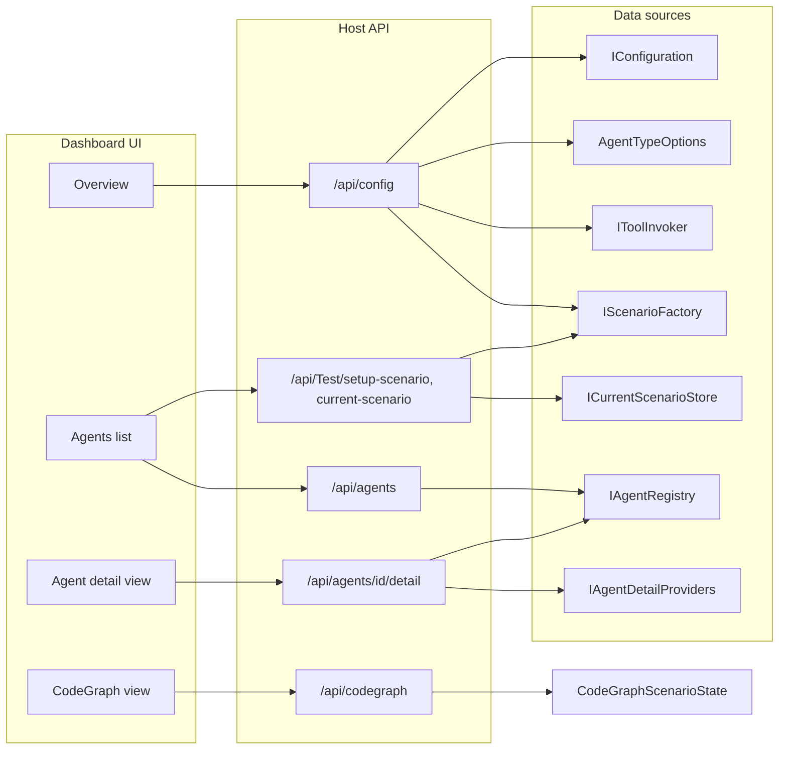

# PRD-006: Host Configuration Dashboard

## Purpose

Provide a read-only dashboard that shows exactly how AgctorSDK.Host is configured: runtime, LLM, tools, scenarios, background services, and all agents—with extensible, per-agent-type detail views (e.g. CoderAgent tools pipeline, LLMAgent model/URL, CodeGraph actor hierarchy and memory representation).

## Scope

- **In-scope:** Host configuration API, extensible per-agent detail API, CodeGraph context API (actor tree + embedding summary), dashboard UI (Razor Pages + Tailwind + Flowbite + JavaScript), and **scenario activation from the Dashboard/Agents tab** (user selects a scenario such as code-generation-chain or code-graph-demo and clicks Apply to activate that scenario’s agents). Read-only for configuration; the only write action is “Apply scenario” to create/register agents.
- **Out-of-scope:** Editing configuration from the dashboard, flow execution, run history, approval gates (see PRD-005), and multi-tenant or multi-Host aggregation.

## Goals

- Expose a single API that describes full Host configuration (runtime, LLM, MCP, paths, background services, registered agent types, available tools, scenarios).
- Support customizable detail views per agent type (e.g. LLMAgent shows Ollama URL/model; CoderAgent shows tools; CodeGraph agents show graph/memory summary).
- When the CodeGraph scenario is in use, expose how the actor model represents source code (Solution → Project → File → Class → Method) and how it is represented in memory (embedding store summary).
- Deliver a dashboard UI built with **Razor Pages, Tailwind CSS, Flowbite, and JavaScript** (Overview, Agents list, Agent detail with type-specific blocks, CodeGraph view) served by the Host so one deployment shows “how Host is configured.”
- On the **Dashboard/Agents** tab, expose **available scenarios** (e.g. code-generation-chain, code-graph-demo); when the user **selects a scenario and clicks Apply**, call the existing scenario-setup API so that scenario’s agents are **activated** (created and registered).

## Non-Goals

- Replacing or duplicating Swagger for general API exploration.
- Flow-centric composition, run console, or approval workflows (PRD-005).
- Full configuration editing or deployment automation from the dashboard (only “Apply scenario” is in scope).

## Current State (Summary)

- **Host** configures agent types in `AgentTypeOptions` (Agent, LLMAgent, CodeExecutorTool, CompileTool, TestRunnerTool, CoderAgent), runtime (InMemory / Proto.Actor / Orleans) from `Agctor:DefaultRuntime`, LLM via `LLMAgent.ConfigureDefaults()` from `Agctor:LLM:*`, tools in ToolInvoker (file-system, code-executor, code-editor), and scenarios via ScenarioFactory (code-generation-chain, code-graph-demo).
- **Existing APIs:** `GET /api/agents` and `GET /api/agents/{id}` return AgentInfo (Id, Type, Status, Metadata). `GET /api/tools` and `GET /api/tools/{id}` list tools and return ToolInfo. No API exposes full Host configuration or per-agent custom details.
- **Agent-specific config:** CoderAgent uses CodeEditorTool → CompileTool → TestRunnerTool (in code). LLMAgent uses static defaults. CodeGraph scenario builds Solution → Project → File actors and agents with graph and embedding store; actor hierarchy is serializable via ActorSerializer.ToDto but not exposed over HTTP.

## Requirements

### 1. Host Configuration API

- **Endpoint:** `GET /api/config` (or `GET /api/dashboard/config`) returning a single DTO.
- **Data to expose:**
  - **Runtime:** name (InMemory, Proto.Actor, Orleans); for Proto: ProtoHost, ProtoPort.
  - **LLM:** OllamaApiUrl, DefaultModel (from Agctor:LLM:* or LLMAgent configured defaults).
  - **MCP:** Host, Port (from Mcp:*).
  - **Paths:** GeneratedCodeRoot (from Agctor:GeneratedCodeRoot).
  - **Background services:** TaskScoper ScanInterval, TaskFlow Interval (from TaskScoper:*, TaskFlow:*).
  - **Registered agent types:** from IOptions<AgentTypeOptions>.Value.AgentTypes (type name → type info).
  - **Available tools:** from IToolInvoker (ids and per-tool ToolInfo: id, name, description, parameters).
  - **Scenarios:** from IScenarioFactory (available scenario names and descriptions).
- **Implementation:** IHostConfigurationService aggregating IConfiguration, IOptions<AgentTypeOptions>, IToolInvoker, IScenarioFactory, and optionally IActorRuntimeAdapter into HostConfigurationDto; ConfigController (or DashboardController) returning this DTO. All under AgctorSDK.Host.

### 2. Extensible Per-Agent Detail (Customizable Agent Views)

- **Requirement:** Each agent type can expose a custom “detail” payload (e.g. CoderAgent: tools pipeline; LLMAgent: LLM URL/model; CodeGraph agents: graph/memory summary).
- **Design:** Provider-based. Define IAgentDetailProvider (e.g. in Core or Host) with AgentTypeName and GetDetail(IAgent). Implementations for known types (LLMAgent, CoderAgent, CodeGraph agents). IAgentDetailProviderRegistry returns the first matching provider by agent type name. Register providers in DI.
- **Endpoint:** `GET /api/agents/{id}/detail`. Returns AgentInfo-like base (id, type, status) plus a **detail** object from IAgentDetailProviderRegistry.GetDetail(agent). If no provider exists, return a generic view (e.g. capabilities). Detail shape is determined by agent type (customizable per type).
- **Example providers:** LLMAgentDetailProvider (Ollama URL, model); CoderAgentDetailProvider (tools: CodeEditorTool, CompileTool, TestRunnerTool); CodeGraph agent providers (summary and/or link to CodeGraph endpoint).

### 3. CodeGraph: Actor Model and Memory Representation

- **Requirement:** For CodeGraph (e.g. code-graph-demo scenario), show the actor hierarchy (Solution → Project → File → Class → Method) and embedding store summary.
- **Approach:** Scenario-scoped state. CodeGraph scenario registers a “CodeGraph context” when it sets up (root SolutionActor as DTO, embedding store summary). ICodeGraphContextAccessor (e.g. CodeGraph or Host) exposes GetCurrent(). CodeGraphContext contains ActorTree (from ActorSerializer.ToDto) and EmbeddingStoreSummary (e.g. vector count).
- **Endpoint:** `GET /api/codegraph/current`. Returns 200 with context (ActorTree + EmbeddingStoreSummary) when code-graph-demo (or current) scenario has been set up; otherwise 404 or empty.

### 4. Dashboard UI

- **Stack:** **Razor Pages** for server-rendered layout and navigation; **Tailwind CSS** and **Flowbite** for styling and components (navbar, cards, badges, list groups); **JavaScript** for fetching dashboard APIs and rendering dynamic content (config, agents list, agent detail, CodeGraph view). Keeps the dashboard in the same Host process with no separate SPA build; can be refined later to align with PRD-005.
- **Styling:** Tailwind CSS (via CDN or build) and Flowbite (Tailwind-based component library) are used across all dashboard pages. Layout uses a Flowbite-style navbar; Overview, Agents, Agent detail, and CodeGraph use Tailwind utility classes and Flowbite-inspired cards, badges, and lists for a consistent, modern UI.
- **Placement:** Dashboard lives under AgctorSDK.Host using ASP.NET Core Razor Pages (e.g. `Pages/Dashboard` or `Areas/Dashboard`), served at `/Dashboard` or `/dashboard`. Shared layout (`_Layout.cshtml`) includes Tailwind and Flowbite (CDN or bundled); optional partials for reusable sections; JS in `wwwroot/js/dashboard.js` (or inline in pages) calls the Host REST APIs and updates the DOM for live data.
- **Sections:**
  1. **Overview:** Runtime, LLM (URL + model), MCP (host + port), GeneratedCodeRoot, TaskScoper/TaskFlow intervals. Razor page provides structure; JS fetches GET /api/config and fills the overview section (or Overview can be server-rendered by injecting IHostConfigurationService into the PageModel).
  2. **Agents:** List from GET /api/agents; **current scenario** (session); **registered types** vs **active agents**; **scenario selector and Apply**. The application records which scenario is selected when the user clicks Apply (session-scoped via `ICurrentScenarioStore`). The Agents page shows: **(a) Current scenario** — the scenario last applied in this session (name and optional description), or “No scenario active” if none; **(b) Activate scenario** — dropdown and Apply button; **(c) Registered types** — agent types available in configuration (from appsettings); these can be instantiated when a scenario is applied; **(d) Active agents** — agent instances created in this session (e.g. after applying a scenario); each links to Agent detail. Show available scenarios (from GET /api/config scenarios or GET /api/test/scenarios). User selects a scenario (e.g. code-generation-chain, code-graph-demo), clicks **Apply**; client calls **POST /api/test/setup-scenario** with `{ scenarioName, parameters }`. On success, the server stores the current scenario for the session; client re-fetches GET /api/agents and GET /api/Test/current-scenario and re-renders so the “Current scenario” block and “Active agents” list update. Optional: show scenario description (GET /api/test/scenarios/{name}) in the UI.
  3. **Agent detail (customizable per type):** Dedicated Razor page (e.g. `AgentDetail.cshtml`) with route `id`; JS fetches GET /api/agents/{id}/detail and renders base info plus type-specific block (e.g. llm: { ollamaApiUrl, defaultModel }; coder: { tools }; codegraph: { graphSummary, embeddingCount }). Fallback: generic key-value view.
  4. **CodeGraph view:** Razor section or page; JS calls GET /api/codegraph/current. When 200, render actor tree (Solution → Project → File → Class → Method) and embedding store summary (e.g. tree view or Mermaid). When 404, show “CodeGraph not active” or hide section.
- **Scenario activation (Agents tab):** Use existing **POST /api/test/setup-scenario** (TestController). Request body: `{ "scenarioName": "code-generation-chain" | "code-graph-demo", "parameters": {} }`. Response indicates success and `createdAgentIds`. After a successful setup, the server records the current scenario for the session (via `ICurrentScenarioStore`). The Agents page calls this when the user selects a scenario and clicks Apply, then re-fetches GET /api/agents and GET /api/Test/current-scenario to show the “Current scenario” and the newly activated agents.
- **Current scenario (session):** **GET /api/Test/current-scenario** returns the scenario name and optional description for the scenario last applied in this session, or null if none. Used by the Agents page to display “Current scenario: &lt;name&gt;” and by other clients (e.g. CodeGraph page “run scenario first” message). Implemented via `ICurrentScenarioStore` (e.g. `CurrentScenarioStore`) set by TestController after successful scenario setup.
- **Tech:** No new backend project. Add Razor Pages to AgctorSDK.Host (MapRazorPages, optional AddRazorPages in Program.cs). **Tailwind CSS** and **Flowbite** are included (e.g. via CDN in layout: `cdn.tailwindcss.com`, `flowbite.min.js`) so dashboard pages use utility classes and Flowbite components without a Node build step. JS uses fetch to call the same Host APIs; no CORS needed when dashboard and API are same origin.

## Architecture (High Level)

## Implementation Phases

- **Phase 1 – Config API:** HostConfigurationDto (and nested DTOs); IHostConfigurationService and HostConfigurationService; ConfigController with GET /api/config. All under AgctorSDK.Host/Models and AgctorSDK.Host/Services (or Controllers).
- **Phase 2 – Per-agent detail:** IAgentDetailProvider and IAgentDetailProviderRegistry (Core or Host); LLMAgentDetailProvider, CoderAgentDetailProvider; optional CodeGraph agent providers. New route GET /api/agents/{id}/detail (AgentsController or dedicated).
- **Phase 3 – CodeGraph context:** ICodeGraphContextAccessor and CodeGraphContext (ActorTree DTO + EmbeddingStoreSummary); CodeGraphDemoScenario registers context on setup; GET /api/codegraph/current in Host (CodeGraphController or Config).
- **Phase 4 – Dashboard UI:** Razor Pages dashboard under AgctorSDK.Host with Tailwind + Flowbite and JS that calls /api/config, /api/agents, /api/agents/{id}/detail, /api/codegraph/current, and **POST /api/test/setup-scenario** for scenario activation. Render Overview, Agents list (including **scenario selector + Apply**), Agent detail (type-specific blocks), and CodeGraph view. Enable Razor Pages in Host (MapRazorPages).

## Documentation and Tests

- Update AgctorSDK.Host/docs: document new endpoints (/api/config, /api/agents/{id}/detail, /api/codegraph/current) in endpoints diagram and README.
- Unit tests: HostConfigurationService (mocked config and services); IAgentDetailProvider implementations (mock agents).
- Integration test: GET /api/config (assert runtime, LLM, tools, scenarios); GET /api/agents/{id}/detail after scenario setup (assert detail shape for at least one type, e.g. LLMAgent).

## Key Files to Add or Touch

| Area         | Files |
| ------------ | ----- |
| Config API  | HostConfigurationDto, IHostConfigurationService, HostConfigurationService, ConfigController |
| Agent detail| IAgentDetailProvider, IAgentDetailProviderRegistry, LLMAgentDetailProvider, CoderAgentDetailProvider; AgentsController or new route |
| CodeGraph   | ICodeGraphContextAccessor, CodeGraphContext, CodeGraphDemoScenario (register context), CodeGraphController or config endpoint |
| Current scenario | ICurrentScenarioStore, CurrentScenarioStore; TestController (set on Apply, GET /api/Test/current-scenario); CurrentScenarioResponse in ApiModels |
| Dashboard UI| Razor Pages: Pages/Dashboard, PageModels, .cshtml views; Tailwind CSS + Flowbite (CDN in _Layout.cshtml); JS: wwwroot/js/dashboard.js and inline scripts for API calls and dynamic rendering; Agents page: current scenario block, “Registered types” vs “Active agents” labels |
| Docs        | AgctorSDK.Host/docs/endpoints-diagram.mmd, endpoints-diagram.md |

## References

- AgctorSDK.Host/Program.cs (agent types, runtime, LLM config)
- AgctorSDK.Host/Services/ToolInvoker.cs (tools)
- AgctorSDK.Host/Services/ScenarioFactory.cs (scenarios)
- AgctorSDK.Agents/Agents/CoderAgent.cs (tools pipeline)
- AgctorSDK.Agents/Agents/LLMAgent.cs (Ollama defaults)
- AgctorSDK.CodeGraph/Persistence/ActorSerializer.cs (ToDto for actor tree)
- AgctorSDK.Host/Services/Scenarios/CodeGenerationChainScenario.cs, CodeGraphDemoScenario.cs (scenarios activated from Dashboard/Agents)
- AgctorSDK.Host/Controllers/TestController.cs (POST /api/test/setup-scenario for scenario activation)
- PRD-005: Flow-Centric Web UI (broader UI context; this dashboard is a read-only configuration view)
- [Tailwind CSS](https://tailwindcss.com), [Flowbite](https://flowbite.com): styling and component library for the dashboard UI
