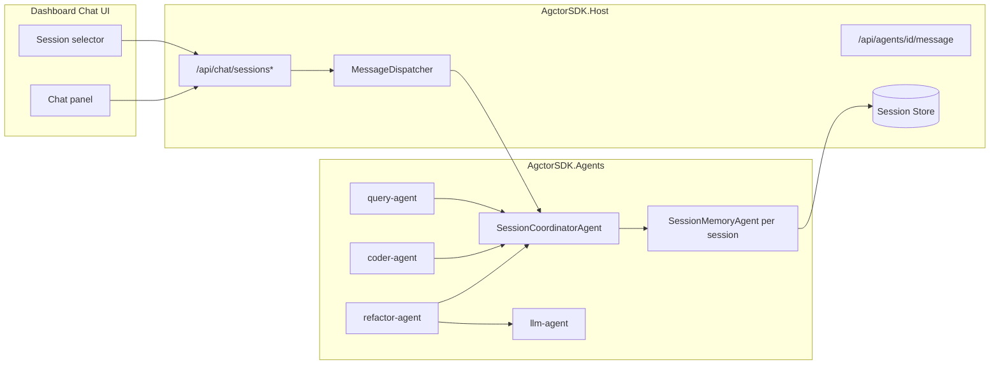

# PRD-006: Session Memory and Persistence for Agent Chat

## Purpose

Provide robust, session-scoped conversational memory for agent chat so follow-up prompts (for example, pronouns like "it") resolve correctly, while keeping each session independent, encapsulated, and reloadable across restarts.

## Scope

- **In-scope:** Session lifecycle APIs (create/list/load), session-aware message routing, actor-based memory management, durable session storage, context composition for LLM prompts, and Dashboard session controls for chat flows.
- **Out-of-scope:** Cross-session memory sharing, global user profiling across sessions, model fine-tuning, and long-term enterprise multi-tenant retention policies.

## Goals

- Ensure every chat turn can access prior turns from the same session.
- Keep sessions isolated so context from one session never leaks into another.
- Persist sessions so they can be loaded later (including historical messages).
- Use Actor Model principles: session state owned by dedicated actors.
- Keep integration compatible with existing agents (`query-agent`, `coder-agent`, `refactor-agent`) and existing Host APIs/UI.

## Non-Goals

- Building a general analytics warehouse for all transcripts.
- Adding external vector databases in the first release.
- Redesigning the full dashboard information architecture.

## Current State (Summary)

- The dashboard chat currently posts only the current prompt payload and no explicit `sessionId`, so follow-up prompts may lose prior turn context.
- `MessageDispatcher` and runtime request-response/correlation behavior are in place, but there is no dedicated session-memory pipeline.
- `RefactorAgent` builds LLM prompt context from code search context plus current request, not from historical user turns.
- No Host API currently exists to create/list/load chat sessions.

## Requirements

### 1. Session Lifecycle API

- **Endpoints:**
  - `POST /api/chat/sessions` -> create a new session.
  - `GET /api/chat/sessions` -> list sessions (id, title/label, created/updated timestamps, turn count).
  - `GET /api/chat/sessions/{id}` -> load session metadata + turn history.
- **Behavior:**
  - Session IDs are stable and unique.
  - Session metadata is stored separately from turn events for efficient listing.

### 2. Session-aware Messaging

- Every chat message routed from UI to agents must include `sessionId` in headers/metadata.
- If `sessionId` is missing in chat endpoints, Host may create a new one (configurable) or reject with validation error.
- Existing non-chat message paths remain backward compatible.

### 3. Actor-based Session Memory

- Add `SessionCoordinatorAgent` to route session operations and own session actor lifecycle.
- Add `SessionMemoryAgent` (one per session) to own:
  - append-only turns
  - summary snapshot
  - retrieval for prompt context
- Session actors are isolated by session ID to match Actor Model encapsulation.

### 4. Durable Session Storage

- Persist session metadata and turns so sessions survive Host restart.
- Recommended first implementation: SQLite-backed `ISessionStore` in Host.
- Support append-only writes and ordered replay by turn timestamp/index.

### 5. Prompt Context Composition

- Before LLM generation for chat-capable flows, build context package from:
  - recent turns (window)
  - session summary
  - current user message
- Enforce token/size budget with deterministic truncation.
- Add configurable policy values (window size, summary refresh cadence).

### 6. Dashboard Session UX

- On chat UI, add:
  - session selector
  - "new session" action
  - current session indicator
- Sending a prompt uses selected session.
- Loading a session displays historical messages in chat panel.

### 7. Reliability, Observability, and Safety

- Trace logs/events include `sessionId` for diagnostics.
- Session isolation is enforced in retrieval path.
- Parsing/normalization hardening for LLM JSON responses (strip fenced markdown, whitespace normalization) so ambiguity errors are surfaced cleanly.

## Architecture (High Level)

## Assembly Placement

- **AgctorSDK.Core:** session contracts, message types, and interfaces (`ISessionStore`, context composer interface, DTOs).
- **AgctorSDK.Agents:** `SessionCoordinatorAgent`, `SessionMemoryAgent`, and session-memory orchestration logic.
- **AgctorSDK.Host:** API endpoints, DI wiring, store implementation, dashboard integration.
- **AgctorSDK.Core.Tests:** unit tests for contracts, composition logic, and session actor behavior where applicable.
- **AgctorSDK.Core.IntegrationTests / AgctorSDK.Host.IntegrationTests:** end-to-end and API integration coverage.

## Implementation Phases

- **Phase 1 – Contracts + Store:** define session models/interfaces and implement durable `ISessionStore`.
- **Phase 2 – Session Agents:** implement coordinator + memory agents and actor messaging contracts.
- **Phase 3 – Host/API Integration:** add session endpoints and propagate `sessionId` through message dispatcher path.
- **Phase 4 – Agent Prompt Integration:** use session context package in `refactor-agent` / related LLM paths before generation.
- **Phase 5 – Dashboard UX:** add session picker/new-session/load behavior in chat UI.
- **Phase 6 – Quality Gate:** unit + integration tests, docs update, and validation under realistic multi-turn scenarios.

## Documentation and Tests

- Update Host docs/endpoints diagrams with session APIs.
- Unit tests:
  - context composition windowing/summarization
  - session store CRUD + ordering
  - session isolation enforcement
- Integration tests:
  - create -> chat -> follow-up pronoun resolution within same session
  - same prompt in different sessions yields independent context
  - restart/load session preserves history

## Key Files to Add or Touch

| Area | Files |
| ---- | ----- |
| Core contracts | `AgctorSDK.Core/Interfaces/ISessionStore.cs`, `AgctorSDK.Core/Interfaces/ISessionContextComposer.cs`, session DTO/message files under `AgctorSDK.Core` |
| Session agents | `AgctorSDK.Agents/Agents/SessionCoordinatorAgent.cs`, `AgctorSDK.Agents/Agents/SessionMemoryAgent.cs` |
| Host services | `AgctorSDK.Host/Services/SessionStore/*` (SQLite or equivalent), DI registration in `AgctorSDK.Host/Program.cs` |
| Host APIs | new chat session controller(s) under `AgctorSDK.Host/Controllers` |
| Agent integration | `AgctorSDK.CodeGraph/Agents/RefactorAgent.cs` (session context injection before LLM call), optional related agent updates |
| Dashboard | `AgctorSDK.Host/Pages/Dashboard/CodeGraph.cshtml` (session selector/new session/load), optional page model/helpers |
| Tests | `AgctorSDK.Core.Tests/*Session*`, `AgctorSDK.Core.IntegrationTests/*Session*`, `AgctorSDK.Host.IntegrationTests/*Session*` |
| Docs | `AgctorSDK.Host/docs/endpoints-diagram.*` and PRD-linked docs updates |

## References

- `AgctorSDK.Host/Pages/Dashboard/CodeGraph.cshtml`
- `AgctorSDK.Host/Services/MessageDispatcher.cs`
- `AgctorSDK.CodeGraph/Agents/RefactorAgent.cs`
- `AgctorSDK.Agents/Agents/LLMAgent.cs`
- `AgctorSDK.Core/Adapters/InMemoryActorRuntime.cs`
- `Project/prd-006-dashboard.md`
- `Project/prd-006-implementation-plan.md`
