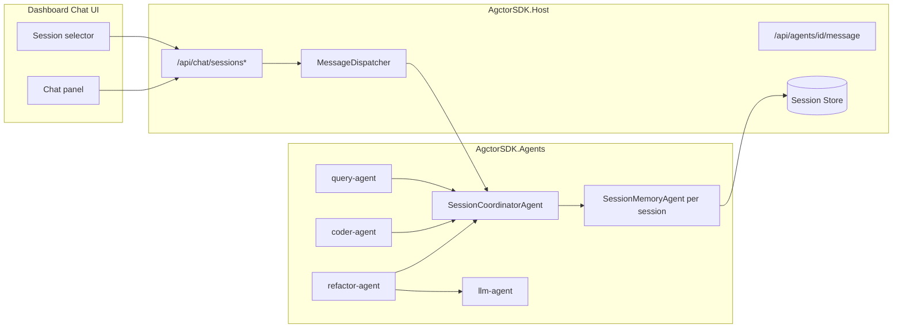

# PRD-006: Session Memory and Persistence for Agent Chat

## Purpose

Provide robust, session-scoped conversational memory for agent chat so follow-up prompts (for example, pronouns like "it") resolve correctly, while keeping each session independent, encapsulated, and reloadable across restarts.

## Scope

- **In-scope:** Session lifecycle APIs (create/list/load), session-aware message routing, actor-based memory management, durable session storage, context composition for LLM prompts, and Dashboard session controls for chat flows.
- **Out-of-scope:** Cross-session memory sharing, global user profiling across sessions, model fine-tuning, and long-term enterprise multi-tenant retention policies.

## Goals

- Ensure every chat turn can access prior turns from the same session.
- Keep sessions isolated so context from one session never leaks into another.
- Persist sessions so they can be loaded later (including historical messages).
- Use Actor Model principles: session state owned by dedicated actors.
- Keep integration compatible with existing agents (`query-agent`, `coder-agent`, `refactor-agent`) and existing Host APIs/UI.

## Non-Goals

- Building a general analytics warehouse for all transcripts.
- Adding external vector databases in the first release.
- Redesigning the full dashboard information architecture.

## Implemented State (March 2026)

- Session memory is implemented end-to-end with strict session isolation and durable persistence.
- Dashboard chat sends and tracks `sessionId`; sessions can be created, listed, selected, and reloaded.
- Session turns (user + assistant) are persisted and replayed through dedicated session APIs.
- `SessionCoordinatorAgent` and `SessionMemoryAgent` are active in the runtime and used by agent orchestration flows.
- `QueryAgent` and `RefactorAgent` use session context in LLM flows with fallback behavior that preserves indexed-search-first semantics.
- `CoderAgent` and `RefactorAgent` include concurrency and parsing hardening for safer multi-turn/multi-request behavior.

## Requirements and Implementation Status

### 1. Session Lifecycle API

- **Endpoints:**
  - `POST /api/chat/sessions` -> create a new session.
  - `GET /api/chat/sessions` -> list sessions (id, title/label, created/updated timestamps, turn count).
  - `GET /api/chat/sessions/{id}` -> load session metadata + turn history.
- **Behavior:**
  - Session IDs are stable and unique.
  - Session metadata is stored separately from turn events for efficient listing.
- **Status:** Implemented via `ChatSessionsController` and validated by integration tests.

### 2. Session-aware Messaging

- Every chat message routed from UI to agents must include `sessionId` in headers/metadata.
- If `sessionId` is missing in chat endpoints, Host may create a new one (configurable) or reject with validation error.
- Existing non-chat message paths remain backward compatible.
- **Status:** Implemented in `MessageDispatcher` with extraction from request payload/metadata/headers and session turn append for user + assistant.

### 3. Actor-based Session Memory

- Add `SessionCoordinatorAgent` to route session operations and own session actor lifecycle.
- Add `SessionMemoryAgent` (one per session) to own:
  - append-only turns
  - summary snapshot
  - retrieval for prompt context
- Session actors are isolated by session ID to match Actor Model encapsulation.
- **Status:** Implemented with coordinator-routed per-session memory actors.

### 4. Durable Session Storage

- Persist session metadata and turns so sessions survive Host restart.
- Recommended first implementation: SQLite-backed `ISessionStore` in Host.
- Support append-only writes and ordered replay by turn timestamp/index.
- **Status:** Implemented using `SqliteSessionStore`.

### 5. Prompt Context Composition

- Before LLM generation for chat-capable flows, build context package from:
  - recent turns (window)
  - session summary
  - current user message
- Enforce token/size budget with deterministic truncation.
- Add configurable policy values (window size, summary refresh cadence).
- **Status:** Implemented via `SessionContextComposer` + `SessionMemoryOptions`.

### 6. Dashboard Session UX

- On chat UI, add:
  - session selector
  - "new session" action
  - current session indicator
- Sending a prompt uses selected session.
- Loading a session displays historical messages in chat panel.
- **Status:** Implemented in `CodeGraph.cshtml`, including transcript loading and session labeling.

### 7. Reliability, Observability, and Safety

- Trace logs/events include `sessionId` for diagnostics.
- Session isolation is enforced in retrieval path.
- Parsing/normalization hardening for LLM JSON responses (strip fenced markdown, whitespace normalization) so ambiguity errors are surfaced cleanly.
- **Status:** Implemented and extended with request serialization in `CoderAgent`/`RefactorAgent`, query/refactor fallback behavior, and response rendering hardening in dashboard chat.

## Architecture (High Level)

## Assembly Placement

- **AgctorSDK.Core:** session contracts, message types, and interfaces (`ISessionStore`, context composer interface, DTOs).
- **AgctorSDK.Agents:** `SessionCoordinatorAgent`, `SessionMemoryAgent`, and session-memory orchestration logic.
- **AgctorSDK.Host:** API endpoints, DI wiring, store implementation, dashboard integration.
- **AgctorSDK.Core.Tests:** unit tests for contracts, composition logic, and session actor behavior where applicable.
- **AgctorSDK.Core.IntegrationTests / AgctorSDK.Host.IntegrationTests:** end-to-end and API integration coverage.

## Implementation Phases (Completed)

- **Phase 1 – Contracts + Store:** Completed.
- **Phase 2 – Session Agents:** Completed.
- **Phase 3 – Host/API Integration:** Completed.
- **Phase 4 – Agent Prompt Integration:** Completed (initially `refactor-agent`, then strengthened in `query-agent` and `refactor-agent` with session-aware fallback paths).
- **Phase 5 – Dashboard UX:** Completed (session controls + transcript loading + chat markdown rendering).
- **Phase 6 – Quality Gate:** Completed (unit/integration coverage and docs updates).

## Documentation and Tests

- Host endpoint docs updated to include session API routes.
- Unit tests include session context packaging and agent follow-up behavior:
  - `AgctorSDK.CodeGraph.Tests/Agents/QueryAgentSessionFollowupTests.cs`
  - `AgctorSDK.CodeGraph.Tests/Agents/RefactorAgentSessionBehaviorTests.cs`
  - `AgctorSDK.Core.Tests/Runtime/CoderAgentRoutingGuidanceTests.cs`
- Integration tests include session API and UX regression paths:
  - `AgctorSDK.Host.IntegrationTests/ChatSessionsControllerIntegrationTests.cs`
  - `AgctorSDK.Host.IntegrationTests/CodeGraphFilePreviewAfterChatIntegrationTests.cs`

## Key Files Added or Updated

| Area | Files |
| ---- | ----- |
| Core contracts | `AgctorSDK.Core/Interfaces/ISessionStore.cs`, `AgctorSDK.Core/Interfaces/ISessionContextComposer.cs`, session DTO/message files under `AgctorSDK.Core/Sessions/*` |
| Session agents | `AgctorSDK.Agents/Agents/SessionCoordinatorAgent.cs`, `AgctorSDK.Agents/Agents/SessionMemoryAgent.cs`, `AgctorSDK.Agents/Agents/CoderAgent.cs` |
| Host services | `AgctorSDK.Host/Services/Sessions/SqliteSessionStore.cs`, `AgctorSDK.Host/Services/Sessions/SessionContextComposer.cs`, DI registration in `AgctorSDK.Host/Program.cs` |
| Host APIs | new chat session controller(s) under `AgctorSDK.Host/Controllers` |
| Agent integration | `AgctorSDK.CodeGraph/Agents/RefactorAgent.cs`, `AgctorSDK.CodeGraph/Agents/QueryAgent.cs` |
| Dashboard | `AgctorSDK.Host/Pages/Dashboard/CodeGraph.cshtml` (session selector/new session/load + markdown render + actor-tree click rebind) |
| Tests | `AgctorSDK.Core.Tests/*Session*`, `AgctorSDK.Core.Tests/Runtime/CoderAgentRoutingGuidanceTests.cs`, `AgctorSDK.CodeGraph.Tests/Agents/*Session*`, `AgctorSDK.Host.IntegrationTests/*Session*` |
| Docs | `AgctorSDK.Host/docs/endpoints-diagram.*` and PRD-linked docs updates |

## References

- `AgctorSDK.Host/Pages/Dashboard/CodeGraph.cshtml`
- `AgctorSDK.Host/Services/MessageDispatcher.cs`
- `AgctorSDK.CodeGraph/Agents/RefactorAgent.cs`
- `AgctorSDK.Agents/Agents/LLMAgent.cs`
- `AgctorSDK.Core/Adapters/InMemoryActorRuntime.cs`
- `Project/prd-006-dashboard.md`
- `Project/prd-006-implementation-plan.md`
