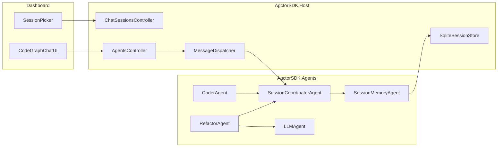

# PRD-006 Session Detailed Execution Plan

## Scope and Defaults

- Implement session memory with strict isolation and durable persistence.
- Keep existing agent APIs compatible while introducing session-aware chat endpoints.
- Default decisions for MVP:
  - Use SQLite-backed store in Host (`ISessionStore` implementation).
  - Use explicit `sessionId` in metadata/headers for all chat requests.
  - Keep `refactor-agent` as first LLM-context integration target.

## Architecture and Flow

## Phase 1: Contracts and Policies (Core)

- Add session models/messages in Core:
  - `SessionInfo`, `SessionTurn`, `SessionTranscript`, `SessionContextPackage`, summary model.
  - session actor message contracts for create/list/load/append/context retrieval.
- Add interfaces:
  - `ISessionStore` in [AgctorSDK.Core/Interfaces](/Users/rahamohebbi/Projects/AGCTOR/AgctorSDK.Core/Interfaces)
  - `ISessionContextComposer` in [AgctorSDK.Core/Interfaces](/Users/rahamohebbi/Projects/AGCTOR/AgctorSDK.Core/Interfaces)
- Add memory policy options (window, summary cadence, size budget).
- Keep naming short/meaningful and contract payloads serializable.

## Phase 2: Session Agents (Agents Assembly)

- Implement `SessionMemoryAgent` in [AgctorSDK.Agents/Agents](/Users/rahamohebbi/Projects/AGCTOR/AgctorSDK.Agents/Agents):
  - Own per-session turn append/read and context package generation.
  - Use `ISessionStore` for persistence/replay.
- Implement `SessionCoordinatorAgent` in [AgctorSDK.Agents/Agents](/Users/rahamohebbi/Projects/AGCTOR/AgctorSDK.Agents/Agents):
  - Resolve/create per-session memory actors.
  - Route operations by `sessionId`.
- Add explicit comments on actor ownership boundaries and isolation guarantees.

## Phase 3: Host Persistence and Wiring

- Implement durable store under [AgctorSDK.Host/Services](/Users/rahamohebbi/Projects/AGCTOR/AgctorSDK.Host/Services):
  - `SqliteSessionStore` + schema bootstrap/migration.
  - metadata list query and ordered turn replay query.
- Register in DI in [AgctorSDK.Host/Program.cs](/Users/rahamohebbi/Projects/AGCTOR/AgctorSDK.Host/Program.cs):
  - `ISessionStore`, `ISessionContextComposer`.
  - session coordinator startup path for active scenario/chat usage.
- Ensure thread-safe singleton behavior aligned with existing Host patterns.

## Phase 4: Session APIs and Message Propagation

- Add `ChatSessionsController` in [AgctorSDK.Host/Controllers](/Users/rahamohebbi/Projects/AGCTOR/AgctorSDK.Host/Controllers):
  - `POST /api/chat/sessions`
  - `GET /api/chat/sessions`
  - `GET /api/chat/sessions/{id}`
- Extend `MessageRequest` in [AgctorSDK.Host/Models/ApiModels.cs](/Users/rahamohebbi/Projects/AGCTOR/AgctorSDK.Host/Models/ApiModels.cs) with session field (or metadata contract helper).
- Update [AgctorSDK.Host/Services/MessageDispatcher.cs](/Users/rahamohebbi/Projects/AGCTOR/AgctorSDK.Host/Services/MessageDispatcher.cs):
  - propagate `sessionId` consistently in headers and metadata.
  - avoid dropping session metadata on runtime sends.
- Append user/assistant turns through coordinator on chat path.

## Phase 5: Agent Prompt Integration (Refactor First)

- Update [AgctorSDK.CodeGraph/Agents/RefactorAgent.cs](/Users/rahamohebbi/Projects/AGCTOR/AgctorSDK.CodeGraph/Agents/RefactorAgent.cs):
  - request `SessionContextPackage` using `sessionId` before LLM prompt build.
  - merge session context + code-search context + current request deterministically.
- Keep existing behavior unchanged when no session context is present.
- Optional follow-up integration for other LLM-capable flows after Refactor validation.

## Phase 6: Dashboard Session UX

- Update [AgctorSDK.Host/Pages/Dashboard/CodeGraph.cshtml](/Users/rahamohebbi/Projects/AGCTOR/AgctorSDK.Host/Pages/Dashboard/CodeGraph.cshtml):
  - add session selector + create session action.
  - load session transcript and render history on switch.
  - include active `sessionId` in send payloads.
- Keep existing chat traces and status banners functional.

## Phase 7: Hardening and Quality Gates

- Parsing hardening in [AgctorSDK.CodeGraph/Agents/RefactorAgent.cs](/Users/rahamohebbi/Projects/AGCTOR/AgctorSDK.CodeGraph/Agents/RefactorAgent.cs):
  - normalize fenced JSON and whitespace before parse.
  - preserve explicit ambiguity errors cleanly.
- Concurrency hardening for shared-field orchestration risk in:
  - [AgctorSDK.Agents/Agents/CoderAgent.cs](/Users/rahamohebbi/Projects/AGCTOR/AgctorSDK.Agents/Agents/CoderAgent.cs)
  - [AgctorSDK.CodeGraph/Agents/RefactorAgent.cs](/Users/rahamohebbi/Projects/AGCTOR/AgctorSDK.CodeGraph/Agents/RefactorAgent.cs)
- Add `sessionId` log enrichment where request orchestration is traced.

## Test Strategy

- Unit tests in [AgctorSDK.Core.Tests](/Users/rahamohebbi/Projects/AGCTOR/AgctorSDK.Core.Tests):
  - session contract invariants, composer truncation, isolation behavior.
- Agent tests in [AgctorSDK.CodeGraph.Tests](/Users/rahamohebbi/Projects/AGCTOR/AgctorSDK.CodeGraph.Tests) and Core tests:
  - refactor/coder session propagation and overlap safety.
- Integration tests in [AgctorSDK.Host.IntegrationTests](/Users/rahamohebbi/Projects/AGCTOR/AgctorSDK.Host.IntegrationTests):
  - create/list/load sessions
  - chat with `sessionId` persists user+assistant turns
  - same follow-up text behaves differently across separate sessions
- End-to-end validation in [AgctorSDK.Core.IntegrationTests](/Users/rahamohebbi/Projects/AGCTOR/AgctorSDK.Core.IntegrationTests) for actor runtime continuity.

## Delivery Order

- Milestone A: Phase 1 + Phase 3 store skeleton + session APIs.
- Milestone B: Phase 2 session agents + dispatcher propagation.
- Milestone C: Phase 5 refactor-agent context integration and ambiguity-fix behavior.
- Milestone D: Phase 6 dashboard controls.
- Milestone E: Phase 7 hardening + full test matrix + docs updates.

## Acceptance Criteria

- Follow-up prompts (for example, pronouns) resolve in the same session.
- Sessions are durable and reloadable after restart.
- No cross-session context leakage under parallel usage.
- Existing non-session flows remain functional.
- Unit tests and integration tests pass with the new session paths.

