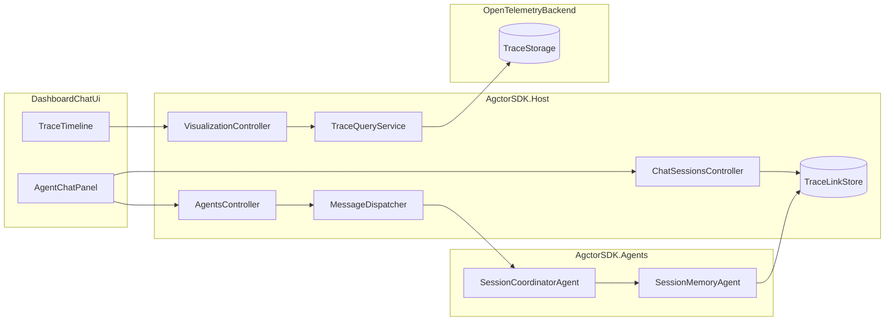

# PRD-008: Historical Trace Timeline for Chat Sessions

## Purpose

Provide durable, session-aware trace history for chat interactions so every prompt can be revisited later with its full Trace Timeline. This makes debugging agent behavior practical across page reloads, session reloads, and Host restarts.

## Scope

- **In-scope:** trace correlation for chat prompts and responses, durable prompt-to-trace lookup, OpenTelemetry-backed historical trace retrieval, transcript API enrichment, and Dashboard UX for loading traces from chat history.
- **Out-of-scope:** storing full trace span payloads in the session database, redesigning the full dashboard layout, cross-session analytics, and general-purpose reporting over all traces.

## Problem Statement

The Dashboard can currently show a Trace Timeline for a live prompt when the response includes a `traceId`, but that timeline is transient. Session transcripts are durable, yet the trace timeline data behind each prompt is not kept in a way the UI can reliably reopen later.

This creates a debugging gap:

- users can reload chat messages but not the trace timeline that explains how a reply was produced
- Host restarts break historical trace inspection
- request/response history and trace history are not linked at the session level

## Goals

- Keep a durable historical trace reference for every chat prompt within a session.
- Allow the Dashboard to load a trace timeline by clicking a historical prompt, response, or turn-level trace affordance.
- Use OpenTelemetry as the source of truth for trace payload retrieval.
- Preserve Actor Model ownership by making session actors own prompt-to-trace correlation state.
- Keep turn-level trace viewing as the default UX while allowing per-message drill-down when request and response trace handles differ.

## Non-Goals

- Replacing the existing Trace Timeline component with a brand-new visualization.
- Building a trace analytics warehouse or global search UI in the first release.
- Requiring full backfill of legacy sessions that were created before trace correlation existed.
- Persisting duplicate copies of all span events inside SQLite.

## Current State

- Sessions and chat turns are durable.
- `SessionTurn` does not carry trace correlation metadata today.
- Live chat requests can return `traceId` immediately to the UI.
- The Trace Timeline endpoint can render a timeline when activities are available, but the current OpenTelemetry activity tracker does not yet retrieve historical activities from a trace backend.
- The chat transcript UI renders text history only and does not expose historical trace selection.

## Requirements and Proposed Status

### 1. Durable Prompt-to-Trace Correlation

- Every chat prompt must have a durable correlation record within its session.
- Correlation must support:
  - stable `sessionId`
  - stable logical chat turn id
  - stable request message id
  - stable response message id
  - primary trace id for the turn
  - optional request trace id and response trace id when they differ
  - agent id and created timestamp
- Correlation data must be append-only and reloadable after restart.
- **Status:** Proposed.

### 2. Actor-Owned Session Trace Index

- Trace correlation must be owned by a dedicated session-scoped actor flow.
- Recommended first implementation:
  - extend `SessionMemoryAgent`, or
  - introduce a focused `SessionTraceIndexAgent` coordinated by `SessionCoordinatorAgent`
- The Host controller layer may orchestrate requests, but it must not become the long-term owner of session trace state.
- **Status:** Proposed.

### 3. OpenTelemetry Trace Retrieval

- Historical trace timelines must be loaded from the configured OpenTelemetry backend, not from transient in-memory activity state.
- The trace retrieval layer must support:
  - query by trace id
  - mapping backend spans into the existing timeline response model
  - clear not-found and backend-unavailable behavior
- `VisualizationController` should remain the Dashboard-facing API surface, but the PRD requires a real backend query implementation behind it.
- **Status:** Proposed.

### 4. Transcript API Enrichment

- Session transcript responses must include enough metadata for trace-aware rendering.
- Each historical prompt/response entry should expose:
  - stable ids
  - turn grouping
  - primary trace metadata
  - optional request/response-specific trace metadata
  - whether the message has a trace available
- The API should support both:
  - transcript-driven loading where the UI uses metadata already returned with the session
  - optional direct lookup endpoints for a turn or message trace alias
- **Status:** Proposed.

### 5. Dashboard Trace History UX

- Users must be able to click a historical request, response, or turn-level trace entry and load the corresponding Trace Timeline.
- Turn-level trace selection is the default experience.
- Message-level drill-down is available only when request and response trace handles differ.
- The selected turn or message should be visually highlighted.
- The Trace Timeline panel must support:
  - loading state
  - trace available state
  - no trace for this message state
  - trace not found state
  - backend unavailable state
- The newest live prompt should continue to auto-load its trace timeline when available.
- **Status:** Proposed.

### 6. Reliability and Compatibility

- Existing live chat behavior must remain backward compatible.
- Older sessions without trace correlation should still load their transcript normally.
- The UI should clearly indicate when a historical message has no trace metadata because it predates this feature.
- The system should tolerate trace backend latency and missing spans without breaking chat rendering.
- **Status:** Proposed.

### 7. Documentation and Testing

- Update Host diagrams and endpoint documentation for the new trace history flow.
- Add unit tests for correlation rules, DTO mapping, and trace query mapping.
- Add integration tests for:
  - session transcript trace metadata
  - live prompt trace capture
  - historical trace loading after reload
  - graceful handling of unavailable traces
- Build all affected projects, then run unit tests, then integration tests.
- **Status:** Proposed.

## Architecture Direction

## API Direction

The exact final route names can be finalized during implementation, but the PRD should plan for the following API capabilities:

- session transcript endpoint returns trace-aware message metadata
- historical trace load by turn id
- historical trace load by message id
- existing `trace/{traceId}/timeline` endpoint remains supported for direct loads

## Frontend Direction

- Keep `TraceTimeline` as the existing standalone component boundary.
- Enrich the chat transcript rendering so each historical item can advertise trace availability.
- Add a compact trace affordance on each turn, with optional drill-down on request/response bubbles when they differ.
- Keep the UI simple:
  - turn-level click should work first
  - message-level drill-down should only appear when useful

## Assembly Placement

- **AgctorSDK.Core:** trace correlation models, contracts, and DTOs.
- **AgctorSDK.Agents:** actor-owned session trace indexing behavior.
- **AgctorSDK.Host:** OpenTelemetry query service, APIs, session transcript enrichment, and Dashboard UX.
- **AgctorSDK.Core.Tests:** unit tests for correlation and mapping logic.
- **AgctorSDK.Host.IntegrationTests:** API and end-to-end trace history coverage.

## Key Risks

- The trace backend may not always return a complete timeline immediately, so retry and empty-state behavior must be explicit.
- A single prompt can produce nested or divergent spans, so the PRD must define one canonical turn-level trace plus optional per-message drill-down.
- Backward compatibility is required for sessions that have no historical trace metadata yet.
- The actor-owned trace index must stay append-only and deterministic so session replay remains simple.

## Acceptance Criteria

- A completed session can be reloaded after restart and still expose historical traces for prompts created after this feature ships.
- Clicking a historical prompt or response loads the corresponding Trace Timeline into the existing panel.
- The default UI uses turn-level trace selection, with message-level drill-down available when request and response trace handles differ.
- Historical timeline payloads are loaded from the OpenTelemetry backend.
- Session-to-trace correlation is durable and actor-owned.
- Sessions without trace metadata still render normally and show a clear non-breaking empty state.
