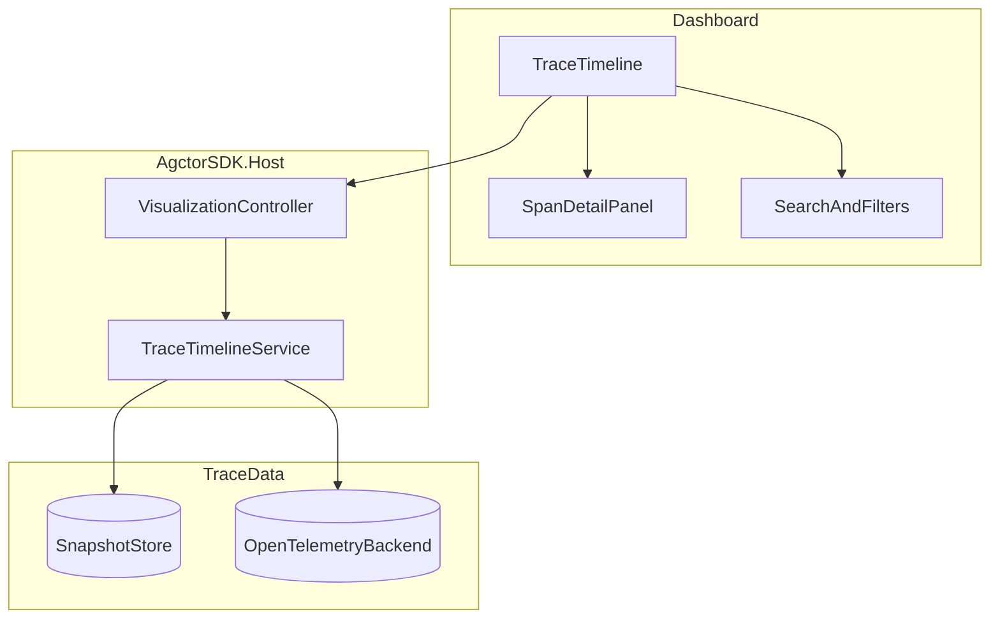

# PRD-009: Trace Timeline Experience Improvements

## Specification status

**Complete (documentation).** This PRD defines the **target** timeline experience; it does **not** imply all items are implemented. What exists today is a **baseline** timeline shipped with **PRD-008** (load trace, simple chart, event list, optional external viewer URL). See [prd-009-implementation-status.md](./prd-009-implementation-status.md) for shipped vs backlog.

---

## Purpose

Evolve the Dashboard **Trace Timeline** beyond “load and list spans” so operators can debug long agent runs quickly: navigate large trees, spot failures, correlate with chat context, and stay performant on heavy traces. This PRD builds on **PRD-008** (historical chat ↔ trace linking); it does not replace durable correlation or session ownership.

**Related:** [PRD-008: Historical Trace Timeline for Chat Sessions](../prd-008/prd-008-trace-history.md)

## Scope

- **In-scope:** timeline visualization and interaction (zoom, pan, collapse, search), span inspection UX, time presentation, error and status emphasis, performance limits and virtualization, clearer empty/error/backend states, optional deep links to external trace tools, and API/DTO extensions needed to support these features.
- **Out-of-scope:** replacing OpenTelemetry as the long-term source of truth for span payloads (may complement local snapshot stores), building a full observability product (metrics/logs explorer), and cross-session global trace search (covered only as a future note).

## Problem Statement

After PRD-008, users can open the correct trace for a chat turn, but inspecting it still feels heavy when:

- traces contain many nested spans with similar names
- failures are buried deep in the tree
- scrolling and scanning dominate over structured navigation
- wall-clock vs relative timing is unclear
- large payloads slow the UI or obscure the tree

## Goals

- Make **large traces navigable** (collapse, filter, search, optional zoom/pan if the renderer supports it).
- Make **errors and critical paths obvious** (highlighting, quick jump to first error).
- Provide **richer span context** (labels, tags, attributes, duration) without duplicating a full APM UI.
- Tie the timeline **visually to chat** (header shows session/turn/message context when loaded from chat).
- Keep **performance predictable** (caps, lazy load, virtualization where applicable).
- Preserve **Actor Model** boundaries: session/trace correlation stays actor-owned; timeline data retrieval stays behind Host services and existing controller surfaces unless a new contract is justified.

## Non-Goals

- Owning long-term span storage in AGCTOR SQLite beyond what PRD-008 already defines (snapshots may remain a cache; OTel backend remains authoritative when configured).
- Redesigning the entire Dashboard chrome in this PRD.
- Implementing a custom trace query language (simple text filter is enough for v1).

## Current State (Baseline)

- Trace Timeline loads from Host visualization APIs; historical paths may use durable snapshot store and/or live activity tracker (see PRD-008 implementation).
- Chat transcript supports turn-level and optional message-level trace selection.
- Basic loading / empty / not-found / unavailable states exist; room to refine copy and recovery actions.

## Requirements and Proposed Status

### 1. Navigation and tree ergonomics

- Support **expand/collapse** at span level and **collapse by depth** (e.g. “collapse below depth N” or “collapse siblings”).
- If the timeline uses a canvas or zoomable layout, add **zoom and pan** with reset-to-fit; if purely DOM-based, document “fit width” / horizontal scroll improvements instead.
- **Status:** Proposed.

### 2. Search and filter

- **Text search** across span names, operation names, and key attribute values (configurable fields).
- Optional **quick filters:** errors only, slow spans above threshold, by agent or `service.name` when present.
- **Status:** Proposed.

### 3. Error and status highlighting

- Visually distinguish **error spans** (status code, exception) from success.
- **Jump to first error** (or next/previous error) in the timeline.
- **Status:** Proposed.

### 4. Span detail panel

- Selecting a span opens a **detail strip or side panel** showing: duration, start/end (wall + relative), parent/children summary, attributes, events (if available in DTO).
- Avoid dumping unbounded JSON; truncate with “show more” for large values.
- **Status:** Proposed.

### 5. Time presentation

- Toggle or dual display: **relative to trace root** vs **wall-clock** (when timestamps exist).
- Show span duration bars consistently with the chosen time mode.
- **Status:** Proposed.

### 6. Chat correlation in timeline chrome

- When a trace is opened from chat, show a compact **context header**: session id (short), turn label, and “message trace” vs “turn trace”.
- Deep link or copy **trace id** for support handoff.
- **Status:** Proposed.

### 7. External viewer link (optional)

- If deployment configures a base URL template (e.g. Grafana/Jaeger), expose **“Open in external viewer”** with trace id substituted.
- Gracefully hidden when not configured.
- **Status:** Proposed.

### 8. Performance and scale

- Define **max spans** or **progressive load** strategy for huge traces; document behavior when truncated (“showing first N spans”).
- Prefer **virtualization** or chunked render for long flat lists if the UI becomes sluggish.
- Debounce search/filter input.
- **Status:** Proposed.

### 9. Reliability of states and messaging

- Sharpen copy and actions for: **NoTrace**, **NotFound**, **Unavailable**, **Partial** (incomplete snapshot), **Stale** (snapshot older than live backend).
- Where possible, offer **retry** and **copy diagnostics** (trace id, request id).
- **Status:** Proposed.

### 10. Data and API direction

- Extend timeline DTOs only as needed for search, error flags, attributes, and time fields—keep backward compatibility for existing clients.
- Prefer a single timeline response shape with optional enriched fields rather than many parallel endpoints.
- **Status:** Proposed.

### 11. Documentation and testing

- Update Host **endpoints** and **class** docs when DTOs or routes change.
- Unit tests: mapping of error status, truncation rules, filter predicates.
- Integration tests: large trace fixture (or mocked payload) and UI contract smoke where applicable.
- **Status:** Proposed.

## Architecture Direction

Session/trace **correlation** remains as in PRD-008; this PRD focuses on **presentation and retrieval quality** of the timeline payload.

## Acceptance Criteria

- Users can **find errors and slow spans** without manually expanding every node.
- **Search/filter** reduces visible spans in a predictable way with clear “no matches” state.
- **Span selection** shows structured detail, not only the tree label.
- **Time** can be interpreted in relative and/or wall-clock terms as specified in implementation.
- **Large traces** remain usable (documented limits or virtualization; no browser hang on typical agent runs).
- **Empty and failure states** are explicit and actionable.
- Build and tests pass per workspace rules when features ship.

## Key Risks

- Enriched DTOs may **bloat responses**; need caps and optional `?include=` query flags if necessary.
- External viewer URLs are **deployment-specific**; must not leak secrets in templates.
- **Snapshot vs live OTel** may disagree; UI should not imply stronger consistency than the backend provides.

---

## Wrap-up (folder closure)

- **PRD-009** is **accepted as the enhancement spec** for the trace timeline.
- **No further edits** to requirements are expected unless product priorities change; track delivery in **implementation-status** and the phase checklist in **implementation-plan**.
- **Entry point:** [prd-009-readme.md](./prd-009-readme.md).
