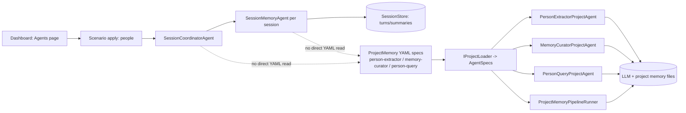

# PRD-013 — Agent Studio Integration + Scenario Defaults

## Problem

Today we have two separate dashboard experiences:

- `/Dashboard/ProjectMemory/Agents` supports creating/editing YAML-defined project-memory agents.
- `/Dashboard/Agents` manages runtime C# agent instances and type enablement, and applies a configured scenario.

This split creates friction:

- Project-memory agents are not first-class in the main Agents page.
- Users cannot manage all agent definitions from one place.
- Scenario selection is not directly surfaced in the primary Agents workflow.

## Goals

1. Integrate ProjectMemory agent management into the main Agents experience.
2. Treat YAML-defined agents as first-class agent definitions alongside C# agent types.
3. Allow selecting and applying a scenario from `/Dashboard/Agents`.
4. Preserve current behavior: a default scenario is still applied by default unless user chooses otherwise.
5. Keep Actor Model semantics intact (definitions/configuration are first-class; runtime actors still spawn through the actor runtime/registry).

## Non-goals

- Replacing Actor-based C# agents with YAML agents.
- Removing `/Dashboard/ProjectMemory/Agents` immediately (we will deprecate in phases).
- Changing project-memory file-canonical architecture under `.agctor/`.

## Desired UX

## `/Dashboard/Agents` (Unified)

Add a new section/tabs:

- `Runtime agents` (current content, mostly unchanged).
- `Agent definitions` (new unified catalog view).

### Agent Definitions panel (new)

Shows a combined list:

- **Kind: csharp-type** (from `AgentTypeOptions` and enablement service)
- **Kind: project-memory-yaml** (from `IProjectAgentSpecRegistry` / loader)

For each definition:

- id/name
- kind
- source (`code` or file path)
- status (enabled/disabled for C# types; valid/invalid for YAML specs)
- actions:
  - inspect
  - edit (YAML for project-memory specs)
  - create new (project-memory spec)

### Scenario controls on Agents page

- Add scenario selector (`GET /api/scenarios`) and `Apply` button directly on `/Dashboard/Agents`.
- Keep startup default behavior:
  - if no scenario is explicitly selected in session, use configured `Agctor:Dashboard:ScenarioName`.
  - on first load/app startup, behavior remains current default-apply path.

## API Plan

Add a small unified definitions endpoint family:

- `GET /api/agents/definitions`
  - returns mixed list (`csharp-type`, `project-memory-yaml`)
- `GET /api/agents/definitions/{id}`
  - typed detail payload
- `POST /api/agents/definitions/project-memory`
  - create new YAML spec
- `PUT /api/agents/definitions/project-memory/{id}`
  - update existing YAML spec
- `DELETE /api/agents/definitions/project-memory/{id}`
  - optional in phase 2 (or soft-delete/disable)

Reuse existing scenario endpoints where possible:

- `GET /api/scenarios`
- `POST /api/test/setup-scenario` (short-term)

Optional cleanup endpoint (future):

- `POST /api/scenarios/{id}/apply` as a clearer scenario-apply API.

## Architecture

Introduce a lightweight read/write aggregation service:

- `IAgentDefinitionCatalog` (Host-level)
  - reads C# definitions from type options + enablement
  - reads YAML definitions from project-memory registry/service
  - normalizes into one DTO

Keep runtime spawn behavior unchanged:

- Scenario apply still spawns actors via `IScenario` implementations and `IActorRuntimeAdapter`.
- Project-memory YAML definitions remain config-first definitions used by ProjectMemory orchestration/services.

### Current Connection Diagram



Notes:

- `SessionCoordinatorAgent` and `SessionMemoryAgent` handle session transcript orchestration/storage and do not directly load project-memory YAML specs.
- YAML specs (`person-extractor`, `memory-curator`, `person-query`) are consumed by project-memory agents/pipeline/tooling paths.
- This distinction is intentional to keep session orchestration and project-memory extraction/curation concerns separate.

## Data Model (DTO)

Proposed unified DTO:

- `id: string`
- `displayName: string`
- `kind: "csharp-type" | "project-memory-yaml"`
- `source: string`
- `state: string` (enabled/disabled/valid/invalid)
- `metadata: object`

### Scenario v1 extension (runtime + persona rosters)

To make scenario editing intuitive while keeping runtime semantics explicit, scenarios carry two distinct rosters:

- `agentTypes: string[]` — runtime-capable C# types used for scenario apply/bootstrap.
- `personaAgentIds: string[]` — non-runtime YAML definitions (e.g. `person-extractor`, `memory-curator`, `person-query`) used as project-memory behavior profile.
- `personaBindings?: { extractor?: string; curator?: string; query?: string }` — optional role slots that reference `personaAgentIds`.

Example:

```json
{
  "id": "people",
  "kind": "declarative",
  "agentTypes": ["SessionCoordinatorAgent", "SessionMemoryAgent"],
  "personaAgentIds": ["person-extractor", "memory-curator", "person-query"],
  "personaBindings": {
    "extractor": "person-extractor",
    "curator": "memory-curator",
    "query": "person-query"
  }
}
```

UX expectation:

- Scenario editor separates **Runtime agent roster** from **Persona roster (YAML, non-runtime)**.
- Apply preview shows both:
  - runtime bootstrap impact,
  - persona profile attached for project-memory flows.

## Delivery Plan (PR-sized)

### Phase 1 — Unified read model + Agents page scenario selector

- Add `IAgentDefinitionCatalog` service and `GET /api/agents/definitions`.
- Update `/Dashboard/Agents` JS/UI:
  - add scenario selector + apply button
  - add `Agent definitions` section (read-only list)
- Keep `/Dashboard/ProjectMemory/Agents` fully operational.

### Phase 2 — YAML CRUD from main Agents page

- Add project-memory definition create/update endpoints.
- Add create/edit drawer in `/Dashboard/Agents`.
- Reuse validation logic from ProjectMemory agents area.

### Phase 3 — Navigation consolidation

- Cross-link old page to new unified section.
- Mark `/Dashboard/ProjectMemory/Agents` as legacy or route it to focused subview.

### Phase 4 — API cleanup

- Optionally introduce dedicated `POST /api/scenarios/{id}/apply`.
- Remove duplicated endpoint wiring if no longer needed.

## Default Scenario Behavior (Explicit)

Required behavior:

1. On host startup, configured default scenario (`Agctor:Dashboard:ScenarioName`) remains authoritative fallback.
2. On `/Dashboard/Agents`, user may explicitly select/apply another scenario.
3. If no user apply occurred in current session, UI reflects configured default and current behavior.

## Risks / Mitigations

- **Risk:** confusion between definition vs runtime instance.
  - **Mitigation:** explicit labels in UI (`Definition`, `Runtime instance`).
- **Risk:** YAML edit validation drift.
  - **Mitigation:** centralize validation in shared service used by both pages.
- **Risk:** duplicated scenario apply flows.
  - **Mitigation:** keep one backend apply path, only add thin endpoint alias later.

## Acceptance Criteria

1. `/Dashboard/Agents` can list both C# and project-memory agent definitions.
2. User can select/apply scenario directly in `/Dashboard/Agents`.
3. Default scenario fallback behavior is unchanged.
4. User can create/edit project-memory agents from `/Dashboard/Agents` (phase 2 completion).
5. Existing `/Dashboard/ProjectMemory/Agents` workflows keep working during migration.

## Test Plan

- Unit:
  - `AgentDefinitionCatalog` mapping and merge tests.
  - Scenario default fallback behavior tests.
- Integration:
  - `GET /api/agents/definitions` returns mixed definitions.
  - Scenario apply from Agents page updates current scenario store.
  - Project-memory YAML create/edit through new endpoints.
- Manual UI:
  - apply default + explicit scenarios from `/Dashboard/Agents`
  - create/edit YAML definition and verify it appears in both pages during transition.

