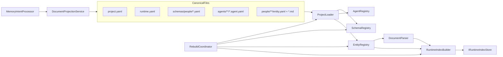

# PRD-013: Implementation plan — Generic Agents + File-Canonical Project Memory

**Status:** MVP delivered in `AgctorSDK.Core` (`ProjectMemory`), sample `samples/people-project/`, three project-memory agents, Host DI + `ProjectMemoryServiceAccessor`. Phase 2 (Sales/Jobs, Studio UIs) not in scope here.

## What the PRD commits to

- **Canonical truth**: `.agctor/` portable tree (YAML + markdown); SQLite/Postgres are **rebuildable** indexes only ([PRD sections 4, 12–13](./prd-013-agctor-prd.md)).
- **MVP** ([section 24](./prd-013-agctor-prd.md)): core infrastructure, **People** project type only, agents **person-extractor**, **memory-curator**, **person-query-agent**, three **update modes** (`replace_section`, `merge_list`, `append_chronological`), import/rebuild/validation.
- **Phase 2** ([section 25](./prd-013-agctor-prd.md)): Sales/Jobs schemas, view helpers, Studio UIs, richer validation, optional semantic retrieval.

## Current codebase (post-MVP)

Core services live under `AgctorSDK.Core/ProjectMemory/` (`IProjectLoader`, `MemoryIntentProcessor`, `DocumentProjectionService`, `RebuildCoordinator`, `IRuntimeIndexStore`, etc.). Host registers `AddAgctorProjectMemory()` and project-memory agent types; see [prd-013-readme.md](./prd-013-readme.md) for file pointers.

**Design note:** `project.yaml` and `runtime.yaml` are implemented with versioned fields (`schemaVersion`, `projectId`, `projectType`, `mode`, SQLite/Postgres paths). Details align with [PRD §7](./prd-013-agctor-prd.md) and the sample project.

## Target architecture (MVP)

**Memory pipeline** (PRD section 12.4): input → extractor agent emits **memory intents** (JSON) → curator validates + routes via `routing-rules.yaml` → `DocumentProjectionService` applies update modes → `RuntimeIndexBuilder` refreshes index.

## Module placement (per repo conventions)

| Area | Location |
|------|----------|
| Models (YAML DTOs, intents, validation results) | [`AgctorSDK.Core`](../../AgctorSDK.Core/) (`ProjectMemory/`) |
| Interfaces (PRD §21) | [`AgctorSDK.Core/ProjectMemory`](../../AgctorSDK.Core/ProjectMemory/) |
| SQLite / Postgres index stores | [`AgctorSDK.Core/ProjectMemory/Indexing`](../../AgctorSDK.Core/ProjectMemory/Indexing/) |
| Markdown parsing / projection | [`AgctorSDK.Core/ProjectMemory/Parsing`](../../AgctorSDK.Core/ProjectMemory/Parsing/), [`Processing`](../../AgctorSDK.Core/ProjectMemory/Processing/) |
| **Tools** | [`AgctorSDK.Tools`](../../AgctorSDK.Tools/) (`ProjectMemoryTool.cs`) |
| **Agents** | [`AgctorSDK.Agents/Agents/ProjectMemory`](../../AgctorSDK.Agents/Agents/ProjectMemory/) |
| Unit tests | [`AgctorSDK.Core.Tests/ProjectMemory`](../../AgctorSDK.Core.Tests/ProjectMemory/) |
| Integration tests | [`AgctorSDK.Core.IntegrationTests/ProjectMemory`](../../AgctorSDK.Core.IntegrationTests/ProjectMemory/) |
| Host wiring | [`AgctorSDK.Host/Program.cs`](../../AgctorSDK.Host/Program.cs) |

**Actor model**: Project-memory agents are actors; runtime uses `ProjectMemoryServiceAccessor` for DI because the actor host constructs agents with `new T(id)` only.

## Implementation sequence (recommended)

1. **Contracts and file formats** — DTOs for `*.agent.yaml`, schema files, `entity.yaml`, memory intents; **`project.yaml` / `runtime.yaml`**.
2. **`ProjectLoader`**, **`SchemaRegistry`**, **`ProjectAgentSpecRegistry`**, **`EntityRegistry`** — load `.agctor/`, resolve paths, validate; discover `people/{entityKey}/`.
3. **`DocumentParser`** — `##` sections for projection.
4. **`MemoryIntentProcessor` + `DocumentProjectionService`** — routing + three update modes; curator writes; extractor does not write files directly.
5. **`IRuntimeIndexStore` + `SQLiteRuntimeIndexStore`** — rebuildable tables.
6. **`RuntimeIndexBuilder` + `RebuildCoordinator`** — full pipeline + logs; **Postgres** via `PostgresRuntimeIndexStore` + `SwitchingRuntimeIndexStoreFactory`.
7. **Reference People project** — [`samples/people-project`](../../samples/people-project/).
8. **Agents and tools** — scoped `memoryAccess`; `PersonExtractorProjectAgent`, `MemoryCuratorProjectAgent`, `PersonQueryProjectAgent`; Host `AgentTypeOptions`.
9. **Quality gate** — build, unit + integration tests; [`AgctorSDK.Core/docs`](../../AgctorSDK.Core/docs/) Mermaid + JPEG automation.

## Acceptance mapping (PRD §23)

- **23.1–23.2, 23.5**: File-only create/restore; SQLite/Postgres modes; YAML agents with scoped tools.
- **23.3–23.4**: Schema + routing + update modes + rebuild + human-readable markdown.

## Risks (from PRD §26, mitigated in plan)

- **Markdown mess**: templates + deterministic projection + single writer (curator).
- **Hidden DB semantics**: durable semantics in files; DB mirrors files only.
- **Schema drift**: `schemaVersion` + validation on rebuild.

## Explicitly out of MVP scope

- Agent Studio / Schema Studio / file explorer UI ([§18](./prd-013-agctor-prd.md)) — Phase 2.
- Sales Lead and Job Search project types — Phase 2 ([§25](./prd-013-agctor-prd.md)).
- Vector/pgvector — optional later ([§15.3](./prd-013-agctor-prd.md)).

## Dependency order

Contracts → loaders/registries → parser + projection → runtime index + rebuild → sample → agents/tools → tests + docs.
