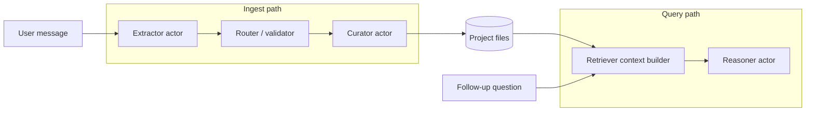

# PRD-013 — Multi-agent orchestration plan

**Status:** Planning — complements [prd-013-agctor-prd.md](./prd-013-agctor-prd.md) and [prd-013-implementation-plan.md](./prd-013-implementation-plan.md).  
**Goal:** Enable **groups of agents** that work together: extract structured memory → validate/route → persist via tools → (later) retrieve and reason over canonical files.

---

## 1. Problem statement

Today, individual project-memory agents exist (extractor, curator, query), and the Dashboard playground can invoke the LLM against a **single** agent spec. There is **no first-class workflow** that:

1. Chains **extract → write** so extracted facts land in workspace files automatically.
2. Chains **retrieve → reason** for follow-up questions that depend on **stored** facts (e.g. age in months from birth month).
3. Exposes a **clear contract** between steps (intents, errors, file paths) and **termination** (when a “group run” is done).

This plan defines **phased** orchestration so implementation stays testable and aligned with the **actor model**.

---

## 2. Principles (non-negotiable)

| Principle | Implication |
| --- | --- |
| **Canonical truth on disk** | Agents **propose** changes; curator/projection **commits** under project root with existing guards. |
| **Strict intent contract** | Extractor output must match what `IMemoryIntentProcessor` / routing expects (avoid arbitrary JSON shapes). |
| **Separation of chat vs project** | Session transcript = conversation; **entity facts** live in project files; reasoners **read project** for “what we know about Raha.” |
| **Actor-friendly handoffs** | Prefer **typed messages** between actors over one mega-prompt; enables tracing and replay. |
| **Observable runs** | Each orchestrated run has a **correlation id** / trace: which agents ran, which files touched. |

---

## 3. Target architecture (logical)

- **Orchestrator** (Phase 1: **deterministic**, rule-based): decides whether to run ingest, query, or both (e.g. new facts in message → ingest first, then answer).
- **Phase 2 (optional):** LLM **supervisor** plans steps from the same menu of specialists; same message contracts.

---

## 4. Agent roles (reuse + gaps)

| Role | Existing / planned | Notes |
| --- | --- | --- |
| Extractor | `PersonExtractorProjectAgent` | Must emit **memory-intent JSON** per PRD, not ad-hoc `entities` arrays unless mapped. |
| Router / validator | `MemoryIntentProcessor` + validation in Core | Already routes; extend only if new intent kinds appear. |
| Curator / writer | `MemoryCuratorProjectAgent` | Applies intents → files via projection. |
| Retriever | `PersonQueryProjectAgent` / `ProjectMemoryOperations` | Builds context from disk + schema. |
| Reasoner | New or extend query agent | Computes answers; **prefer deterministic date math** when inputs are structured. |
| Orchestrator | **New** (Host or Core service + thin actor façade) | Not a “chat LLM” in v1 — **rules + state machine**. |

---

## 5. Phased delivery

### Phase O — Contracts & documentation (1–2 days design)

- [ ] Freeze **extractor output schema** vs **MemoryIntentBatch** (single JSON schema or codegen-friendly DTO).
- [ ] Document **orchestrator states**: `Idle → Extracting → Routing → Writing → Done` and `Idle → Retrieving → Answering → Done`.
- [ ] Add **failure modes**: partial extract, validation error, tool denial, retry policy (max steps).

**Exit:** Signed-off section in PRD or ADR; sample golden JSON for tests.

### Phase 1 — Deterministic orchestrator (“pipeline MVP”)

- [ ] **Orchestrator service** (interface in Core, implementation callable from Host):  
  - Input: `projectRoot`, `userMessage`, `correlationId`, optional `sessionId`.  
  - Output: ordered list of **step results** (extract, validate, write, retrieve, answer) + final user-visible text.
- [ ] Wire **extract → MemoryIntentProcessor → curator** in-process (reuse existing agents’ *logic* or send actor messages — pick one for consistency).
- [ ] **Single entry API** for Dashboard or MCP: e.g. `POST /api/project-memory/orchestrator/run` (name TBD).
- [ ] **Tests:** integration tests with temp `people-project` fixture; assert files change when ingest path runs.

**Exit:** One end-to-end demo: paste “Raha is 45…”, see `people/…` updated, then second call answers using retrieved context.

### Phase 2 — UX: “Scenario” or “Agent group” in Dashboard

- [ ] Register orchestrator as a **scenario** or dedicated page (“Project memory pipeline”).
- [ ] Show **step timeline** (reuse trace/timeline patterns where possible).
- [ ] Optional: “Apply extraction” toggle vs dry-run.

**Exit:** Non-developer can run the two-step demo from the UI.

### Phase 3 — Rich reasoning & tools

- [ ] **Birth date / age in months:** either structured fields in entity docs + small **deterministic** calculator, or tool that reads YAML and returns numbers to the reasoner.
- [ ] Tighten **tool allowlists** per agent spec so extractor cannot write raw paths.

**Exit:** Example question in PRD answered reliably with trace showing retrieve + compute.

### Phase 4 — Optional LLM supervisor

- [ ] Replace rule-based branch selection with LLM planner **only if** Phase 1 metrics show need; keep **same** specialist contracts.

---

## 6. Workstreams

| Workstream | Owner area | Deliverables |
| --- | --- | --- |
| Contracts | Core PRD + models | Intent schema, orchestrator DTOs, error codes |
| Orchestrator | Core + Host | `IOrchestrator` / `ProjectMemoryPipelineRunner`, DI, API |
| Agents | AgctorSDK.Agents | Align extractor output; optional thin “reasoner” actor |
| Tools | AgctorSDK.Tools | Ensure ProjectMemoryTool coverage for curator path |
| UX | AgctorSDK.Host | Page or scenario wiring, timeline |
| QA | Tests | Unit (orchestrator branches), integration (disk + API) |

---

## 7. Dependencies & risks

| Risk | Mitigation |
| --- | --- |
| LLM emits wrong JSON | JSON repair or strict retry; validate before curator |
| Double-writes | Idempotent intents or transaction log per `correlationId` |
| Orchestrator complexity | Phase 1 stays **code-first**, no planner LLM |
| Confusion with playground | Rename/labelling: playground = **spec test**; orchestrator = **project writes** |

---

## 8. Open decisions (resolve before Phase 1 coding)

1. **Orchestrator placement:** Core library (portable) vs Host-only (HTTP-first).
2. **Actor vs direct calls:** Message-passing between `PersonExtractorProjectAgent` and `MemoryCuratorProjectAgent` vs shared service calling Core in one process (latency vs purity).
3. **User confirmation:** Auto-apply after extract vs confirm dialog in UI.
4. **Naming:** Public API route and scenario name (`project-memory-pipeline`, etc.).

---

## 9. Acceptance criteria (MVP orchestration)

1. Given a valid project root, a **single orchestrated request** with ingest intent **updates at least one canonical file** under `people/` (or configured entity root).
2. A **second request** that only asks a question **reads** from those files (or fails loudly if missing).
3. Logs or API response include **step list** and **correlation id** for debugging.
4. No regression to existing **playground** and **rebuild** flows.

---

## 10. Document history

| Version | Date | Notes |
| --- | --- | --- |
| 1.0 | 2026-04-07 | Initial plan from multi-agent brainstorm |
