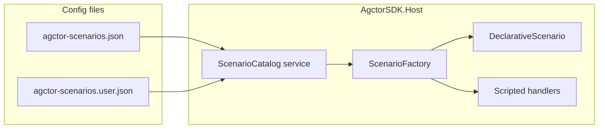

# PRD-013 — Scenario catalog, dynamic loading, and chat project binding

**Status:** Planning — extends Host dashboard scenario system and chat session projects.  
**Complements:** [prd-013-agctor-prd.md](./prd-013-agctor-prd.md) (project memory on disk), [prd-013-multi-agent-orchestration-plan.md](./prd-013-multi-agent-orchestration-plan.md) (pipeline orchestration).  
**Does not replace:** Canonical `.agctor/` project memory layout; this PRD addresses **runtime scenario definitions** and **chat project metadata** in the Host.

---

## 1. Problem statement

Today, dashboard scenarios are **hardcoded** in C#: [`ScenarioFactory`](../../AgctorSDK.Host/Services/ScenarioFactory.cs) maps scenario names (`code-generation-chain`, `code-graph-demo`) to concrete `IScenario` types. Agent rosters for complex flows are duplicated in code (e.g. [`DemoAgentIds`](../../AgctorSDK.Host/Services/Scenarios/CodeGraphDemoScenario.cs) in `CodeGraphDemoScenario`). There is **no** first-class **`people`** (or people/person) scenario in that registry—only chat UI strings and `SessionProjectTypes` on chat buckets.

Operators cannot:

- Add or reorder agents in a scenario without a code change and redeploy.
- Treat **people-oriented chat** as the same **scenario** concept used by **Apply scenario** on the Agents dashboard.
- Bind a **chat project** to a **stable scenario id** validated against a single catalog.

---

## 2. Goals

1. **JSON-driven scenario catalog** — scenarios (id, display metadata, agent type roster) load from configuration files, not a hardcoded dictionary.
2. **Default + user overlay** — ship `agctor-scenarios.json` with the Host; allow `agctor-scenarios.user.json` (or equivalent) to override/extend without losing defaults on upgrade.
3. **First-class `people` scenario** — a declarative scenario `id: "people"` suitable for people/person-oriented chat and memory workflows, listed alongside scripted demos.
4. **Hybrid scenario kinds** — **declarative** scenarios (generic setup from JSON only) and **scripted** scenarios (existing C# `SetupAsync` for CodeGraph/code-gen) both appear in one catalog; JSON holds **metadata + agent roster** for both where possible.
5. **Dashboard UX** — simple editor: list scenarios, add/remove **agent type ids** per scenario, save validated changes to the user file.
6. **Chat linkage** — each **chat project** stores a **`scenarioId`** referencing the catalog; APIs and UI validate it. **Display name** of the project remains user-defined (e.g. “Raha Mohebbi”); **scenario** selects the agent bundle / semantic class.

---

## 3. Non-goals (initial phases)

- Loading **arbitrary C# types** or executable code from JSON (security). Scripted scenarios use an **allowlisted** set of handler keys mapped to existing classes.
- **Fully** reimplementing `CodeGraphDemoScenario.SetupAsync` as data in v1 — imperative CodeGraph/bootstrap logic stays in C#; JSON supplies **identity, description, and agent roster** to reduce duplication and support the editor.
- **Per-project actor runtime isolation** in v1 — selecting a scenario on a chat project does not, by default, spawn a separate runtime; see §10.4.

---

## 4. Current code anchors

| Concern | Location |
| --- | --- |
| Scenario name → type map | [`AgctorSDK.Host/Services/ScenarioFactory.cs`](../../AgctorSDK.Host/Services/ScenarioFactory.cs) |
| Scenario interface | [`AgctorSDK.Host/Services/IScenario.cs`](../../AgctorSDK.Host/Services/IScenario.cs) |
| Code graph demo | [`AgctorSDK.Host/Services/Scenarios/CodeGraphDemoScenario.cs`](../../AgctorSDK.Host/Services/Scenarios/CodeGraphDemoScenario.cs) |
| Code generation chain | [`AgctorSDK.Host/Services/Scenarios/CodeGenerationChainScenario.cs`](../../AgctorSDK.Host/Services/Scenarios/CodeGenerationChainScenario.cs) |
| HTTP setup | [`AgctorSDK.Host/Controllers/TestController.cs`](../../AgctorSDK.Host/Controllers/TestController.cs) `POST /api/Test/setup-scenario` |
| Chat project model | [`AgctorSDK.Core/Sessions/Models/SessionProject.cs`](../../AgctorSDK.Core/Sessions/Models/SessionProject.cs) (`ProjectType` today) |
| SQLite session store | [`AgctorSDK.Host/Services/Sessions/SqliteSessionStore.cs`](../../AgctorSDK.Host/Services/Sessions/SqliteSessionStore.cs) |

**Gap:** `SessionProject.ProjectType` is **not** the same system as `IScenario`. This PRD introduces **`ScenarioId`** (and migration path from `project_type`) so chat projects align with the catalog.

---

## 5. Configuration files and paths

| File | Role |
| --- | --- |
| **`agctor-scenarios.json`** | Bundled defaults (e.g. under `AgctorSDK.Host/Config/`), copied to output. |
| **`agctor-scenarios.user.json`** | Optional user/operator overlay: merge over defaults (same idea as `appsettings.User.json`). |

**Configuration keys (suggested):**

- `Agctor:Scenarios:DefaultFile` — relative to content root or absolute path to default JSON.
- `Agctor:Scenarios:UserFile` — optional user overlay path.

**Merge semantics:** User file **overrides** scenarios with matching `id`; may **append** new scenario ids not in defaults if product allows (decision: **v1 = override-by-id only** for simplicity, or document append rules explicitly in implementation).

---

## 6. JSON schema (normative)

### 6.1 Top level

```json
{
  "version": 1,
  "scenarios": [ ]
}
```

- **`version`** — integer; bump when breaking schema changes.
- **`scenarios`** — array of scenario objects.

### 6.2 Scenario object

| Field | Type | Required | Notes |
| --- | --- | --- | --- |
| `id` | string | yes | Stable key: `people`, `code-graph-demo`, etc. Lowercase kebab-case recommended. |
| `displayName` | string | yes | Human label for UI. |
| `description` | string | no | Shown in dashboard and API. |
| `kind` | string | yes | `"declarative"` or `"scripted"`. |
| `agentTypes` | string[] | yes | Agent **type ids** (e.g. `session-coordinator-agent`). Must validate against server-known catalog. |
| `handler` | string | conditional | Required when `kind` is `"scripted"`. Value from **allowlist** (e.g. `CodeGraphDemoScenario`, `CodeGenerationChainScenario`). |

### 6.3 Validation rules

- **`id`** unique across merged catalog.
- **`kind`** ∈ `{ declarative, scripted }`.
- **`handler`** present iff `kind === scripted`; must map to exactly one registered C# scenario handler.
- **`agentTypes`** — each entry must exist in the Host’s agent type registry (or documented exception list); invalid entries rejected at load or at save time with clear errors.

### 6.4 Example: `people` (declarative)

```json
{
  "id": "people",
  "displayName": "People / person",
  "description": "Chat and session memory oriented around people; enables coordinator and session-memory agents for conversational workflows.",
  "kind": "declarative",
  "agentTypes": [
    "session-coordinator-agent",
    "session-memory-agent"
  ]
}
```

*Exact agent list is illustrative—implementation must align with registered types in `Program.cs` / agent factory.*

### 6.5 Example: `code-graph-demo` (scripted)

```json
{
  "id": "code-graph-demo",
  "displayName": "Code graph demo",
  "description": "Minimal CodeGraph with indexer, embeddings, and related agents (see handler).",
  "kind": "scripted",
  "handler": "CodeGraphDemoScenario",
  "agentTypes": [
    "indexer-agent",
    "embedding-coordinator-agent",
    "search-agent",
    "llm-agent",
    "intent-agent",
    "query-agent",
    "coder-agent",
    "refactor-agent",
    "session-coordinator-agent"
  ]
}
```

*Roster mirrors current [`DemoAgentIds`](../../AgctorSDK.Host/Services/Scenarios/CodeGraphDemoScenario.cs); scripted handler continues to own bootstrap logic.*

### 6.6 Example: `code-generation-chain` (scripted)

```json
{
  "id": "code-generation-chain",
  "displayName": "Code generation chain",
  "description": "Root → LLM with CodeExecutor for generation and validation.",
  "kind": "scripted",
  "handler": "CodeGenerationChainScenario",
  "agentTypes": [
    "root-agent",
    "llm-agent"
  ]
}
```

*Agent ids must match what [`CodeGenerationChainScenario`](../../AgctorSDK.Host/Services/Scenarios/CodeGenerationChainScenario.cs) creates—adjust during implementation to stay in sync.*

---

## 7. Runtime architecture



### 7.1 ScenarioCatalog service

- Loads default + user JSON at startup.
- Merges into an in-memory **catalog** (list of definitions).
- Exposes: `IReadOnlyList<ScenarioDefinition> List()`, `ScenarioDefinition? Get(string id)`, validation helpers.
- Optional: `Reload()` for admin/dev after file write.

### 7.2 ScenarioFactory refactor

- **Remove** hardcoded `Dictionary<string, Type>` of scenario **names** as the source of truth.
- **Resolve** `IScenario` by:
  - **`declarative`** → single generic `DeclarativeScenario` that implements `IScenario` and whose `SetupAsync` enables/creates agents according to `agentTypes` from the definition (aligned with patterns used today in scripted scenarios, but data-driven).
  - **`scripted`** → resolve `handler` to existing class via allowlist; **inject** the merged `ScenarioDefinition` (or `agentTypes`) so handlers stop using only private static arrays.

### 7.3 Compatibility with `TestController`

- `POST /api/Test/setup-scenario` continues to accept `scenarioName`; value must match catalog **`id`**.
- Unknown ids return 400 with list of valid ids from catalog (not from a hardcoded string).

---

## 8. HTTP API (specification)

| Method | Path | Purpose |
| --- | --- | --- |
| GET | `/api/scenarios` | List scenarios (id, displayName, description, kind, agentTypes count or full list for admin). |
| GET | `/api/scenarios/{id}` | Single scenario definition. |
| PUT | `/api/scenarios` or `/api/scenarios/{id}` | Persist changes to **user** JSON only; validate schema and agent types. |
| POST | `/api/scenarios/reload` | Optional: reload catalog from disk (dev/admin). |

**Agent picker source:** Reuse or align with existing agent listing endpoints used by the dashboard (e.g. config/agents) so the Scenarios editor only offers **valid** type ids.

**Auth:** If the Host gains auth later, restrict PUT/reload to operators; v1 may remain open on localhost dev.

---

## 9. Dashboard UX (specification)

- **Route:** `/Dashboard/Scenarios` (or a tab on `/Dashboard/Agents` if preferred for discoverability).
- **Layout:**
  - Left: scenario list from `GET /api/scenarios`.
  - Right: selected scenario — edit `displayName`, `description`; **agentTypes** as add/remove list with dropdown from server catalog.
  - **Save** writes user JSON; display validation errors inline.
- **Scripted scenarios (v1):** `kind` and `handler` **read-only** in UI; **agentTypes** editable if product allows roster changes without breaking handler assumptions—otherwise lock scripted roster in v1 and document in UI (“Edit roster may require handler support”).

---

## 10. Chat system integration

### 10.1 Data model

- Add **`ScenarioId`** to `SessionProject` (and SQLite `session_projects` table).
- **Migration:** map existing `project_type` values where possible (`people`, `person` → `people` scenario id); otherwise nullable `scenario_id` until user re-saves project in UI.
- Deprecation: **`ProjectType`** may remain as denormalized cache or be removed after migration—implementation chooses one path and documents it.

### 10.2 API

- `CreateChatProjectRequest` / `UpdateChatProjectRequest`: include **`scenarioId`** (required for new projects once enforced).
- `ChatProjectsController` / DTOs: validate `scenarioId` against `ScenarioCatalog` on create/update.
- Responses expose `scenarioId` + optional resolved `displayName` for convenience.

### 10.3 UI

- Playground, Projects, Pipeline: **scenario** dropdown populated from `GET /api/scenarios` (not hardcoded people/person/custom type text fields).
- **Project display name** remains free text (e.g. “Raha Mohebbi”, “Portable Toilet business — Irvine”).
- **Follow-up:** Remove **custom project type** text fields from JS once `scenarioId` is authoritative.

### 10.4 Relationship to global “Apply scenario”

- **Default (v1):** The existing **Apply scenario** flow on the Agents dashboard remains **host-wide** (current behavior).
- Chat **`scenarioId`** is **metadata**: filtering, labeling, future prompts, and optional future **per-project** apply. It does **not** imply a separate actor isolation boundary unless a later PRD adds it.

---

## 11. Phased delivery

| Phase | Scope |
| --- | --- |
| **A** | Add default `agctor-scenarios.json` + optional user file; implement `ScenarioCatalog`; refactor `ScenarioFactory` to build registry from catalog; include `people`, `code-graph-demo`, `code-generation-chain`. |
| **B** | Refactor scripted scenarios to consume `agentTypes` from catalog definitions; reduce/remove duplicate static arrays where safe. |
| **C** | Implement §8 APIs; build `/Dashboard/Scenarios` editor; integration tests for load, PUT round-trip, validation. |
| **D** | Chat: `scenario_id` column + migration; wire `ChatProjectsController` and session UI; update Host endpoints/docs diagrams. |

---

## 12. Acceptance criteria

1. No scenario **id** is registered solely inside a hardcoded `ScenarioFactory` dictionary; catalog JSON is the source of truth for **which** scenarios exist.
2. Catalog includes a **`people`** scenario with `kind: declarative` and appears in `GET /api/scenarios`.
3. `POST /api/Test/setup-scenario` succeeds for `code-graph-demo` and `code-generation-chain` using catalog ids after refactor.
4. Operator can edit a **declarative** scenario’s `agentTypes` in the dashboard and persist to user JSON; reload reflects changes.
5. Creating a chat project with an invalid `scenarioId` is rejected with a clear error; valid id is stored and returned.

---

## 13. Risks and mitigations

| Risk | Mitigation |
| --- | --- |
| Scripted handler assumes fixed agent set | Version scripted handlers to read roster from injected definition; integration tests for setup-scenario. |
| Invalid or stale `agentTypes` in JSON | Validate against registry at load and on PUT; show errors in UI. |
| User file merge conflicts / concurrent edits | Single-file write with last-write-wins in v1; document; optional file lock or ETag later. |
| Drift between JSON and C# agent creation order | Declarative scenario applies deterministic ordering; document scripted handler ordering. |

---

## 14. Open decisions (implementation)

- Exact **allowlist strings** for `handler` (class short name vs fully qualified).
- Whether **append** of new scenario ids via user file is allowed in v1.
- Whether scripted scenario **agentTypes** are editable in UI v1 or read-only.

---

## Document history

| Date | Change |
| --- | --- |
| 2026-04-08 | Initial PRD added (planning only). |
