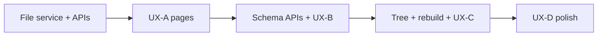

# PRD-013 UX/UI — Implementation plan (Dashboard)

**Specification:** [prd-013-ux-ui.md](./prd-013-ux-ui.md)  
**Backend reference:** [prd-013-implementation-plan.md](./prd-013-implementation-plan.md), `AgctorSDK.Core/ProjectMemory/`  
**Pattern reference:** PRD-012 Dashboard + `GET/PUT /api/runtime` + Razor + `wwwroot/js/dashboard/*.js`

This plan turns the UX PRD into **engineering phases**: APIs, Razor pages, static assets, tests, and documentation. It does not repeat full UX copy; see §6–11 in the UX PRD.

---

## 1. Goals of this plan

1. Ship **UX-A → UX-D** slices with clear **dependencies** and **acceptance hooks** (mapped to UX PRD §11).
2. Reuse existing Host conventions: **Tailwind + Flowbite**, **Razor Pages** under `Pages/Dashboard/`, **JSON APIs** under `Controllers/`, **page-specific JS** under `wwwroot/js/dashboard/`.
3. Keep **canonical files** as source of truth: UI reads/writes `.agctor/` via services; optional future `IProjectMemoryFileStore` abstraction if needed for testing.
4. **No duplicate business rules** in the Host: validation orchestration should call `AgctorSDK.Core` (`ProjectLoader`, `ProjectRebuildValidator`, serializers) where possible.

---

## 2. Current assets (reuse)

| Asset | Location | Use |
| --- | --- | --- |
| Load project & agent specs | `IProjectLoader`, `LoadedProjectContext` | List agents, bind editor |
| Serialize YAML | `ProjectYamlSerializer` | Preview + save `*.agent.yaml` |
| Validate rebuild | `ProjectRebuildValidator`, `RebuildCoordinator` | Validate + rebuild actions |
| Agent DTO | `AgentDefinitionSpec` | Form binding (mirror properties) |
| Schema DTOs | `ProjectTypeBundle`, entity/doc/routing models | Schema Studio |
| Project root config | `ProjectMemoryAgentOptions`, `Agctor:ProjectMemory:ProjectRoot` | Single active project (v1) |

**Gap:** File **write** paths for agents/schemas from Host are not yet exposed as a single service. **Plan:** add a thin `IProjectMemoryFileService` (or extend existing) in **Core or Host** that: resolves paths under project root, writes text atomically, and rejects paths outside `.agctor/` / entity roots per policy. UI calls this from API handlers.

---

## 3. Product decisions (resolve before UX-B)

| Question | Recommended default for v1 |
| --- | --- |
| Single vs multi-project | **Single active project** via `Agctor:ProjectMemory:ProjectRoot` + optional “Open folder” that updates `appsettings.User.json` (same pattern as PRD-012 user settings) |
| Template storage | **Static JSON or YAML** under Host `wwwroot/templates/project-memory/` **or** embedded resources; copy into `.agctor/agents/` on save |
| Import | **Path string** (server-local) first; upload zip later (UX-D) |

Document chosen decisions in the UX PRD “Open questions” when locked.

---

## 4. Information architecture → routes

Map UX PRD §6 to Razor routes (adjust names in code if needed):

| UX area | Route | Notes |
| --- | --- | --- |
| Project memory overview | `/Dashboard/ProjectMemory` or `/Dashboard/ProjectMemory/Index` | Health, path, validate/rebuild CTA |
| Agents (list) | `/Dashboard/ProjectMemory/Agents` | |
| Agent editor | `/Dashboard/ProjectMemory/Agents/Edit` | Query `?id=` or new |
| Templates | `/Dashboard/ProjectMemory/Templates` | Gallery + wizard |
| Storage rules | `/Dashboard/ProjectMemory/Schema` | Tabs for sub-areas |
| Workspace | `/Dashboard/ProjectMemory/Workspace` | Tree + preview |
| Import & rebuild | `/Dashboard/ProjectMemory/Maintenance` | Or split Import/Logs |

**Navigation:** Add a **dropdown or grouped links** “Project memory” in `_Layout.cshtml` (avoid nav clutter: one parent + sub-links or a single landing page with cards).

---

## 5. API surface (proposed)

All JSON; CSRF for cookie auth if added later; for same-origin fetch from Dashboard, anti-forgery tokens on Razor forms or header for POST.

| Method | Path | Purpose |
| --- | --- | --- |
| GET | `/api/project-memory/status` | Project root, loaded manifest summary, last validation/rebuild timestamps (store in memory or small JSON sidecar under `.agctor/logs/` if needed) |
| GET | `/api/project-memory/agents` | List agent specs (from `ProjectLoader`) |
| GET | `/api/project-memory/agents/{id}` | One spec + raw path |
| PUT | `/api/project-memory/agents/{id}` | Save agent YAML (body = DTO or raw YAML string) |
| DELETE | `/api/project-memory/agents/{id}` | Delete file with confirm |
| GET | `/api/project-memory/templates` | List built-in agent templates |
| POST | `/api/project-memory/agents/from-template` | Body: templateId, newId, overrides |
| GET | `/api/project-memory/schema` | Bundle summary or per-file endpoints |
| PUT | `/api/project-memory/schema/{segment}` | `entity-types` / `document-types` / `routing-rules` / `workspace` / `project-type` |
| GET | `/api/project-memory/tree` | JSON tree: roots + files (no dotfiles except allowed) |
| GET | `/api/project-memory/file` | Query `path=` relative to project root — preview content |
| POST | `/api/project-memory/validate` | Run loader + `ProjectRebuildValidator` without full rebuild |
| POST | `/api/project-memory/rebuild` | `RebuildCoordinator.RebuildAsync` |

**Controller:** `ProjectMemoryController` or split `ProjectMemoryAgentsController` / `ProjectMemorySchemaController` if files grow.

---

## 6. Phase UX-A — Nav, overview, Agent Studio, templates

| Step | Action | Location |
| --- | --- | --- |
| A.1 | Add **Project memory** nav + landing page | `Pages/Dashboard/ProjectMemory/Index.cshtml`, `_Layout.cshtml` |
| A.2 | **Status API** + minimal overview UI | `Controllers/ProjectMemoryController.cs` (or section), JS optional |
| A.3 | **GET/PUT/DELETE agents** + list page | Razor + `wwwroot/js/dashboard/project-memory-agents.js` |
| A.4 | **Agent editor** multi-section form + preview tab (YAML from `ProjectYamlSerializer.Serialize`) | Same JS + partials or one page |
| A.5 | **Validation** on save: in-memory `AgentDefinitionSpec` round-trip + loader reload | Core helper or small validator in Host |
| A.6 | **Template gallery** static data + **wizard** (5 steps per UX §7.3) | Templates JSON + `Templates.cshtml` + wizard JS |
| A.7 | **Host file write service** + tests | New service interface + implementation |

**Acceptance:** Matches UX PRD §11 items 1–2 (template path + full editor sections) once wired.

---

## 7. Phase UX-B — Storage rules (Schema Studio)

| Step | Action | Location |
| --- | --- | --- |
| B.1 | **Read schema bundle** into DTOs for UI | Reuse `ProjectLoader` + existing YAML models |
| B.2 | **Tabbed UI** for project type, entity types, document types, routing, workspace | `Pages/Dashboard/ProjectMemory/Schema.cshtml` |
| B.3 | **Routing rule builder**: ordered list, drag handle or up/down | JS component |
| B.4 | **PUT** per segment with validation (orphan routes, etc.) | Call Core validation or extend `ProjectRebuildValidator` |
| B.5 | **Preview** export YAML per file | Serializer |

**Acceptance:** UX PRD §11 item 3 (routing rule + preview).

---

## 8. Phase UX-C — Workspace browser + import/rebuild

| Step | Action | Location |
| --- | --- | --- |
| C.1 | **Tree API** + lazy load for large trees | `GET tree`, `GET file` |
| C.2 | **Markdown preview** (client-side render or server markdown) | Simple `<pre>` or lightweight MD lib |
| C.3 | **Maintenance page**: validate + rebuild buttons | `Maintenance.cshtml` |
| C.4 | Wire **RebuildCoordinator** + **validation** results DTO | Map `ValidationIssue` to JSON |
| C.5 | **Import path** input: set `ProjectMemory:ProjectRoot` via `IUserSettings`-style merge (reuse PRD-012 pattern) | New service or extend config service |

**Acceptance:** UX PRD §11 item 4.

---

## 9. Phase UX-D — Polish

- Diff before overwrite (agent + schema file).
- Optional raw YAML edit mode with validation.
- Storage starter packs (second template type).
- Host `docs/` mermaid updates for new HTTP endpoints.

---

## 10. Security & safety

1. **Path traversal:** All file paths must be normalized under `ProjectRoot`; reject `..` and absolute paths.
2. **Scope:** Writes limited to `.agctor/agents/`, `.agctor/schemas/`, entity roots (`people/` etc.) — mirror tool guard semantics.
3. **Production:** Consider read-only mode flag for demo deployments.

---

## 11. Testing

| Layer | Scope |
| --- | --- |
| Unit (Host) | Path resolver, `ProjectMemoryFileService`, DTO mapping |
| Integration | `WebApplicationFactory` + `GET/PUT` agents against temp folder fixture |
| E2E (optional) | Playwright: open Agent Studio, save, see file on disk |

Reuse patterns from `AgctorSDK.Host.IntegrationTests`.

---

## 12. Documentation

- Update `AgctorSDK.Host/docs/` endpoints diagram (Mermaid + regenerate JPEG per workspace rules).
- Short **user** section in README or Dashboard help panel (glossary: memory intent, routing, rebuild).

---

## 13. Dependency order

**Parallel track:** Template JSON + wizard assets can start alongside A.1.

---

## 14. Rollback / flags

- Feature flag `Agctor:ProjectMemory:EnableDashboard` (default `true` in dev) to hide nav + routes if needed.
- No migration risk: files remain editable by hand if UI is off.

---

## Document history

| Version | Date | Notes |
| --- | --- | --- |
| 1.0 | — | Initial implementation plan for prd-013-ux-ui.md |
