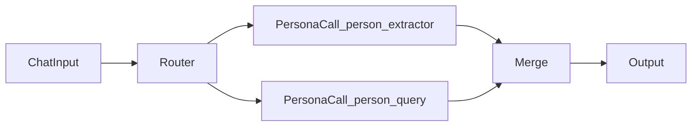

# PRD-014: Scenario Visual Designer Modal

## Goals

1. Provide a simple, intuitive visual designer as a **modal popup** on `/Dashboard/Scenarios`.
2. Let users model how personas collaborate to satisfy a request (route, parallel fan-out, merge, output).
3. Preserve Actor Model boundaries:
   - runtime actors continue to be spawned via scenario apply/runtime path,
   - persona YAML definitions remain non-runtime orchestration profiles.
4. Keep existing non-visual scenario editing fully usable as fallback.

## Non-goals (v1)

- Replacing persona authoring screens (`/Dashboard/Agents`, Project Memory pages).
- Building a full BPMN/workflow engine with arbitrary scripting.
- Auto-optimizing latency/cost with complex planners.
- Changing current scenario apply endpoint contracts in this phase.
- **React, Vue, or server-rendered JS frameworks** for the graph UI; v1 is **vanilla JS** + a small static script surface (see **Rendering and portability**).

**Shipped today:** `Router` supports **deterministic** substring + default edge and optional **`routerMode: llm`** (see **Smart LLM Router (Phase 10)**). **`PersonaCall`** persists **`config.personaId`** with a **Phase 11** modal **roster picker** (YAML **`name`** / **`role`** labels via `GET /api/project-memory/agents`).

## User stories

- As an operator, I want to open a visual modal and compose a flow quickly, without editing raw JSON.
- As an operator, I want to route one prompt to multiple personas and merge outputs explicitly.
- As an operator, I want validation and simulation so I can trust what will execute.
- As an operator, I want clear labels that personas are non-runtime definitions.

## UX: modal on `/Dashboard/Scenarios`

1. New button: **Open visual designer** on scenario editor.
2. Modal contains:
   - left: node palette (`ChatInput`, `Router`, `PersonaCall`, `Merge`, `Output`),
   - center: flow canvas (Cytoscape.js) with palette-driven add/connect,
   - right: node properties and execution summary.
3. Footer actions:
   - `Validate`,
   - `Simulate`,
   - `Save flow`,
   - `Cancel`.
4. Inline helper text:
   - persona calls resolve to **project-memory YAML agent specs** at execution time (same stack as Project Memory playground),
   - scenario **apply** still bootstraps session/runtime actors; the **flow runner** performs orchestration steps (see **Runtime execution**).

## Runtime execution (PRD-014 Phase 6+)

Flow nodes are **executable orchestration steps**, not decorative placeholders. A dedicated **scenario flow runner** (Host service) interprets the canonical `GraphDocument` and performs work; it does **not** spawn arbitrary actors from the browser—only the runner invokes agreed primitives (today: project-memory persona LLM round-trip).

### Glossary

| Term | Meaning |
| --- | --- |
| **GraphDocument** | Canonical `scenario.flow` JSON (nodes, edges, policies). |
| **Runner** | `IScenarioFlowExecutionService` — loads scenario + flow, validates, walks the graph. |
| **PersonaCall** | Runner resolves `config.personaId` against `personaAgentIds`, loads YAML spec from project root, builds the same prompt envelope as playground, calls local LLM once. |

### API (MVP)

- `POST /api/scenarios/{id}/flow/run` — body: `message`, optional `sessionId` (for transcript-aware prompts). Requires configured **project memory root** when the path includes `PersonaCall`.
- Response: final `Output` node text (or structured error: no flow, validation, bad parallel topology, missing project root, persona not found).

### Execution semantics (v1)

| Node | Behavior |
| --- | --- |
| `ChatInput` | Seeds run context with the user `message`. |
| `Router` | **Current:** copies upstream text; chooses **one** outgoing **sequential** edge via substring match on user message + default branch (edge id order). **Phase 10:** LLM returns validated `targets[]` of `personaId`s; runner runs **one or more** linked `PersonaCall` nodes (default parallel → `Merge`). |
| `PersonaCall` | One LLM call per node; input text = upstream node output (single sequential predecessor). `config.personaId` must appear in `personaAgentIds`. |
| `Merge` | Concatenates non-empty outputs from **sequential and parallel** predecessors into this node, ordered by **edge id** (deterministic). |
| `Output` | Terminal: returns merged text from predecessors (same concat rule as `Merge`). |

### Edge modes (v1 + Phase 8)

- **`sequential`**: supported end-to-end.
- **`parallel`**: **supported** for a single fan-out from one node to multiple branch starts that all reach **one** shared `Merge` (deterministic join, `Merge` input order by edge id). **Nested** parallel forks inside a branch are rejected. A node may not mix parallel and sequential outgoing edges in one step.

### Actor model

- **Option A (current):** runner is a **stateless Host service**; it calls `IProjectMemoryPersonaLlmRunner` (HTTP to Ollama, same as playground). Session actors remain created via scenario apply / coordinator as today.
- **Option B (later):** introduce a `ScenarioFlowCoordinatorActor` per run if we need durable step state, cancellation, or cross-step correlation in the actor tree.

### Precedence vs declarative defaults

When `flow` is present and valid, **flow run** is the explicit orchestration path for the `flow/run` API. The same runner is also used when dashboard chat targets **`session-coordinator-agent`** and the applied scenario defines `flow` (Phase 8).

### Observability (stretch)

Log scenario id, graph id, node id, and persona id per step; expose correlation id when wired to chat.

## Smart LLM Router (Phase 10 — delivered)

**Goal:** Mode-switch the `Router` with an **LLM routing step** that infers **one or more intents** and selects **one or more** downstream **`PersonaCall`** nodes, using **graph-discovered candidates** and **strict structured output**.

### Problem statement

Operators need a **smart** router that:

- Routes the **same user prompt** to **one or many** persona agents based on **semantic** intent, not substring rules.
- **Discovers** eligible `PersonaCall` targets **automatically** from the graph (outgoing edges from this `Router` to `PersonaCall` nodes), enriched with YAML metadata (id, name, role, truncated instructions).
- Supports **multiple `Router` nodes** in one scenario (each Router = one LLM call + bounded fan-out).

### Goals

1. **LLM routing** with a **validated JSON contract** (see **Router LLM response schema** and [`scenario-flow-router-response.schema.json`](./scenario-flow-router-response.schema.json)).
2. **Auto candidate list** from **topology**: sequential outgoing edges from this `Router` whose target node `type` is `PersonaCall` (ids must remain in `personaAgentIds` / catalog rules).
3. **Multi-target execution**: after parsing + validation, run **selected** `PersonaCall` nodes — **default v1 policy:** **parallel** invocation then **existing `Merge`** (reuse Phase 8 semantics and timeouts); **alternative** sequential ordering = router output order (document if offered as `Router.config.executionMode`).
4. **Composition:** any number of `Router` nodes; no shared mutable router state beyond flow `store` and session transcript.
5. **Safe failure:** invalid JSON, unknown `personaId`, empty `targets`, or confidence below threshold → documented behavior (fail with message, or single **fallback** `personaId` from `Router.config`, v1 TBD in implementation).

### Non-goals (Phase 10 v1)

- Routing to nodes that are **not** `PersonaCall` children of this Router in the graph (no “invented” targets).
- Replacing **`parallel` / `Merge`** with a new join primitive (reuse `Merge`).
- Custom fine-tuned classifier models (LLM-only).
- Modal **Simulate** executing the real router LLM (client stays structural / last-server-validation only unless a debug API is added).

### Execution semantics (delivered)

| Step | Behavior |
| --- | --- |
| **Discover** | Collect target `PersonaCall` node ids (and `config.personaId`) from **sequential** edges `Router → PersonaCall`. Build prompt appendix: one block per candidate from project-memory YAML (bounded length). |
| **LLM call** | Single non-streaming generate returning **JSON only** matching router response schema. |
| **Validate** | Parse JSON → whitelist `targets[].personaId` against candidate set → dedupe → enforce `maxTargets` / `minConfidence` / `fallbackPersonaId` from `Router.config`. |
| **Run** | Invoke `PersonaCall` for each selected target; **multiple picks** → **parallel + `Merge`**; **single pick** → linear path to `Output`. |
| **Multiple Routers** | Repeat per `Router` node on the path; each invocation independent. |

### `Router` node `config` (GraphDocument — planned fields)

Optional JSON on `Router` nodes (extend `scenario-flow.schema.json` when stable):

| Field | Purpose |
| --- | --- |
| `routerMode` | e.g. `deterministic` (legacy substring) \| `llm` (Phase 10); default migration TBD. |
| `maxTargets` | Cap on number of `PersonaCall` invocations per Router (e.g. 1–5). |
| `fallbackPersonaId` | If LLM output invalid / empty, optional single persona to run. |
| `minConfidence` | Optional; drop targets below threshold. |
| `model` / `temperature` | Optional overrides for routing call only. |
| `maxInstructionCharsPerPersona` | Bound prompt size for candidate blurbs. |

### Router LLM response schema

Canonical machine output (versioned). Repo copy: [`scenario-flow-router-response.schema.json`](./scenario-flow-router-response.schema.json). Illustrative instance:

```json
{
  "schemaVersion": "1.0",
  "targets": [
    { "personaId": "person-query", "reason": "User asked for stored facts", "confidence": 0.86 }
  ],
  "needsClarification": false,
  "clarificationPrompt": null
}
```

- **`targets`**: only **`personaId`** values that appear in the **discovered candidate set** for this Router.
- **`needsClarification` / `clarificationPrompt`**: reserved; v1 may **fail closed** or return a fixed clarification message (implementation choice documented in Phase 10 PR).

### Catalog / designer validation (planned)

- `Router` in `llm` mode: require **≥1** outgoing sequential edge to a `PersonaCall` node.
- Warn if no `Merge` follows multi-target pattern (when `maxTargets` > 1 or LLM can return multiple).

### UX (modal — delivered for Router)

- Property panel for `Router`: **routerMode**, optional limits/fallback, **read-only list** of sequential `PersonaCall` candidates.
- Help text: **Simulate** does not call the routing LLM.

### API

- **Phase 10:** reuse `POST /api/scenarios/{id}/flow/run` and coordinator path; no separate router endpoint required.
- **Optional debug:** `POST /api/scenarios/{id}/flow/router-preview` with body `{ "routerNodeId", "message" }` returning parsed routing JSON only (out of scope unless added in plan).

## PersonaCall property UX (Phase 11 — delivered)

**Problem:** Adding a **`PersonaCall`** from the palette currently defaults `config.personaId` (e.g. first entry in `personaAgentIds`). Operators think in **product terms** (“Memory Curator”, “Person Extractor”) while the graph must store canonical **YAML `id`** (`memory-curator`, `person-extractor`).

**Goal:** In the flow modal, when a **`PersonaCall`** node is selected, show a **dropdown** (or equivalent) of personas **allowed for this scenario** — i.e. **`personaAgentIds`** — labeled with **human-readable names** from project-memory agent specs (`name`, fallback `role` or `id`). Persist **`config.personaId`** only; no change to interpreter or `flow/run` contract.

### Requirements

1. **Roster source of truth:** options = intersection of scenario `personaAgentIds` and what catalog validation already allows (unknown ids remain invalid on save).
2. **Labels:** resolve via Host API listing agent specs for the configured **project root** (or extend an existing project-memory endpoint); cache per modal session to avoid spam.
3. **Empty roster:** block or warn with copy pointing to the main scenario form (“Add personas to this scenario first”).
4. **New node:** on add `PersonaCall`, either prompt for persona or default to first roster id **after** picker is implemented (avoid silent wrong persona).

### Non-goals (Phase 11 v1)

- Authoring YAML from the modal (still **Agents** / project memory).
- Personas not listed on the scenario (no “browse all project agents” unless explicitly added later).

### Acceptance (Phase 11)

- Operator can assign **Memory Curator** vs **Person Extractor** (or any rostered agent) without typing raw ids.
- Saved `GraphDocument` round-trips with correct `personaId`; server validation unchanged.

**Implementation:** modal left panel **PersonaCall (selected)** + `GET /api/project-memory/agents` label cache; `validateFlowDocument` optional roster argument from **Validate** in the modal.

## Orchestration model (v1)

### Node types

- `ChatInput`: entry point for user request.
- `Router`: **Shipped:** condition-based branch chooser **and** optional **`routerMode: llm`** with auto-discovered `PersonaCall` targets and structured JSON (see **Smart LLM Router**).
- `PersonaCall`: resolve persona by **`config.personaId`** and run one **project-memory** LLM turn (playground-equivalent). **Phase 11 (delivered):** modal picker maps display names → `personaId`.
- `Merge`: combine branch outputs (ordered or policy-driven); v1 runner uses deterministic edge-id ordering.
- `Output`: final response composer (terminal).

### Edge behavior

- `sequential`: next node runs after prior completes.
- `parallel`: fan-out branches run concurrently, then converge via `Merge` — **supported at runtime** (Phase 8) with the constraints in **Edge modes** above.

### Example flow



## Data contract (proposed)

Add a visual flow payload under each scenario. The stored shape is a **GraphDocument**: product-owned JSON that describes orchestration **only** (no Cytoscape-specific dump as the source of truth).

### GraphDocument (canonical, portable)

Recommended top-level fields:

| Field | Purpose |
| --- | --- |
| `schemaVersion` | String or int; drives migrations (e.g. `"1.0"`) |
| `graphId` | Stable id within the scenario (or scenario id + suffix) |
| `name` | Human label for revisions UI |
| `status` | `active` \| `archived` \| `deleted` (soft-delete) |
| `createdAtUtc` / `updatedAtUtc` | Audit metadata |
| `nodes[]` | `id`, `type`, `label`, `config` (semantics live here) |
| `edges[]` | `id`, `fromNodeId`, `toNodeId`, `mode`, `condition?` |
| `outputPolicy` | `first_non_empty` \| `merge_sections` \| `ranked` |
| `ui` (optional) | Presentation only, e.g. `nodeLayouts[id] = { x, y }` |

**Embedded in scenario catalog / API** as a nested `flow` object (names align with `ScenarioDto` evolution): `flow.schemaVersion`, `flow.graphId`, `flow.name`, `flow.status`, optional timestamps, `flow.nodes[]`, `flow.edges[]`, `flow.outputPolicy`, `flow.ui`.

**Do not** persist `cy.json()` or library-native graphs as canonical: that couples storage to one renderer and breaks portability.

### JSON Schema (validation, not the graph itself)

Optionally ship a **JSON Schema** document (Draft 2020-12 or similar) that *describes* GraphDocument: required keys, `type` enums, id patterns. The repo copy lives at [`scenario-flow-schema.json`](./scenario-flow-schema.json); copy under `wwwroot/schemas/` when implementing Host-side or client validation. Use it with a validator (e.g. AJV in a build step, or server-side validation in C#) in addition to domain rules (reachability, persona ids). The schema is a **contract**, not a replacement for the custom graph model.

### Versioning and delete

- **Version history:** Prefer file-based or catalog-stored **revisions** (append-only or named snapshots), or rely on **Git** for `.agctor`/scenario artifacts so operators can diff and revert.
- **Delete:** Default to **soft-delete** (`status: deleted` or `archived`); hard delete only via explicit maintenance or GC policy.
- **UI:** “Previous revisions” picker loads a snapshot GraphDocument; Save writes a new revision or overwrites per product rules.

## Rendering and portability

### Chosen v1 renderer: Cytoscape.js

- Library: [Cytoscape.js](https://js.cytoscape.org/) — **vanilla JS**, runs in the browser, no React/Vue requirement.
- Load via static asset under `wwwroot` or pinned CDN; ASP.NET Core serves static files — **no Node in production** unless a team chooses a dev-only bundler.

### Abstraction: canonical JSON ↔ library

Introduce a **narrow interface** implemented only by adapters; the modal and save pipeline depend on the interface, not on Cytoscape.

**Conceptual API (vanilla JS module):**

- `mount(container: HTMLElement, doc: GraphDocument): void`
- `read(): GraphDocument` — export current graph back to canonical form (including `ui.nodeLayouts` from positions)
- `onChange(callback: (doc: GraphDocument) => void): void` — optional dirty tracking
- `destroy(): void` — teardown on modal close

**v1 implementation:** `CytoscapeAdapter` maps `GraphDocument` → Cytoscape `elements` + stylesheet; on save, maps Cytoscape element `data` (ids + mirrored config) back to GraphDocument.

**Swapping libraries later:** Replace only the adapter module (e.g. JointJS, plain SVG) as long as it implements the same interface.

### Anti-patterns (avoid lock-in)

- Treating renderer-native JSON as the persisted format.
- Storing execution semantics only in stylesheet or internal graph state without round-tripping to `nodes[].config` / `edges[]`.
- Using auto-generated library ids as business ids unless explicitly assigned and owned in GraphDocument.

### Compatibility with existing scenario shape

- `agentTypes` remains runtime roster.
- `personaAgentIds` remains non-runtime roster.
- `personaBindings` remains optional role shortcuts.
- Visual flow references must be validated against `personaAgentIds`.

## API (v1 scope)

Reuse `GET/PUT /api/scenarios` payload with extended scenario DTO shape (include optional `flow`).

Validation errors (400) should include:

- missing entry/output nodes,
- broken edges,
- unreachable output,
- unknown persona id in `PersonaCall`,
- invalid merge policy or router condition (deterministic mode).
- (Phase 10) invalid Router LLM JSON or targets outside the candidate set.

## Acceptance criteria

1. User can launch modal from `/Dashboard/Scenarios`.
2. User can build a valid flow (input -> router/persona -> merge -> output) in under 2 minutes.
3. Save persists and reloads flow with stable node/edge semantics.
4. Invalid graph saves are blocked with actionable validation messages.
5. Simulation shows chosen path(s), branch mode, and merge behavior.
6. Existing non-visual scenario edit/apply remains functional.
7. Save/reload round-trip: `GraphDocument` written to API matches document read back after modal close/reopen (no loss of `nodes`, `edges`, or `ui` layouts not derived from the library).
8. Cytoscape is confined to the adapter module; swapping renderer does not require changing the scenario catalog shape.
9. **`POST /api/scenarios/{id}/flow/run`** executes graphs from `ChatInput` to `Output` with **sequential** paths and **parallel** fan-out to a shared `Merge`, invoking **real** `PersonaCall` steps against project-memory YAML when project root is configured (per-call timeout; nested parallel forks rejected).
10. Unit-level tests cover graph walking (`Router` branch + `PersonaCall` ordering) with a stub persona invoker (no Ollama required).
11. **(Phase 10)** LLM `Router` discovers `PersonaCall` candidates only from **graph edges** from that Router; runtime **rejects** any `personaId` not in that set.
12. **(Phase 10)** One user message can route to **multiple** `PersonaCall` nodes when the routing JSON selects multiple targets, with outputs combined via existing **`Merge`** (parallel policy default).
13. **(Phase 10)** A scenario may contain **multiple** `Router` nodes; each performs an independent routing LLM call.
14. **(Phase 10)** Malformed routing JSON or empty valid targets yields a **documented** error or fallback behavior (no silent mis-routing).
15. **(Phase 11)** With a non-empty `personaAgentIds` roster, the operator can set each `PersonaCall`’s persona from a **labeled** list; saved `personaId` matches roster and passes existing catalog validation.

## Risks / mitigations

- **Complexity creep** -> lock v1 to 5 node types; no arbitrary scripts.
- **Semantic confusion** -> modal copy distinguishes catalog personas, flow execution, and scenario apply.
- **Config drift** -> one canonical serialized flow model and deterministic validation.
- **Renderer lock-in** -> GraphDocument + `GraphRenderer` adapter; never persist `cy.json()` as canonical.
- **UX overload** -> Cytoscape canvas + palette first; optional extensions (e.g. dagre layout) behind adapter only.
- **Dual orchestration** -> document precedence: `flow/run` is explicit; chat integration is phased (see implementation plan).
- **Ollama availability** -> same failure behavior as playground; surface errors in API response.
- **LLM Router (Phase 10)** -> invalid JSON: strict schema validation or user-visible error; **cost/latency**: cap `maxTargets`, cache persona blurbs, log per Router; **security**: never execute personas outside candidate list.
- **Persona picker (Phase 11)** -> **stale labels** if YAML renames but id stable (show id in subtitle); **API churn** if project root unset (degrade to raw id list only).

