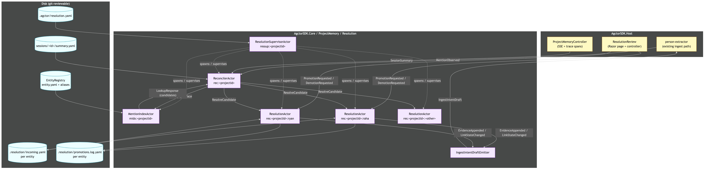

# Resolution actor topology

[Edit source](./resolution-actor-topology.mmd)

Per-project supervisor spawns a reconciler, a mention index, and one resolution actor per canonical entity. The existing `person-extractor` ingest path emits `MentionObserved`; the resolver emits `IngestIntentDraft` back through ingest — it never writes markdown directly.
