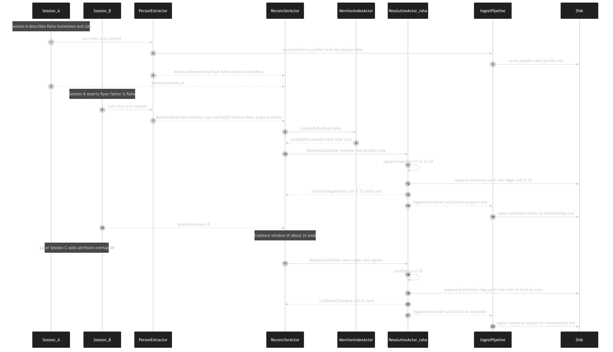

# Resolution message flow (cross-session Raha / Ryan example)

[Edit source](./resolution-message-flow.mmd)

Session A writes Raha’s profile. Session B independently says "Ryan's father is Raha". The `ReconcilerActor` — seeded by `MentionObserved` and `SessionSummary` messages — fans out a `ResolveCandidate` to `res:<proj>:raha`, which runs the signal ensemble, stores a soft link, and emits an ingest intent that rewrites the mention site in `ryan/relationships.md`. Later evidence pushes confidence past the hard threshold, triggering auto-promotion and a second, canonical ingest intent.
