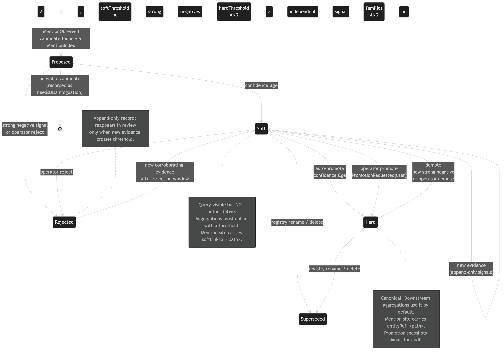

# Resolution edge state machine

[Edit source](./resolution-state-machine.mmd)

Edges move between `Soft` (query-visible, non-authoritative) and `Hard` (canonical) with append-only promotion / demotion audit rows. Rejected edges can return to `Soft` only when new corroborating evidence arrives; `Superseded` is used when the underlying entity is renamed or deleted.
