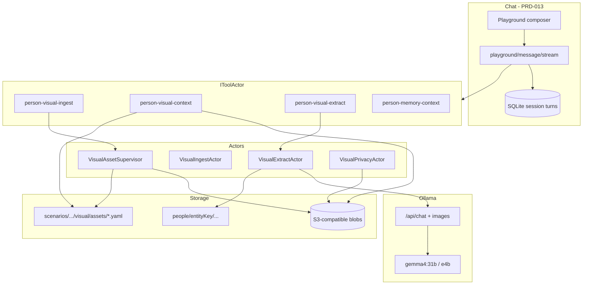
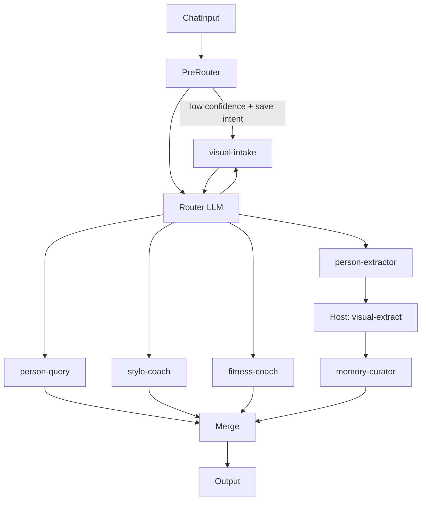

# PRD-023: Visual Person Memory (chat-integrated)

## 1. Overview

Users attach **photos of people** in the existing **chat playground** (and the same session store as PRD-013). **Annotation is optional** — users can attach and send with a natural-language prompt; the system infers who is in the photo, occasion, and intent from the **message + project focus + conversation + vision**. Users may still **optionally** tag people or add captions for precision. Blobs are stored in **S3-compatible** storage; searchable metadata and vision-derived facts live next to **scenario-scoped people memory** (`scenarios/<id>/people/<entityKey>/`).

Vision uses **Ollama** with **Gemma 4** multimodal models (e.g. `gemma4:31b`, already the project default). Extraction calls **`/api/chat`** with base64 images — not text-only `/api/generate`.

The feature is implemented with **Actors** (async ingest, extract, privacy purge) and **`IToolActor` tools** invoked from scenario flow `toolIds` and the stream handler — aligned with `PersonMemoryContextTool` today.

## 2. Goals

| ID | Goal |
| --- | --- |
| G1 | Upload images from chat; persist **asset references** on session turns (not raw bytes in SQLite). |
| G2 | **Infer** subjects and context from the user prompt when tags are omitted; optional manual tags refine or override. |
| G2b | Deliver a **polished chat UX** (attach → send immediately → live progress → gentle clarify only when needed). |
| G3 | **Extract** structured facts via Ollama Gemma 4 vision; route proposals through **generic inbox** (PRD-019/022). |
| G4 | **Retrieve** relevant photos during advice flows (style, fitness, general Q&A) via `PersonVisualContextTool`. |
| G5 | Integrate with **`people` scenario flow**: router, new personas, existing session-end ingest and privacy. |
| G6 | **Forget person** and **export** include visual assets and S3 objects (extend PRD-022). |

## 3. Non-goals

- Standalone photo gallery app separate from chat
- Mandatory tagging UI before every send (tags are optional; clarify-on-low-confidence only)
- Automatic face identification across photos (no biometric matching in v1)
- Medical or diagnostic claims from body photos
- Multi-tenant auth / legal GDPR copy
- Replacing text-only `person-extractor` with a single multimodal extract call (text and vision remain separate pipelines in v1)
- Calendar/contacts import

## 4. Architecture principles

| Principle | Detail |
| --- | --- |
| Chat-first | Primary UX: `POST /api/project-memory/playground/message/stream` + extended request body |
| Tools for I/O | S3, indexes, signed URLs, appendices — `PersonVisualIngestTool`, `PersonVisualContextTool`, `PersonVisualExtractTool` |
| Actors for async work | `VisualAssetSupervisorActor`, `VisualIngestActor`, `VisualExtractActor`, `VisualPrivacyActor` |
| Markdown + inbox for memory | Approved facts → `profile.md` / `timeline.md` via existing replay; ambiguous → inbox |
| One vision stack | Default **`VisionModel` = `DefaultModel`** (`gemma4:31b`); optional `gemma4:e4b` for extract-only |
| Prompt-first | User message is always passed into extract + retrieve; manual tags merge as hints |
| Never block chat on extract | Assistant streams immediately; vision + inbox update in background (SSE) |

### 4.1 Component diagram



## 5. Dependencies

| Dependency | Usage |
| --- | --- |
| PRD-013 | `SessionProject`, `SessionTurn`, playground SSE |
| PRD-014 | Scenario `flow`, `LlmNode.config.toolIds`, Router |
| PRD-019 | Generic inbox proposals from visual extract |
| PRD-021 | `SessionEndIngest` — reconcile attachment manifests |
| PRD-022 | Inbox decide, forget person, export, `AutoIngestOnSessionEnd` |
| Ollama ≥ Gemma 4 support | Verified local: **`gemma4:31b`** (~19 GB) — multimodal Text + Image per [Ollama library](https://ollama.com/library/gemma4) |

## 6. Configuration

```json
{
  "Agctor": {
    "LLM": {
      "OllamaApiUrl": "http://127.0.0.1:11434",
      "DefaultModel": "gemma4:31b",
      "VisionModel": "gemma4:31b",
      "VisionFallbackModels": ["gemma4:e4b"],
      "VisionTimeoutSeconds": 180,
      "VisionMaxImagesPerRequest": 3
    },
    "Visual": {
      "Provider": "s3",
      "Endpoint": "http://localhost:9000",
      "Bucket": "agctor-visual",
      "MaxUploadBytes": 15728640,
      "MaxAttachmentsPerTurn": 5,
      "AllowedMimeTypes": ["image/jpeg", "image/png", "image/webp", "image/heic"],
      "ExtractPromptVersion": "visual-extract-v1",
      "DefaultVisualTokenBudget": 280
    }
  }
}
```

| Setting | Purpose |
| --- | --- |
| `VisionModel` | Ollama tag for `PersonVisualExtractTool` and multimodal coach turns |
| `VisionUseSameAsDefault` | When true (default), `VisionModel` tracks `DefaultModel` |
| `DefaultVisualTokenBudget` | Gemma 4 image token budget (70–1120 per Ollama docs); 280 for outfit/progress photos |

## 7. Data model

### 7.1 Asset catalog (on disk)

Path: `scenarios/<scenarioId>/visual/assets/<assetId>.yaml`

| Field | Description |
| --- | --- |
| `assetId` | ULID/UUID |
| `scenarioId` | Sanitized scenario folder |
| `storage` | `bucket`, `key`, `contentType`, `sha256`, `bytes` |
| `capturedAt` | EXIF or user override |
| `uploadedAt`, `uploadedBySessionId`, `sourceTurnGroupId` | Provenance |
| `context.userCaption`, `context.occasion` | User annotation |
| `subjects[]` | `{ entityKey, role, box? }` |
| `privacy` | `sensitivity`, `allowAgentUse[]` |
| `extraction` | `status`, `ollamaModel`, `promptVersion`, `lastRunAt` |

S3 key layout: `projects/{projectId}/scenarios/{scenarioId}/assets/{assetId}/original.{ext}` (+ optional `thumb_512.webp`).

Per-entity index (optional): `scenarios/<scenarioId>/people/<entityKey>/visual/index.yaml` listing `assetId` refs.

### 7.2 Session turn attachments (API + DB)

Extend session turns with **`AttachmentsJson`** (column or normalized table). Schema version **`1.0`**:

```json
{
  "schemaVersion": "1.0",
  "attachments": [
    {
      "assetId": "01JABCDEF",
      "kind": "image",
      "mime": "image/jpeg",
      "fileName": "gym.jpg",
      "state": "uploaded",
      "subjects": [],
      "inference": { "source": "prompt", "confidence": 0.82, "entityKeys": ["raha"] },
      "caption": null,
      "privacy": {
        "sensitivity": "normal",
        "allowAgentUse": ["fitness", "general"]
      }
    }
  ]
}
```

| Rule | Value |
| --- | --- |
| `Content` | Human-readable text; may be empty if attachments present |
| Max attachments / turn | 5 (configurable) |
| Persisted in DB | Metadata only — never base64 image bytes |
| `viewUrl` | Populated on **GET transcript** via short-lived presigned GET |

### 7.3 Asset lifecycle states

`pending_upload` → `uploaded` → `inferring` → `ready_for_extract` → `extracting` → `extracted` → `inbox_pending` → `ready` | `failed` | `deleted`

Manual annotate (optional) can set `subjects` at any time after `uploaded`; state may show `annotated` when user explicitly tags.

### 7.3.1 Subject inference (prompt-first)

When the user sends a message with attachments **without** manual tags, **`VisualInferActor`** (or extract pre-pass) resolves subjects using:

| Signal | Use |
| --- | --- |
| User message (`payload`) | Primary — “this is me at the gym”, “Ryan’s school photo”, “compare to last week” |
| `SessionProject.FocusEntityKey` | Default primary subject when message uses “I/me/my” |
| Last N transcript turns | Coref-style hints (“he” → focus entity) |
| `search_entities` / known people list | Match spoken names to folder slugs |
| Vision model (Gemma 4) | `suggestedSubjects[]` + `sceneTags` in extract JSON |

Output on asset YAML:

```yaml
inference:
  source: prompt          # prompt | manual | mixed
  confidence: 0.82
  entityKeys: [raha]
  rationale: "User said 'my gym progress'; project focus raha"
```

| Confidence | Behavior |
| --- | --- |
| ≥ 0.75 | Proceed with extract + coach answer; no blocking clarify |
| 0.45 – 0.74 | Answer in chat; append **soft clarify** chip (“Tag who’s in this photo?”) |
| &lt; 0.45 | Short **visual-intake** clarify turn optional — only if user asked to save facts |

**Never** require a separate tagging step before the assistant responds.

### 7.4 Vision extraction output

`scenarios/<scenarioId>/visual/extractions/<assetId>.yaml` plus inbox proposals. JSON shape from Ollama (parsed):

```json
{
  "schemaVersion": "1.0",
  "memoryIntents": [
    {
      "entityKey": "raha",
      "knowledgeType": "physical_attribute",
      "attribute": "footwear",
      "value": "white running shoes",
      "confidence": 0.85,
      "source": "visual",
      "assetId": "01JABCDEF"
    }
  ],
  "sceneTags": ["indoor", "gym"],
  "qualityWarnings": []
}
```

`knowledgeType` values follow **person-extractor** routing rules (`physical_attribute`, `preference`, `observation`, `profile_fact`, etc.).

### 7.5 Assistant turn tool trace (optional)

```json
{
  "schemaVersion": "1.0",
  "invocations": [
    {
      "toolId": "person-visual-context",
      "operation": "BuildContext",
      "success": true,
      "summary": "3 assets, intent=fitness"
    }
  ]
}
```

## 8. Ollama / Gemma 4 vision

| Topic | Requirement |
| --- | --- |
| V1 | Use **`POST /api/chat`** with `messages[].images` (base64); implement `IOllamaVisionChatClient` in Core |
| Model | Default **`gemma4:31b`** (matches `Agctor:LLM:DefaultModel`); optional **`gemma4:e4b`** for extract-only on smaller GPUs |
| Text paths | Router, text-only extract may keep **`/api/generate`** until migrated |
| Image prep | Download from S3 → resize (max edge 1024) → base64 |
| Gemma 4 practices | Image **before** text in user message; **no** `<|think|>` in extract system prompt; strip thought blocks from stored assistant history |
| Token budget | Pass configurable visual token budget (default 280); higher for OCR-like tasks |
| Health | On Host startup, warn if `VisionModel` not in `ollama list` |

## 9. Tools (`IToolActor`)

| HTTP `toolId` | CLR type | Operations |
| --- | --- | --- |
| `person-visual-ingest` | `PersonVisualIngestTool` | `InitUpload`, `CompleteUpload`, `Annotate`, `InferFromPrompt`, `LinkToTurn`, `GetAsset` |
| `person-visual-context` | `PersonVisualContextTool` | `BuildContext`, `RetrieveByIntent`, `ListForEntity` |
| `person-visual-extract` | `PersonVisualExtractTool` | `Extract`, `ReExtract`, `GetExtraction` |

Register with `[AgctorHostTool]`; document parameters in `ToolActorDiscovery` hint map (same as `person-memory-context`).

### 9.1 `BuildContext` parameters

| Param | Description |
| --- | --- |
| `projectRoot`, `scenarioId`, `userMessage`, `agentSpecId` | Same as `PersonMemoryContextTool` |
| `visualIntent` | `style` \| `fitness` \| `general` |
| `entityKeys` | Optional override |
| `maxAssets` | Default 3 |

Returns text appendix + signed URL list for LLM (and optional `includeInLlm: true` for multimodal persona call).

## 10. Agents (YAML personas)

| Agent id | Role | Flow `toolIds` | Notes |
| --- | --- | --- | --- |
| `visual-intake` | Clarify low-confidence subjects | `person-visual-ingest` | Rare; only when inference confidence &lt; threshold and save intent |
| `person-extractor` | Text facts (existing) | — | Host runs visual extract after if attachments |
| `memory-curator` | Narrate ingest (existing) | `apply-memory-intents` | Appendix includes visual summary |
| `person-query` | Q&A (existing) | `person-memory-context`, `person-visual-context` | |
| `style-coach` | Fashion advice (new) | `person-memory-context`, `person-visual-context` | `visualIntent=style` |
| `fitness-coach` | Progress / form (new) | same | `visualIntent=fitness`; non-medical guardrails |
| `relationship-coach` | (existing) | add `person-visual-context` | Group photos |

YAML `tools.allow` lists semantic tokens (`person-visual-context`, etc.) plus existing `read_document`, `search_entities`.

## 11. Scenario flow (`people`)

Extend catalog flow in `agctor-scenarios.user.json` (not a new scenario id).

### 11.1 Pre-router (deterministic, before LLM Router)

First match wins on `routingContext` + message + attachments:

| Priority | Condition | Target |
| --- | --- | --- |
| P0 | PRD-019 confirmation yes/no on pending inbox | Existing `IngestOnly` short-circuit (no flow) |
| P1 | All attachments `do_not_infer` | Skip vision extract; coach may still see thumbnail |
| P2 | Style keywords + attachments | `style-coach` |
| P3 | Fitness keywords + attachments | `fitness-coach` |
| P4 | Save/persist keywords + attachments | `person-extractor` chain (+ async visual extract) |
| P5 | Question + attachments | `person-query` or coach by keywords |
| P6 | Attachments only / vague prompt | `person-query` or coach using inferred intent |
| P7 | Text-only | LLM Router (existing) |

**Removed:** block on “unannotated” attachments. Inference runs in parallel with the routed persona; `visual-intake` is not the default first hop.

### 11.2 `routingContext` (appended for Router LLM)

```
hasAttachments: true
attachmentCount: 1
allAnnotated: true
attachmentSummary: 1 image; subjects: raha(primary); captions: "leg day"
projectFocusEntity: raha
suggestedIntent: fitness
```

### 11.3 Flow graph (target)



Add `personaAgentIds`: `visual-intake`, `style-coach`, `fitness-coach`.

Host steps (async, non-blocking):

1. **`pm-visual-infer`** — prompt + focus + entities (fast; may be merged into extract in v1).
2. **`pm-visual-extract`** — Gemma 4 vision → inbox; runs for any `uploaded` attachment unless `do_not_infer`.

Also runs after **person-extractor** when save intent + attachments. Not a new PRD-014 node type.

## 12. HTTP API

### 12.1 Upload (supports composer before stream)

| Method | Path | Purpose |
| --- | --- | --- |
| POST | `/api/visual/assets/init-upload` | Presigned PUT + `assetId` |
| POST | `/api/visual/assets/{id}/complete` | Verify hash; start ingest actor |
| PATCH | `/api/visual/assets/{id}` | Annotate subjects, caption, privacy |
| GET | `/api/visual/assets` | List by `scenarioId`, optional `entityKey` |
| GET | `/api/visual/assets/{id}` | Metadata + signed view URL |
| POST | `/api/visual/assets/{id}/re-extract` | Re-run vision (debug / model upgrade) |
| DELETE | `/api/visual/assets/{id}` | Tombstone + S3 delete |

Implementations delegate to **`PersonVisualIngestTool`** / supervisor actor.

### 12.2 Chat stream (extend existing)

`POST /api/project-memory/playground/message/stream`

Additional body fields:

| Field | Type | Description |
| --- | --- | --- |
| `turnGroupId` | string? | Client-generated; ties upload + user + assistant |
| `attachments` | array? | `[{ "assetId", "state": "uploaded" \| "annotated", "subjects"? }]` — manual `subjects` optional |

Behavior unchanged for text-only requests.

### 12.3 Transcript

`GET /api/chat/sessions/{sessionId}` — turns include `attachments[]` with `viewUrl` (ephemeral).

### 12.4 Privacy (extend PRD-022)

| Existing | Extension |
| --- | --- |
| `POST .../privacy/forget-person` | Also delete S3 keys for assets referencing entity; `VisualPrivacyActor` |
| `GET .../privacy/export` | Include `visual/assets/*.yaml` (+ optional blob manifest) |

## 13. SSE events (`AgentStreamEvent`)

Existing types preserved: `flow_plan`, `flow_step`, `llm_delta`, `llm_done`, `error`.

| Type | Payload (JSON string) |
| --- | --- |
| `attachment_state` | `{ assetId, state, detail? }` |
| `attachment_preview` | `{ assetId, viewUrl, expiresAt }` |
| `visual_extract_started` | `{ assetId, model }` |
| `visual_extract_done` | `{ assetId, proposalCount, inboxIds? }` |
| `visual_inbox` | `{ count, scenarioId }` |
| `tool_invocation` | `{ toolId, operation, status }` (optional) |

**Flow step ids:** `pm-visual-upload`, `pm-visual-annotate`, `pm-visual-extract`, `pm-visual-retrieve` (plus existing `pm-generic-inbox-confirm`, `pm-person-extract`, `pm-persona-llm`).

Extract and infer run **fully async** after the user message is accepted. The assistant **always** streams immediately using the user prompt + any prior extractions + inline image(s) in the multimodal LLM call when needed. Inbox updates arrive later via SSE (`visual_extract_done`, `visual_inbox`). **No configuration to block on extract.**

## 14. Requirements by track

### 14.1 Storage (023a)

| ID | Requirement |
| --- | --- |
| S1 | `IBlobStore` abstraction with S3 implementation (MinIO dev, AWS/R2 prod). |
| S2 | Presigned PUT/GET; server verifies SHA-256 on complete. |
| S3 | Asset catalog YAML under `scenarios/<id>/visual/assets/`. |
| S4 | Config under `Agctor:Visual:*` and optional `.agctor/runtime/visual-storage.yaml`. |

### 14.2 Chat + turns (023b)

| ID | Requirement |
| --- | --- |
| C1 | `ProjectMemoryPlaygroundStreamRequestDto` accepts `turnGroupId`, `attachments[]`. |
| C2 | `SessionTurn` stores `AttachmentsJson`; migration for SQLite session store. |
| C3 | Playground composer per [prd-023-ux-spec.md](./prd-023-ux-spec.md) — attach, send without required tags. |
| C4 | Optional inline tag chips (entity picker) + caption; never gate Send on tags. |
| C5 | Emit SSE `attachment_state` / `attachment_preview` during upload pipeline. |
| C6 | Attachment strip on user bubbles in transcript; progress on active uploads. |

### 14.3 Tools (023c)

| ID | Requirement |
| --- | --- |
| T1 | Three tools in `AgctorSDK.Tools`; registered in Host DI and `AgctorToolCatalog`. |
| T2 | `ProjectMemoryPersonaToolRouting` maps personas to visual tools. |
| T3 | `ScenarioFlowLlmNodeToolIds` recognizes `person-visual-context` (like `person-memory-context`). |
| T4 | Playground pre-loads visual context when flow `toolIds` include it. |

### 14.4 Vision extract (023d)

| ID | Requirement |
| --- | --- |
| E1 | `IOllamaVisionChatClient` — chat API + images; uses `VisionModel`. |
| E2 | `VisualExtractActor` processes `uploaded` assets; uses user message + inferred/manual subjects; writes extraction YAML. |
| E6 | `InferFromPrompt` merges manual tags over auto-inference (`mixed` source). |
| E3 | Proposals enter **generic inbox**; high-confidence policy may auto-approve (off by default). |
| E4 | Respect `privacy.sensitivity` and `do_not_infer` — skip Ollama call. |
| E5 | `person-extractor` instructions note: host runs visual extract separately for attachments. |

### 14.5 Scenario flow (023e)

| ID | Requirement |
| --- | --- |
| F1 | Extend `people` flow nodes and router hints per §11. |
| F2 | Add agent YAML: `visual-intake`, `style-coach`, `fitness-coach`. |
| F3 | Pre-router runs before `ScenarioFlowRouterLlmService` when `useScenarioFlow`. |
| F4 | `memory-curator` receives visual ingest telemetry in flow appendix. |

### 14.6 Privacy + session end (023f)

| ID | Requirement |
| --- | --- |
| P1 | `IPrivacyMemoryService.ForgetPersonAsync` purges visual refs + S3. |
| P2 | Export zip includes visual metadata files. |
| P3 | `SessionEndIngest` scans turns for unattached/orphan `uploaded` assets; enqueue extract. |
| P4 | Unit tests: forget purges keys; extract produces inbox row. |

## 15. Acceptance criteria

1. User attaches a photo **without tags**, sends “How’s my gym progress?” — assistant responds immediately; inference assigns **raha** from project focus + prompt; trace shows `pm-visual-retrieve` + async `pm-visual-extract`.
2. Same flow produces **pending inbox** row asynchronously; user approves in chat with “yes” — fact appears in `people/raha/profile.md` or `timeline.md`.
3. User optionally taps “Tag people” on the bubble later and corrects subject — asset updates to `inference.source: mixed`; re-extract optional.
4. `gemma4:31b` completes extract via `/api/chat` + images (verified available locally).
5. `GET` session transcript returns attachment metadata and working `viewUrl`.
6. **Forget person** removes `people/raha/`, asset YAML, and S3 objects for assets where raha was primary subject.
7. Text-only playground message behavior unchanged (no regression).
8. UX acceptance: send with attachment in ≤2 clicks (attach + send); progress visible without leaving chat.
9. `dotnet build`, Core unit tests, and relevant integration tests pass.

## 16. Defaults

| Topic | Default |
| --- | --- |
| Vision model | Same as `DefaultModel` (`gemma4:31b`) |
| Extract timing | **Always async** — never block assistant stream |
| Annotate before send | **Optional** — prompt inference + vision; manual tags override |
| Inference clarify | Soft chip in thread; dedicated `visual-intake` only if confidence &lt; 0.45 and save intent |
| Inbox | All visual intents require approval (same as ambiguous text) |
| Max images in LLM turn | 3 |
| Dev storage | MinIO on `localhost:9000`, bucket `agctor-visual` |

## 17. Risks and mitigations

| Risk | Mitigation |
| --- | --- |
| VRAM / latency on 31b vision | Async extract; optional `gemma4:e4b` for extract; resize images |
| Gemma thinking tokens in JSON extract | System prompt without `<|think|>`; parse JSON only |
| Large photos | Presigned upload; size limits; thumbnail for UI |
| PII in S3 | Same trust boundary as project root; forget-person purge |

## 18. UX specification

Detailed interaction design: **[prd-023-ux-spec.md](./prd-023-ux-spec.md)**.

Summary:

- **Composer:** paperclip + drag-drop + paste; thumbnail chips with upload progress; Send enabled as soon as upload completes (no tag wall).
- **Transcript:** images inline on user bubbles; subtle “Analyzing photo…” → “Insights ready” on the bubble footer.
- **Clarify:** non-modal chip row under the message, not a blocking wizard.
- **Inbox:** badge on Reminders strip; toast when visual proposals arrive.
- **Accessibility:** keyboard attach, alt text from extract, focus management on chips.

## 19. Success metrics (post-launch)

- Median time from upload complete to inbox proposal &lt; 60s on dev hardware (31b)
- Zero session delete failures when visual purge fails (best-effort + retry queue)
- Playground E2E: attach + prompt-only send → immediate reply + async inbox
- ≥90% of test prompts correctly infer primary subject without manual tags (fixture set)
