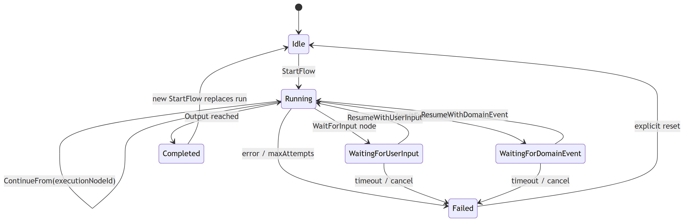

# Flow Runtime State Machine

[Edit source](./flow-runtime-state-machine.mmd)

States owned by `ScenarioFlowRuntimeActor` (PRD-024). Public API exposes `executionNodeId` and `status` — not internal transition names.
