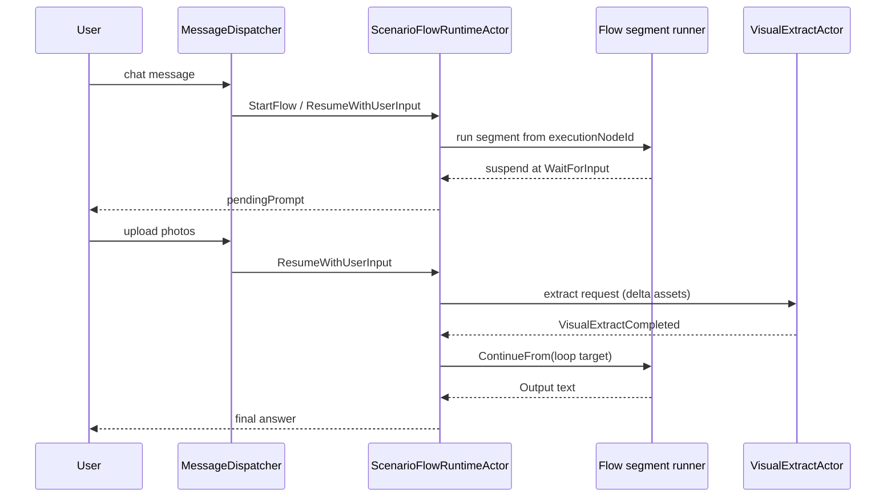

# PRD-024: Scenario Flow Loops & Agctor Scenario Flow Studio

## Document control

| Field | Value |
| --- | --- |
| **Status** | Draft — ready for implementation |
| **Depends on** | PRD-014 (flow graph v1), PRD-023 (visual pipeline), PRD-020 (actors) |
| **Schema version** | GraphDocument **2.0**; runtime snapshot **1.0** |
| **Product name** | **Agctor Scenario Flow Studio** |

---

## 1. Goals

1. Support **multi-turn** scenario flows with **suspend → resume** and **loop-back** to earlier nodes (e.g. collect photos, re-extract, re-advise on style).
2. Align with **Actor Model**: one actor owns flow execution state; domain side effects go through existing domain actors via messages.
3. Extend **Agctor Scenario Flow Studio** (formerly “Scenario flow designer”) so all v2 graph constructs are **editable, validatable, and simulatable** in the UI.
4. Preserve **backward compatibility**: v1 graphs (`schemaVersion: 1.0`) run unchanged (single-pass interpreter path).

## 2. Non-goals

- Replacing PRD-014 node types or removing the stateless interpreter for simple graphs.
- Arbitrary scripting / BPMN expressions in the graph.
- Spawning one actor per `LlmNode` (personas remain stateless LLM invocations).
- Cross-session flow migration (snapshot is session-scoped).
- Automatic layout algorithms for loop-back edges (manual or simple bezier in v1).

---

## 3. Problem statement

Today `ScenarioFlowGraphInterpreter`:

- Runs **one forward pass** per HTTP/chat turn from `ChatInput`.
- Uses a **`completed` set** that prevents revisiting nodes.
- **Router `needsClarification`** ends the run without resuming at the Router on the next turn.
- **Generic inbox** and **visual extract completion** are handled **outside** the graph (playground/controller side channels).

Operators need flows like:

1. User asks for **style advice**.
2. Style persona finds **no photos**.
3. Flow **asks user to upload** and **suspends**.
4. User uploads; **same extract path** runs on **new attachments only**.
5. Facts saved; **style persona runs again** with richer context.
6. User receives final answer.

This pattern generalizes to inbox confirmation, retries, and iterative coaching.

---

## 4. User stories

- As an operator, I want to draw a **loop back** from “Ask user” to an earlier ingest node so missing input is collected without custom code.
- As an operator, I want the Studio to show **where execution is paused** (`At node: …`) when simulating multi-turn flows.
- As a user, I want the companion to **remember** that I was asked for photos and **continue** the same scenario after I upload.
- As a developer, I want **visual extract completion** to **resume** the flow via an actor message, not a one-off controller hack.

---

## 5. Architecture overview

### 5.1 Layers

| Layer | Responsibility |
| --- | --- |
| **GraphDocument 2.0** | Declarative nodes, edges, loop regions (config only) |
| **ScenarioFlowRuntimeActor** | Owns `executionNodeId`, status, store, loop regions, suspend/resume |
| **ScenarioFlowGraphInterpreter** | Executes a **segment** from `executionNodeId` until suspend, Output, or segment end |
| **Domain actors** | Visual extract, inbox persist, asset supervisor — unchanged boundaries |
| **Scenario Flow Studio** | Edits and validates v2 graphs; multi-turn simulate |

### 5.2 Actor model (required)



**Rules:**

1. **Single writer** for flow execution state: `ScenarioFlowRuntimeActor`.
2. **No shared mutable** interpreter state across turns.
3. **LlmNode** invocations stay **synchronous calls** from the segment runner (or `Ask` to a pool later); do **not** spawn per-node actors.
4. Domain completion = **mailbox message** to runtime (`ResumeWithDomainEvent`), not polling.

### 5.3 Runtime scope (locked)

- **One** `ScenarioFlowRuntimeActor` per **`(sessionId, appliedScenarioId)`** pair.
- Switching applied scenario **stops** the previous runtime (or archives snapshot — product choice: **stop + clear** in v1).
- Actor id convention: `scenario-flow-runtime/{sessionId}/{scenarioId}` (implementation detail).

### 5.4 Execution position naming (locked)

| Concept | Name | Example |
| --- | --- | --- |
| Current graph node being executed or waited on | **`executionNodeId`** | `"ask-photos"` |
| Studio / logs label | **At node:** | At node: Ask user |
| API override (rare) | `resumeFromExecutionNode` | only when policy allows |

**Do not use** `cursor`, `cursorNodeId`, or `currentStep` in APIs or persistence.

---

## 6. GraphDocument 2.0

### 6.1 Schema version

- v1 graphs: `schemaVersion: "1.0"` — behavior unchanged (single-pass via existing interpreter).
- v2 graphs: `schemaVersion: "2.0"` — require runtime actor when any v2 construct present:
  - node types: `Gate`, `WaitForInput`, `AwaitEvent`, `Notify`
  - edge mode: `loopBack`

Canonical schema: [`scenario-flow-schema-v2.json`](./scenario-flow-schema-v2.json).

### 6.2 New node types

#### `Gate` (Studio label: **Gate**)

Deterministic branch on **runtime facts** (no LLM).

| `config` field | Type | Description |
| --- | --- | --- |
| `fact` | string | Fact key, e.g. `visual.hasPhotos`, `inbox.hasPending` |
| `operator` | string | `isTrue`, `isFalse`, `equals`, `gt`, `lt` |
| `value` | any | Required for `equals` / numeric ops |
| `trueEdgeId` | string | Outgoing edge id when condition true |
| `falseEdgeId` | string | Outgoing edge id when condition false |

Facts are populated by tools, segment outputs, or domain events — documented fact catalog in §6.6.

#### `WaitForInput` (Studio label: **Ask user**)

Suspends until the user sends the next message (and optional attachments).

| `config` field | Type | Description |
| --- | --- | --- |
| `promptTemplate` | string | Shown when suspending (supports `{{fact}}` placeholders v2.1) |
| `acceptAttachments` | bool | Default `true` |
| `attachmentPolicy` | string | `any` \| `imagesOnly` (default `imagesOnly` for visual loops) |

On suspend: runtime sets `status: WaitingForUserInput`, stores `pendingPrompt`, keeps `executionNodeId` on this node until resume.

#### `AwaitEvent` (Studio label: **Wait for event**)

Suspends until a **domain event** arrives.

| `config` field | Type | Description |
| --- | --- | --- |
| `eventType` | string | e.g. `visual.extract.completed`, `inbox.confirmed` |
| `timeoutSeconds` | int | Default 120 |
| `timeoutEdgeId` | string | Edge when timeout fires |
| `correlationKey` | string | Optional; bind to asset batch id |

#### `Notify` (Studio label: **Notify**)

Fire-and-forget signal; does not suspend. Used to wake downstream context (optional if `loopBack` already re-runs target).

| `config` field | Type | Description |
| --- | --- | --- |
| `target` | string | `persona:{personaId}` or `actor:{actorType}` |
| `signal` | string | e.g. `visual.photos.available` |
| `includeStoreKeys` | string[] | Keys copied into signal payload |

#### Existing nodes (unchanged semantics)

`ChatInput`, `Router`, `LlmNode`, `Merge`, `Output` — PRD-014 behavior within a segment.

### 6.3 New edge mode: `loopBack` (Studio label: **Loop back**)

| `config` field | Type | Required | Description |
| --- | --- | --- | --- |
| `loopRegionId` | string | yes | Groups edges sharing attempt budget |
| `maxAttempts` | int | yes | Max traversals of this loop region per run (default 3) |
| `storeInvalidation` | string | yes | `fromTargetForward` \| `keepAll` \| `iterationScopeOnly` |
| `incrementAttempt` | bool | no | Default `true` |

**Visual:** dashed edge, distinct color, arrow indicating re-entry direction.

**Execution:** when traversing `loopBack`, runtime sets `executionNodeId` to `toNodeId`, applies store invalidation, increments `loopRegions[].attempt`, aborts if `attempt > maxAttempts`.

### 6.4 Dynamic re-entry policy (optional on nodes)

Nodes may define `reEntryPolicy` for event-driven resume without drawing every loop edge:

```json
{
  "reEntryPolicy": {
    "onEvent": {
      "visual.extract.completed": "visual-intake",
      "inbox.confirmed": "memory-curator"
    },
    "default": "style-coach"
  }
}
```

**Rule:** `onEvent` targets must be explicit node ids in the same graph. Validator rejects unknown ids.

### 6.5 Store scoping

Node outputs and facts are tagged with scope:

| Scope | Lifetime | Invalidation on loopBack `fromTargetForward` |
| --- | --- | --- |
| `run` | Entire flow run | Cleared from target node forward |
| `iteration` | Current loop region attempt | Cleared per `iterationScopeOnly` |
| `session` | Snapshot lifetime | Never cleared by loop |

**Delta attachments:** runtime maintains `attachments.newSinceLastResume` (session-scoped) for ingest nodes.

### 6.6 Runtime fact catalog (v1)

| Fact key | Source | Typical use |
| --- | --- | --- |
| `visual.hasPhotos` | `person-visual-context` tool or asset catalog | Gate before style advice |
| `visual.extract.pending` | Runtime after ingest | AwaitEvent correlation |
| `inbox.hasPending` | Generic inbox store | Gate before continue |
| `inbox.confirmed` | User confirmation event | Resume curator path |
| `user.hasAttachments` | Resume payload | Gate after Ask user |

Extending facts requires PRD update + Studio picker entry.

### 6.7 Validation rules (catalog + Studio)

1. v2 graphs with loops must declare `loopRegionId` + `maxAttempts` on every `loopBack` edge in that region.
2. `WaitForInput` / `AwaitEvent` must have at least one outgoing edge (resume path) or attached `loopBack`.
3. Sum of `maxAttempts` across regions ≤ **session cap** (default **10**, configurable).
4. `loopBack` must not target `Output` directly without an intermediate processing node (warning in Studio).
5. Parallel + `loopBack` from the same node: **rejected** (same as PRD-014 parallel/sequential mix).
6. Every node must remain reachable from `ChatInput` and have a path to `Output` (may pass through suspend nodes).

---

## 7. Runtime snapshot

Persisted per `(sessionId, scenarioId)` under `.agctor/runtime/scenario-flow/` (path TBD in implementation plan).

Schema: [`scenario-flow-runtime-snapshot.schema.json`](./scenario-flow-runtime-snapshot.schema.json).

```json
{
  "schemaVersion": "1.0",
  "flowId": "people-style-loop",
  "executionNodeId": "ask-photos",
  "status": "WaitingForUserInput",
  "store": {
    "nodeOutputs": {},
    "facts": { "visual.hasPhotos": false },
    "attachments": { "newSinceLastResume": [] }
  },
  "loopRegions": [
    { "regionId": "photo-collection", "attempt": 1, "maxAttempts": 3 }
  ],
  "pendingPrompt": "Upload 2–3 full-body photos so I can advise on style.",
  "awaitingEvent": null,
  "startedAtUtc": "2026-05-27T12:00:00Z",
  "updatedAtUtc": "2026-05-27T12:00:05Z"
}
```

### 7.1 Status enum

| Status | Meaning |
| --- | --- |
| `Idle` | No active run (or cleared) |
| `Running` | Segment execution in progress |
| `WaitingForUserInput` | Suspended at `WaitForInput` |
| `WaitingForDomainEvent` | Suspended at `AwaitEvent` |
| `Completed` | Terminal Output produced |
| `Failed` | Error or attempts exhausted |

---

## 8. Message protocol (`ScenarioFlowRuntimeActor`)

| Message | Payload | Behavior |
| --- | --- | --- |
| `StartFlow` | `userMessage`, `attachments[]`, `correlationId` | New run from `ChatInput`; reset snapshot |
| `ResumeWithUserInput` | `userMessage`, `attachments[]` | Requires `WaitingForUserInput`; follows `loopBack` or sequential resume |
| `ResumeWithDomainEvent` | `eventType`, `payload` | Requires `WaitingForDomainEvent`; may apply `reEntryPolicy` |
| `CancelFlow` | reason | Clear snapshot → `Idle` |

**Domain → runtime events (subscribe / forward):**

| Event type | Publisher | Typical payload |
| --- | --- | --- |
| `visual.extract.completed` | Visual pipeline / `VisualExtractActor` | `assetIds[]`, `summary` |
| `inbox.confirmed` | Generic inbox decision | `proposalIds[]` |
| `visual.extract.failed` | Visual pipeline | `error`, `assetIds[]` |

### 8.1 Segment execution

The **segment runner** (evolved interpreter):

1. Starts at `executionNodeId`.
2. Executes until: `WaitForInput`, `AwaitEvent`, `Output`, or unhandled error.
3. Returns control to runtime actor with updated snapshot.

v1 graphs without suspend nodes: segment runs **ChatInput → Output** in one `StartFlow` (equivalent to today).

### 8.2 Photo loop (locked behavior)

- **Re-entry target:** `visual-intake` LlmNode (or dedicated ingest node in catalog template).
- **Attachments:** only **delta** since last resume passed to ingest/extract.
- **After extract:** `loopBack` to `style-coach` (not only `Notify`).
- **`Notify`:** optional for background agents; not required for user-visible path.

### 8.3 Generic inbox (locked)

Move confirm loop into graph:

`curator` → `Gate(inbox.hasPending)` → `Ask user` → user confirms → `ResumeWithDomainEvent(inbox.confirmed)` → `loopBack` to curator or forward edge.

Playground imperative confirm remains as **fallback** until migration complete.

---

## 9. APIs

### 9.1 Existing (extended)

| Endpoint | Change |
| --- | --- |
| `POST /api/scenarios/{id}/flow/run` | Accepts optional `sessionId`, `resume: true`; returns `status`, `executionNodeId`, `pendingPrompt`, `output` when complete |
| Dashboard chat via `MessageDispatcher` | Routes to runtime actor when scenario `flow.schemaVersion >= 2.0` or v2 nodes detected |

### 9.2 New (proposed)

| Endpoint | Purpose |
| --- | --- |
| `GET /api/sessions/{sessionId}/scenario-flow/state` | Debug/Studio: read snapshot |
| `POST /api/sessions/{sessionId}/scenario-flow/cancel` | Cancel suspended run |

Response shape for incomplete runs:

```json
{
  "completed": false,
  "status": "WaitingForUserInput",
  "executionNodeId": "ask-photos",
  "pendingPrompt": "Upload 2–3 full-body photos…",
  "output": null
}
```

---

## 10. Agctor Scenario Flow Studio (UX summary)

Full UX: [prd-024-ux-spec.md](./prd-024-ux-spec.md).

| Change | Detail |
| --- | --- |
| **Title** | Modal and section: **Agctor Scenario Flow Studio** |
| **Palette** | Add Gate, Ask user, Wait for event, Notify |
| **Edges** | Loop back tool + inspector (`loopRegionId`, `maxAttempts`, invalidation) |
| **Simulate** | Multi-turn stepping; shows `executionNodeId` and status |
| **Validate** | v2 rules + region attempt caps |

---

## 11. Reference catalog template

New or updated `people` scenario flow: **`people-style-photo-loop`** (see [docs/style-photo-loop-flow.mmd](./docs/style-photo-loop-flow.mmd)).

Delivered as `agctor-scenarios.user.json` example + integration test fixture.

---

## 12. Acceptance criteria

### Runtime & actor model

1. v2 flow with `WaitForInput` **suspends** with `status: WaitingForUserInput` and `pendingPrompt`; does not call `Output`.
2. Next user message with same session + scenario **resumes** without restarting at `ChatInput` unless `StartFlow` explicitly requested.
3. `loopBack` increments `loopRegions[].attempt` and **fails** when `attempt > maxAttempts` with user-visible error.
4. `executionNodeId` is present in API responses and logs; **no** `cursor` field in public contracts.
5. `visual.extract.completed` **resumes** a flow waiting at `AwaitEvent` without user message.
6. v1 graph (`schemaVersion: 1.0`) still passes all existing PRD-014 integration tests unchanged.

### Style photo loop (reference)

7. User asks style question with no photos → receives upload prompt → uploads → extract runs → style advice references new visual context.
8. Re-entered extract receives **only new** attachment ids since last resume.

### Studio

9. Operator can add all v2 node types from palette and connect **Loop back** edges with validation feedback.
10. Simulate panel runs **at least two turns** (ask → resume) and displays **At node:** after each step.
11. Invalid loop (missing `maxAttempts`, dead suspend) **blocks Save** with actionable message.

### Inbox

12. Generic inbox confirmation can be modeled as Gate + Ask user + AwaitEvent without playground-only branch (or documented parallel until migration).

---

## 13. Risks & mitigations

| Risk | Mitigation |
| --- | --- |
| Infinite loops | `maxAttempts` per region + session cap; validator |
| Stale store on re-entry | `storeInvalidation` policies; tests per policy |
| Dual orchestration (playground vs flow) | Migrate inbox confirm; feature flag per scenario |
| Actor mailbox backlog | Single runtime actor per session+scenario; bounded queue |
| Studio complexity | Distinct edge styles; loop region highlight |
| v1 regression | Keep stateless interpreter path; contract tests |

---

## 14. Success metrics

- Style photo loop E2E integration test green without controller side-channel resume.
- ≥3 loop patterns documented (photos, inbox, retry) reusable in Studio templates.
- Zero v1 scenario test regressions in CI.
