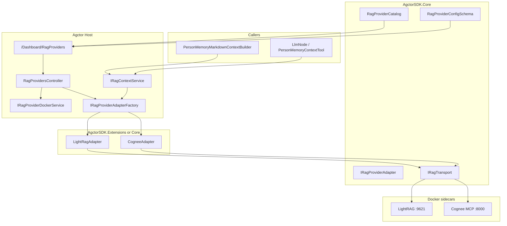

# PRD-025: External RAG provider adapters & dashboard

## 1. Overview

Agctor today stubs `contextStrategy: rag | graph_rag` in Project Memory and falls back to `markdown_all`. This PRD introduces a **provider adapter system** so the Host can query **external RAG backends** (starting with **LightRAG** and **Cognee**) while keeping `.agctor/` files as canonical truth.

Operators configure and run local Docker sidecars from **`/Dashboard/RagProviders`**, patterned after **`/Dashboard/ActorRuntime`** (PRD-012).

## 2. Goals

| ID | Goal |
| --- | --- |
| G1 | **Unified adapter contract** for ingest, query, health, and optional collection management across heterogeneous RAG systems. |
| G2 | **Transport pluggability**: same adapter semantics over **REST** or **MCP** (HTTP/SSE/stdio proxy). |
| G3 | **Dashboard parity** with Actor runtime: catalog, selection, config persistence, Docker install/start/stop, terminal commands, health. |
| G4 | **v1 providers**: LightRAG (graph/light graph) and Cognee (memory graph + RAG completion). |
| G5 | **Wire Project Memory**: replace stub in `PersonMemoryMarkdownContextBuilder` when `contextStrategy` is `rag` or `graph_rag`. |
| G6 | **Extensibility path** for PageIndex, RAGFlow, ColPali, and SaaS offerings without changing call sites. |

## 3. Non-goals (v1)

- Building Agctor's own vector/graph index (future Actor-model RAG — separate initiative).
- Mandatory ingest/sync from `.agctor/` on every save (optional manual “sync workspace” in v1.1).
- Replacing CodeGraph's internal `EmbeddingStoreActor` pipeline.
- Production hardening for multi-user cloud deployment (design hooks only).

## 4. Architecture recommendation

### 4.1 Why adapter + transport (not alternatives)

| Approach | Verdict |
| --- | --- |
| **A. `IRagProviderAdapter` + `IRagTransport`** | **Recommended.** Semantic ops stable; REST vs MCP is an implementation detail per provider. |
| B. MCP-only | Rejects REST-first backends (LightRAG API) unless every provider ships MCP. |
| C. REST-only | Rejects MCP-native Cognee without a shim. |
| D. LangChain/LlamaIndex as universal facade | Heavy dependency; hides provider capabilities; poor fit for Actor boundaries. |
| E. One giant switch in Host | Unmaintainable as provider count grows. |

### 4.2 Layer diagram



### 4.3 Core contract (`AgctorSDK.Core`)

```csharp
// Semantic operations — transport-agnostic
public interface IRagProviderAdapter
{
    string ProviderId { get; }           // "LightRAG", "Cognee"
    Task<RagHealthResult> GetHealthAsync(CancellationToken ct);
    Task<RagQueryResult> QueryAsync(RagQueryRequest request, CancellationToken ct);
    Task<RagIngestResult> IngestAsync(RagIngestRequest request, CancellationToken ct);
}

public sealed record RagQueryRequest(
    string Query,
    string? CollectionId,
    int TopK,
    string? FilterJson,
    RagQueryMode Mode);                  // Vector | Graph | Hybrid | Auto

public sealed record RagQueryResult(
    IReadOnlyList<RagContextChunk> Chunks,
    string? ProviderTraceId,
    string? RawDebugJson);

public sealed record RagContextChunk(
    string Text,
    double? Score,
    string? SourcePath,
    IReadOnlyDictionary<string, string>? Metadata);
```

**Transport interface** (internal to adapter implementations):

```csharp
public interface IRagTransport
{
    Task<HttpResponseMessage> SendRestAsync(RagRestCall call, CancellationToken ct);
    Task<McpToolResult> InvokeMcpToolAsync(string toolName, object args, CancellationToken ct);
}
```

Each provider adapter maps Agctor's **normalized** request/response to provider-specific APIs:

| Agctor op | LightRAG (REST) | Cognee (MCP) |
| --- | --- | --- |
| Query | `POST /query` | MCP `search` (`GRAPH_COMPLETION` or `RAG_COMPLETION`) |
| Ingest | `POST /documents` | MCP `cognify` / `add` |
| Health | `GET /health` | MCP ping / health tool |

### 4.4 Provider catalog (`RagProviderCatalog`)

Static descriptors (like `ActorRuntimeCatalog`):

| Id | Display | Strategy tags | Docker | Default transport |
| --- | --- | --- | --- | --- |
| `None` | Markdown only (no RAG) | — | No | — |
| `LightRAG` | LightRAG | `rag`, `graph_rag` | Yes (`lightrag`) | REST (+ optional MCP bridge) |
| `Cognee` | Cognee | `graph_rag`, memory | Yes (`cognee-mcp`) | MCP HTTP |

Future rows: `PageIndex`, `RAGFlow`, `ColPali`, `AzureSearch`, etc.

### 4.5 Configuration

Persisted in **`appsettings.User.json`** (Tier A, same as Actor runtime):

```json
{
  "Agctor": {
    "Rag": {
      "DefaultProvider": "LightRAG",
      "LightRAG": {
        "BaseUrl": "http://127.0.0.1:9621",
        "ApiKey": "",
        "Transport": "Rest",
        "DefaultMode": "Hybrid"
      },
      "Cognee": {
        "BaseUrl": "http://127.0.0.1:8000",
        "Transport": "McpHttp",
        "McpPath": "/mcp",
        "SearchType": "RAG_COMPLETION",
        "LlmApiKeyEnv": "LLM_API_KEY"
      }
    }
  }
}
```

Secrets: store API keys in user settings file or env vars referenced by Docker compose (never commit).

**Per-scenario override (v1.1):** `.agctor/scenarios/<id>/rag.yaml` with `providerId` + `collectionId`.

### 4.6 Docker sidecars

Compose root: `docker/rag-providers/docker-compose.yml` (parallel to `docker/actor-runtimes/`).

| Service | Image / build | Ports | Notes |
| --- | --- | --- | --- |
| `lightrag` | `ghcr.io/hkuds/lightrag` or pinned tag | 9621 | Wizard `.env` copied to `docker/rag-providers/lightrag/.env` |
| `cognee-mcp` | `cognee/cognee-mcp:main` | 8000 | `TRANSPORT_MODE=http`, mount `cognee-data` volume |

`IRagProviderDockerService` mirrors `IActorRuntimeDockerService`:

- `GetStatusAsync(providerId)`
- `InstallAsync` — `docker compose pull` + preset terminal commands
- `StartAsync` / `StopAsync`
- `ResolveComposeFilePath()`

Reuse **`terminal-command-panel.js`** with `data-context-type="rag-provider"`.

### 4.7 Integration with Project Memory

When `contextStrategy` is `rag` or `graph_rag`:

1. Resolve **active provider** from `Agctor:Rag:DefaultProvider`.
2. If provider is `None` or health check fails → fall back to `markdown_focus` with user-visible note (same as today).
3. Call `IRagContextService.BuildAppendixAsync(...)`:
   - `QueryAsync` with user message + scenario scope filter.
   - Format chunks into markdown appendix (provenance line cites provider + collection).
4. Respect `ProjectMemoryAccessGuard` — do not inject chunks from paths the agent cannot read.

**Mapping:**

| contextStrategy | Suggested `RagQueryMode` | Default provider |
| --- | --- | --- |
| `rag` | `Hybrid` or `Vector` | LightRAG |
| `graph_rag` | `Graph` | Cognee or LightRAG |

`LlmNode.config` may add optional keys:

```json
{
  "contextStrategy": "graph_rag",
  "ragProviderId": "Cognee",
  "ragCollectionId": "people-scenario-1",
  "ragTopK": 8
}
```

### 4.8 Future: Actor-model RAG (not v1)

Deferred design hook: `RagOrchestratorActor` owns ingest jobs, retries, and provider health; tools send messages instead of calling adapters synchronously. v1 uses **`IRagContextService`** (sync) to ship faster; actor wrapper added without changing the adapter contract.

### 4.9 Future: SaaS & closed-source providers

Same `IRagProviderAdapter` with transport = REST + OAuth2/API key. Catalog entry includes `DeploymentKind: LocalDocker | RemoteSaas | RemoteSelfHosted`. Dashboard shows connection test instead of Docker panel when not Docker-backed.

## 5. API (`RagProvidersController`)

| Method | Route | Purpose |
| --- | --- | --- |
| GET | `/api/rag-providers` | Current provider, configured, catalog, health summary |
| PUT | `/api/rag-providers` | Save selection + provider config → `appsettings.User.json` |
| GET | `/api/rag-providers/health` | Active adapter + Docker sidecar health |
| GET | `/api/rag-providers/docker/{providerId}` | Docker status (mirror runtime) |
| POST | `/api/rag-providers/docker/{providerId}/{action}` | `install` \| `start` \| `stop` |
| POST | `/api/rag-providers/query` | Debug query from dashboard (test retrieval) |

## 6. v1 provider notes

### 6.1 LightRAG

- **Type:** Graph + vector hybrid (LightRAG).
- **Local run:** Official `docker compose up` ([LightRAG Docker docs](https://github.com/HKUDS/LightRAG/blob/main/docs/DockerDeployment.md)).
- **Agctor transport:** REST to `BaseUrl` (default `http://127.0.0.1:9621`).
- **Optional:** Community MCP bridge (`lightrag-mcp`) as alternate transport — not required for v1.
- **Config fields:** BaseUrl, ApiKey, DefaultMode, EmbeddingModel hint (display only).

### 6.2 Cognee

- **Type:** Memory graph + embeddings (`GRAPH_COMPLETION`, `RAG_COMPLETION`).
- **Local run:** `docker run -e TRANSPORT_MODE=http cognee/cognee-mcp:main` or compose profile `mcp`.
- **Agctor transport:** MCP over HTTP to `/mcp` (streamable HTTP or SSE per Cognee version).
- **Config fields:** BaseUrl, McpPath, SearchType, LlmApiKey (for cognify), data volume path.
- **Note:** Cognee requires LLM API key for graph build; document in dashboard help text.

## 7. Acceptance criteria

1. `/Dashboard/RagProviders` loads; catalog shows LightRAG, Cognee, and None.
2. Selecting a provider persists to `appsettings.User.json`; banner confirms save.
3. Docker panel shows status; Install/Start/Stop work when Docker available (same UX as Actor runtime).
4. Test query box returns chunks from running LightRAG or Cognee.
5. Playground / `PersonMemoryContextTool` with `contextStrategy: rag` uses LightRAG when selected and healthy.
6. `contextStrategy: graph_rag` uses configured graph provider (default Cognee) when healthy.
7. When provider down, appendix includes fallback note + `markdown_focus` behavior.
8. Unit tests: catalog ids, config schema, adapter request mapping (mock transport).
9. Integration tests: mock HTTP/MCP servers for query path.

## 8. Security

- RAG sidecars bind `127.0.0.1` by default.
- API keys only in user settings or env — never logged.
- Dashboard query test is operator-only (same auth as other dashboard APIs).
- Injected context chunks filtered by `ProjectMemoryAccessGuard`.

## 9. Observability

- Trace events: `rag.provider.query`, `rag.provider.health`, `rag.docker.action` (align with PRD-009 timeline).
- Include `providerId`, `latencyMs`, `chunkCount`, `fallbackReason` in trace JSON.
